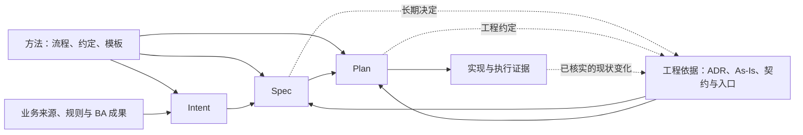

# AI SDLC 统一文档体系

[总览与下一步](../../README.md) · 方法正文 · 三产物、步骤交接与文档归属

更新日期：2026-09-16。本文定义工具套件面向目标项目的文档分层、默认路径、各类产出内容和归属。目录是可复用约定，尚未在具体业务项目中初始化。

**准备主线保持 Intent → Spec → Plan 三个步骤与三份主产物。** ADR、As-Is 和执行证据分别承担长期约定、当前事实和实际结果的记录职责；按工作需要产生支持材料。

## 阅读入口

| 要解决的问题 | 阅读位置 |
| --- | --- |
| 有哪些层，分别由谁维护 | [四层模型](#layers) |
| 每份产出具体放在哪里 | [统一目录](#layout)、[产出目录](#artifacts) |
| 每一步读什么、写什么 | [流转与落点](#flow) |
| 同一内容怎样避免多处维护 | [权威位置](#authority) |
| 何时创建、如何归档与复用 | [生命周期与适配](#lifecycle) |

本文集中维护**产出类型、路径与归属**。Intent、Spec、Plan 的完整内容要求由 [产物约定](sdd-artifact-contracts.md)维护；ADR 的读取和演进由 [上下文方案](../knowledge/sdd-context-and-project-knowledge.md)维护；As-Is 的调查与证据细则由 [实施指南](../knowledge/brownfield-as-is-implementation-and-reuse.md)维护。各文档通过引用连接，修改同一要求时回到对应权威位置。

<a id="layers"></a>

## 1. 四层模型

| 层 | 回答的问题 | 保存什么 | 归属与维护 |
| --- | --- | --- | --- |
| 方法层 | 工作怎样开展，产物怎样生成与检查？ | 工作流、产物约定、模板、工具与宿主适配说明 | 方法仓库或插件维护；项目记录采用版本 |
| 项目知识层 | 项目是什么，现在怎样工作，长期遵循什么？ | 项目入口、词表、ADR、Topic As-Is、权威契约导航 | 项目维护，跨变更复用 |
| 变更层 | 这次为什么改、改成什么、怎样完成？ | Intent、Spec、Plan；按需保存来源、调查与附件 | 按本次需求与开发范围维护；共享上游引用复用 |
| 证据层 | 实际检查或交付了什么，结论适用于哪个状态？ | 初始化检测、验证、审查和交付记录，必要原始报告 | 随项目级活动或具体变更保存 |

这是按职责和生命周期分层。系统、项目、模块是**适用范围**，记录在文档中，不再重复建立几套类型。证据可以位于变更目录内部，层次不要求对应四个并列文件夹。

项目源码、schema、测试、CI 与工具配置继续放在仓库已有位置。文档引用其权威定义；本体系负责记录决定、解释、工作安排和结果。

<a id="layout"></a>

## 2. 统一默认目录

下列路径相对于目标项目的文档归属仓库。没有既有布局时采用这些默认路径；已有等价结构时按第 6 节映射。

```text
README.md                                 # 现有项目介绍，链接统一入口
CONTEXT.md                                # 领域词表：仅术语与含义
docs/
├── project/
│   ├── README.md                         # 项目入口、全局地图、实际路径映射
│   └── evidence/                         # 项目级活动证据，按需
│       ├── <activity-id>.md              # 初始化、工具检测或 As-Is 核验结果
│       └── <activity-id>/                # 需要保留的原始报告，按需
├── adr/
│   ├── README.md                         # 有效决定与历史关系索引
│   └── <adr-id>-<slug>.md                # 统一的项目决定与规范
├── knowledge/
│   └── topics/
│       └── <topic-id>.md                 # 主题 As-Is 与仓库证据
└── changes/
    ├── README.md                         # 变更导航，数量增加后按需创建
    └── <change-id>-<slug>/
        ├── intent.md                     # 问题、目标、范围与约束
        ├── spec.md                       # 需求、AC 与 Design
        ├── plan.md                       # Tasks、依赖、验证安排与状态
        ├── context.md                    # 较长的共享上下文，按需抽出
        ├── sources/                      # 原始材料快照及来源说明，按需
        ├── research/                     # 本次调查或原型结论，按需
        ├── attachments/                  # 主产物的图表或详细附件，按需
        └── evidence/
            ├── verification.md           # 实际验证记录，首次验证时建立
            ├── review.md                 # 实际审查记录，首次审查时建立
            ├── delivery.md               # 实际提交或交付后的结果
            └── runs/<run-id>/            # 需要保留的日志、截图、报告，按需
```

宿主指引如 AGENTS.md、CLAUDE.md 只引导读取项目入口和相关流程；项目工程约定在 ADR 中维护。方法层的工作流和模板保留在方法仓库或插件，项目入口记录可访问的位置和采用版本；需离线使用时，可在 `docs/project/method/` 保存明确版本的副本。

**目录列出的是落点，不要求初始化时创建所有文件。** 项目入口先建立；首次形成相关术语、决定或主题时再建立词表、ADR 或 Topic。变更逐步形成或引用三类主产物；实际活动发生后才产生对应证据。

以下使用 `<change>/` 简写 `docs/changes/<change-id>-<slug>/`，使用 `<method>/` 指项目采用的方法包位置。

<a id="feature-story-layout"></a>
<a id="scope-layout"></a>

### 默认布局与范围复用

默认一项边界清楚的需求使用上述一个变更目录，包含 intent.md、spec.md、plan.md。BA 负责 Intent 及其业务确认，已有整体方案和原型保持原位置，由 Intent 引用；Spec 细化要求与方案，Plan 组织工程工作。无需额外创建 feature.md、story.md 或固定的 Feature/Story 目录树。

领取部分范围时，先用 Spec/Plan 的范围章节和已有工作清单表达；需要独立维护时，再使用项目已有子目录或独立变更目录保存对应 Spec/Plan。各自引用共同 Intent 的版本、相关材料和公共方案，注明未覆盖范围，不复制共同业务正文。

一份 Intent 可供多个明确范围的 Spec/Plan 使用。只有业务目标或决定确需分别维护时，才由 BA 拆出新的 Intent；拆分条件见[范围与复用约定](sdd-artifact-contracts.md#scope)。外部系统中的 Feature、Story、Issue 名称和标识作为可选来源关联，保留其已有布局。

每项工作的状态在实际负责它的 Plan 中维护，整体进度引用分项结果；组合验证放在负责整体交接的范围及其 evidence/ 中。按实际维护需要组织文件，不按领取人或 Agent 会话复制。

<a id="artifacts"></a>

## 3. 每类产出的内容与落点

### 3.1 方法层

这些是可复用方法资产，内容描述“怎样做”。本仓库现阶段的文件对应关系见 [README](../../README.md)。

| 产出 | 产品化后的落点 | 必须包含什么 | 如何使用 |
| --- | --- | --- | --- |
| 产物约定 | `<method>/contracts/` | 产物职责、输入、必要内容、引用方式、状态与交接判据 | 生成或检查相应产物时读取 |
| 执行工作流 | `<method>/workflows/` | 触发条件、读取步骤、动作、输出位置、完成与回退条件 | 各步骤执行时采用 |
| 可复制模板 | `<method>/templates/` | 章节或字段骨架、填写说明、来源及版本要求 | 用真实输入生成项目文档 |
| 适配说明 | `<method>/adapters/` | 逻辑产物到宿主/框架位置的映射、读取机制与限制 | 接入工具时使用 |

闭环动作、专业节点职责、所需上下文、转换与汇合规则由 workflows/ 管理，节点之间的交接字段由 contracts/ 定义。节点运行时通过现有产物修订和证据引用交接，不增加 Loop、Graph 两类主产物，也不按节点复制 Intent、Spec 或 Plan。具体规则见 [闭环、节点与交接](sdd-spec-to-commit-workflow.md#loops-and-routing)。

方法层实现如何分配给 Skill、脚本、Agent 和 Git hooks，由[实现机制分工](../tools/sdd-capability-implementation-map.md)维护。Skill 指向共用规则，脚本检查与维护项目产物，宿主/钩子适配提供执行入口；项目状态和证据仍保存在上述统一位置，不进入工具安装目录。

方法升级不自动改写项目已接受的 ADR 或历史变更。项目采用新的流程版本时，明确适用范围和产物迁移方式。

### 3.2 项目知识层

| 产出 | 默认落点 | 必须包含什么 | 产生与更新时机 |
| --- | --- | --- | --- |
| 项目入口／全局地图 | `docs/project/README.md` | 项目职责与边界；仓库及模块导航；能力与主题索引；ADR、词表、契约和构建测试入口；采用的方法版本；实际产物路径映射；尚未调查范围 | 项目初始化建立；布局、边界、能力或方法版本变化时更新 |
| 领域词表 | `CONTEXT.md` | 规范名称、含义、易混概念与避免使用的别名 | 术语明确或修订时更新；只记录词义 |
| ADR 索引 | `docs/adr/README.md` | ID、标题、位置、主题、范围、读取触发、状态、生效条件、替代/补充关系 | ADR 建立、采纳或关系变化时同步 |
| ADR 正文 | `docs/adr/<adr-id>-<slug>.md` | 背景；决定与规则；理由和替代方案；适用范围与生效条件；代价与例外；符合性验证方式；状态及采纳依据；来源变更与关联材料 | 初始化时采用既有约定；Spec/Plan 中按需沉淀长期决定；按演进规则维护 |
| Topic As-Is | `docs/knowledge/topics/<slug>.md`，或工具原生 Wiki 路径 | 当前行为与范围；关键实现协作；限制与未知；来源、适用代码状态和验证入口。工具已维护的元数据直接复用 | 优先复用已有知识，按需求补页；使用前核对关键依据，实施收尾按影响更新 |
| 变更索引（按需） | `docs/changes/README.md` | 变更 ID、标题、目录或外部入口、活跃/关闭摘要及状态来源链接 | 变更多时建立；依据变更正文或既有管理系统同步导航 |

Topic 是主题知识页的称呼，不是必须编号和追踪的独立实体。八个调查方向只作查漏提示，不要求每页填满；最小模板沿用 [As-Is 指南](../knowledge/brownfield-as-is-implementation-and-reuse.md#templates)。采用 OpenWiki 时正文留在原生 `openwiki/`，项目入口链接其导航，不复制到默认目录。

项目规范统一是 ADR 的规则内容；详细契约、配置或已有手册按明确采用关系引用。第一版 As-Is 限于仓库内可验证事实，外部材料不能直接被写成已经核实的运行现状。

### 3.3 变更层：三个主产物

| 产出 | 默认落点 | 必须包含什么 | 主要输入与用途 |
| --- | --- | --- | --- |
| Intent | `<change>/intent.md` | 来源、问题与影响对象、目标、范围、约束与业务决定、BA 材料采用说明、已确认版本/范围及依据、开放问题、交接结论 | BA 负责生成维护并确认业务表述；超出授权的决定沿用现有决策人；给 Spec 交接业务依据 |
| Spec | `<change>/spec.md` | Intent 承接；当前与目标变化；场景、规则、异常与 AC；质量兼容要求；Design 的模块、接口、数据、关键机制和取舍；风险与验证策略；ADR 采用及新增/演进记录；未决范围 | 从 Intent 及所引用的 BA 成果、仓库事实、ADR 和技术调查形成；给 Plan 提供可拆解、可验证的方案 |
| Plan | `<change>/plan.md` | 输入与实施范围、修改落点、有顺序的工作清单和必要依赖、整体验证安排、进度、步骤结果引用及未决事项；公共要求写一次 | 从 Spec、相关约束、实际代码/测试和环境形成；支持执行、验证及恢复 |

表中路径也适用于需要独立维护的部分范围；共享 Intent 或 Spec 时，在本地负责维护的产物中记录原文位置与采用范围，不创建内容相同的占位副本。

Design 保存在 Spec 的方案章节，Tasks 保存在 Plan 的任务章节；不建立默认的 `design.md` 或 `tasks.md`。复杂图表或细节可抽到附件，所属主产物保留解释与权威引用。

记录默认以步骤产物为单位，详见[记录粒度](sdd-artifact-contracts.md#granularity)。输入、输出、完成判断与未决事项直接保存在所属文档；AC/Task/测试/运行结果的逐项编号与追踪按实际需要增加。

### 3.4 变更层：按需支持材料

| 产出 | 默认落点 | 必须包含什么 | 何时独立保存 |
| --- | --- | --- | --- |
| 原始来源 | 已有材料的原位置；必要快照放 `<change>/sources/<source-id>.*` | 原文或必要快照；来源位置、版本/日期、提供者或来源角色、采用范围 | 原位置无法稳定复用，或需要保留本次采用的材料时才保存快照 |
| 调查／原型结论 | `<change>/research/<question-id>.md` | 要回答的问题、检查范围、来源与基线、发现、推断和未知项、结论及影响的 Spec/Plan 位置 | 调查较长，或结论需要后续复核时；短结论直接写在对应主产物 |
| 共享变更上下文 | `<change>/context.md` | 多仓库映射、公共基线、较长的事实与来源索引、调查入口、相关产物引用 | 多仓库或长任务需要跨步骤共享较多材料时 |
| 设计／实施附件 | `<change>/attachments/<name>.*` | 所属主产物与章节、用途、采用版本、具体图表或细节 | 主文档无法简洁承载时；正文仍说明关键决定与承接关系 |

来源说明可写在材料头部或原有引用处，无需为每个文件再建一份元数据文件。原型代码复用仓库已有试验目录，并由调查报告关联位置、版本和用途。

BA 已有 PRD、业务方案和交互原型优先留在原文档/设计系统，Intent 记录采用版本、用途与已确定范围，Spec 直接读取并引用。自产业务设计附件归属 Intent，自产工程方案附件归属 Spec；无须复制为两套正文。材料不可访问时明示缺口。详细采用规则见 [Intent 生成与交接](sdd-artifact-contracts.md#intent)。

共享上下文默认分布在三份主产物的输入依据中；有必要才抽出 `context.md`。抽出后，公共基线和事实只维护一处。目标仍由 Intent 维护，方案与采用结论由 Spec 维护，任务状态和执行下一步由 Plan 维护，检查结果由证据记录维护；context.md 只引用这些内容。

### 3.5 证据层

| 产出 | 默认落点 | 必须包含什么 | 产生时机 |
| --- | --- | --- | --- |
| 项目初始化／工具检测／As-Is 核验记录 | `docs/project/evidence/<activity-id>.md` | 活动目的、参与仓库与代码状态、实际工具/环境、检查步骤、结果、缺口、更新的入口/ADR/Topic 引用、下一步 | 对应项目级活动实际执行后；属于具体变更的检查存入该变更证据 |
| 验证记录 | `<change>/evidence/verification.md` | 本步骤验证对象与范围、相关代码状态（含未提交修改和新增文件）、实际检查与结果、必要环境/时间/报告、未执行项及限制；有具体问题时引用相关条款 | 实际验证后汇总，重跑更新当前结论；必要时引用已有运行记录，无需逐个 AC/Task 建表 |
| 审查记录 | `<change>/evidence/review.md` | 受审代码状态与完整范围、所用 Spec/ADR 版本、自查或独立审查方式、发现 ID 与位置/影响/依据、处理状态与决定、修复及复查证据；无发现也注明已查范围 | 审查后建立；修正后更新发现状态并保留原问题 |
| 交付记录 | `<change>/evidence/delivery.md` | 实际交付对象与状态、提交/PR 或制品引用、交付范围、有效验证与审查引用、剩余事项、接续位置 | 实际提交或交付后建立；准备阶段的安排仍在 Plan |
| 原始执行输出 | `<change>/evidence/runs/<run-id>/`；项目活动使用 `docs/project/evidence/<activity-id>/` | 支撑结论所需的日志、截图、报告或数据；能与检查记录、代码状态和环境关联 | 需要复核原始结果时保留；可引用项目现有 CI/报告系统 |

生成验证策略或命令时尚无实际结果，内容先写在 Spec/Plan；不能预填“验证通过”。交付记录区分本地提交、合并、发布等实际状态，不能由其中一步推断其他步骤已经完成。

当前本地代码生成与验证的产出为仓库改动、Plan 状态与交接、verification.md 和 review.md，以及必要知识更新。Plan 保存本地结论和结果引用；本地完成不要求建立 delivery.md。具体节点、输入和完成条件见[Plan 之后的流程](sdd-spec-to-commit-workflow.md#post-plan)。

Git Commit 的结果只能在提交完成后记录。交付记录可引用已经存在的提交，并在后续正常文档提交或既有外部交付系统保存；不要求该提交包含一份写有自身 hash 的文件，也不为此循环修改提交。

验证按步骤汇总，保留当前适用结果和必要报告；需要区分多次运行时使用现有 run ID、时间或版本定位，无需为每次尝试自建运行台账。保留的旧结果注明原代码状态；重要结论不能只依赖不可定位的终端历史。采用外部报告时记录可访问位置。

运行需要暂停或恢复时，在对应记录补充本次目标、输入修订、已发生的动作及结果引用、停止原因与接续位置；轮次、耗时或成本按实际可取得的数据记录。任务状态仍在 Plan，运行期 checkpoint 只作恢复指针。本文中的 ADR/Spec/Task/证据引用用于追溯，和决定执行下一步的控制图分别维护。

<a id="flow"></a>

## 4. 每一步的读取、产出与回写

| 工作 | 读取哪些输入 | 主落点 | 同步或按需产生 |
| --- | --- | --- | --- |
| 项目初始化 | 已有说明、仓库结构、现有规则、工具与构建入口 | 项目入口、首批 Topic | 明确术语；采用既有约定的 ADR；项目级检测证据 |
| Intent | 业务诉求、业务规则、BA 分析/方案/原型与确认；必要时参考项目说明或轻量现状，默认不导入 ADR | `intent.md` | 引用已有成果，按需保留来源快照或业务设计附件；记录待决定/调查事项 |
| Spec | Intent 及所引用的 BA 成果、相关 Topic、ADR、契约与源码、针对性调查 | `spec.md`，含 Design | 调查报告、方案附件、新增/替代 ADR；同步 ADR 索引 |
| Plan | Spec、相关 Intent 约束、ADR、实际文件/测试/环境 | `plan.md`，含 Tasks | 工程约定 ADR、详细实施附件；方案受影响先回写 Spec |
| 实现与局部验证 | 当前 Task、前置结果、Spec、ADR 和代码 | 仓库实际源码/测试/配置；Plan 任务状态 | verification.md 与必要运行报告 |
| 整体验证与审查 | Spec 的 AC/Design、相关 ADR、组合实现、已有证据 | verification.md、review.md | 修正相关代码与上游产物，复核受影响证据 |
| 本地结果交接与知识回写 | 最终本地实现、有效决定与验证/审查结果 | Plan 本地结论与接续；更新相关 ADR/Topic | 同步必要说明和索引；未提交事实注明工作区版本 |
| 后续实际提交或交付 | 已核验本地结果、实际提交/交付对象 | delivery.md | Plan 引用实际交付及剩余事项；不反推其他交付状态 |



基础 BA 材料整理已属于 Intent 主线。后续 BA/QA 专业扩展复用这些落点：业务来源保留原位置或按需进入 sources，目标与业务决定进入 Intent，规则和 AC 由 Spec 承接；测试安排进入 Plan，测试代码留在现有测试目录，实际结果进入 evidence。只有现有产物无法表达新的长期职责时，才扩充类型及内容约定。

<a id="authority"></a>

## 5. 一项内容只维护一处

| 内容 | 权威位置 | 其他文档怎样使用 |
| --- | --- | --- |
| 术语含义 | 项目 CONTEXT.md | Topic、ADR、Spec 引用，说明本次上下文 |
| 长期决定、工程规范与理由 | ADR 及明确采用的引用材料 | Spec 说明本次应用，Plan 展开任务 |
| 实际行为与已核验事实 | Topic As-Is 与仓库证据；本次尚未沉淀的调查在 research 或主产物输入依据 | 用版本与条件引用，不把计划当成现状 |
| 变更目标、边界 | Intent | Spec 承接，Plan 核对 |
| 本次要求、AC 与关键方案 | Spec；长期决定引用 ADR | Plan 展开工作，实现与审查直接读取 |
| 工程 Task 的顺序、状态与执行下一步 | Plan | context、索引和交付记录通过链接定位；与需求整体进度区分 |
| 需求/工单整体进度 | 已采用的进度管理系统；当前团队使用 Colla | Plan 的交接、Intent 和索引引用对应事项；同一整体状态不建立第二处独立权威 |
| 实际验证、审查与交付结果 | evidence 内对应记录或明确采用的外部结果 | Plan 保存状态与结果引用，避免复制另一份结果表 |

项目入口和 ADR/变更索引以导航为主。索引可以显示摘要，但更新依据来自正文；不要在索引里单独修改规则、任务状态或验证结论。

新建文件前先判断内容的归属、是否已有权威位置、是否真的需要独立文件。工程规范进入 ADR，本次方案进入 Spec，当前事实进入 Topic；无法明确归属的零散文档先在当前产物中记录问题，不新造同义类型。

<a id="external-authority"></a>

### 5.1 仓库与外部系统的权威映射

默认 Intent、Spec、Plan 的权威正文在项目仓库。项目已有正式需求、工单或变更系统时，可以按产物指定外部权威，仓库文件作为带版本的工作副本或引用；同一内容仍只由一个权威位置决定有效版本。原始业务来源与整理后的 Intent 职责不同，保留来源不等于建立第二份权威 Intent。

项目入口的既有路径映射按需要补充以下信息，不另建映射系统：

| 信息 | 要说明什么 |
| --- | --- |
| 权威对象与位置 | 产物及适用范围、仓库路径或外部系统；外部记录 ID 和可定位修订 |
| 工作副本 | 本地位置、依据的权威修订、哪些字段或正文允许在此起草 |
| 维护与接受责任 | 维护人、业务/工程接受依据及授权来源；沿用所属产物中的记录 |
| 写回方式与边界 | 谁或什么工具可以更新哪些内容、何时写回、怎样核对实际结果 |
| 关联与状态 | 外部记录与仓库版本的关联；待写回、已同步或冲突等实际情况 |

使用前读取所采用的权威修订，并检查自上次采用后是否有相关变化。发生冲突时按权威内容和已确认决定复核，不能按最后修改时间自动覆盖，也不能把未经接受的工作副本当作有效输入。原范围仍有效的工作可继续，受影响范围先协调。

外部写回仅在已有授权内进行。写回前核对目标当前修订；写回后核对内容、实际修订与关联。接口支持版本条件或去重时直接复用；不支持时保留比较依据，不能用盲目重试覆盖他人更新。失败时保留本地候选和待同步事项，不能宣布权威记录已更新；恢复先确认上次写入是否实际成功。

Spec 的工程接受依据留在 Spec，Plan 引用并补本次实施授权；外部系统持有该依据时引用其记录。团队共享交接应能访问所采用的权威版本及必要证据；“本地完成”仍按本地流程判断，不自动意味着完成外部写回或共享交接。

<a id="colla-mapping"></a>

### 5.2 当前团队的 Intent 与 Colla 衔接

2026-09-16 用户明确当前工作方式：**BA 先生成 Intent.md，再通过 MCP 同步到 Colla；Colla 管理进度。** 这是用户提供的项目现状，本仓库尚未验证具体 MCP 接口、字段或权限。

沿用第 5.1 节已经接受的权威规则，分清业务正文、整体进度与工程执行记录：

| 内容 | 当前约定 | 关联方式 |
| --- | --- | --- |
| 业务目标、范围和已确认决定 | 默认以 BA 维护的仓库 Intent 为权威；同步到 Colla 不自动改变正文的权威位置 | 关联 Intent 的路径、采用修订与 Colla 事项；草稿与已确认内容保持原状态 |
| 需求/工单整体进度 | 由 Colla 管理 | Intent、Plan 或变更索引引用同一 Colla 事项；关闭与交付证据按实际完成情况同步 |
| 工程执行细节 | Plan 保留 Task、依赖、验证安排、执行状态与接续信息 | 需要同步到 Colla 的进度是约定范围的汇总；不要求逐 Task 复制一套清单 |
| 验证、审查及交付证据 | 保留在原证据位置或已有交付系统 | Colla 与 Plan 引用可访问的实际结果，不能由事项已关闭反推验证已经通过 |

BA 生成与业务确认继续遵循 Intent 约定；MCP 同步成功不能将未确认内容升级为已确认需求。Colla 中出现业务修改时，按已有 BA 维护与权威冲突规则处理，再同步有效版本；目前未确认双向正文编辑机制，不据“已同步”推断自动反向覆盖仓库。

接入时在已有映射中补 Colla 事项与 Intent/交付范围的关联、允许同步的字段、可取得的修订依据、状态对应及结果核对方式。一次需求包含多个交付范围时继续引用共同 Intent。写入失败与重试沿用第 5.1 节；不因 MCP 调用已发出就记录外部更新成功。

MR 实际合并后按[MR 收尾规则](sdd-spec-to-commit-workflow.md#mr-closeout)更新对应范围；全部范围及项目要求的验收条件满足后才关闭整体事项。Intent 标记完成/归档并保留正文；Colla 写回失败保留待同步状态。自动收尾规则已确认，具体连接尚未实现。

<a id="lifecycle"></a>

## 6. 生命周期、路径映射与复用

### 6.1 创建与维护

- **首次整理：** 建立项目入口、可核验的首批 Topic 及必要活动证据；已有规范通过 ADR 明确采用，未知历史不补造。
- **新变更：** 使用稳定 change ID，按三个步骤逐步形成主产物；支持文件在需要时创建。
- **跨步骤：** 读取上游产物和相关原文，检查版本及范围；当前步骤新增的来源由当前产物记录。
- **长期沉淀：** Spec/Plan 中的长期决定及时进入 ADR；实际实现后的稳定事实进入 Topic，均保留来源和范围。
- **归档：** 默认保留原路径；符合项目关闭条件后，在 Plan 的交接部分记录变更关闭，采用既有管理系统时引用其状态；已有变更索引据此展示归档状态。关闭不等于只完成本地提交，原路径保留有利于稳定引用。
- **恢复或新变更复用：** 比较相关来源和代码差异，复核仍有效的结论；历史产物不自动升级到最新 ADR 或方法版本。

### 6.2 既有框架与多仓库

项目入口记录逻辑类型到实际位置的映射，生成和读取都使用同一张表。例如：

| 逻辑位置 | 默认路径 | 项目已有结构的处理 |
| --- | --- | --- |
| ADR | `docs/adr/` | 保留既有决策位置，登记索引及采用方式 |
| 变更主产物 | `docs/changes/<change-id>-<slug>/` | 映射已有框架目录及文件，缺失的 Intent/Spec/Plan 按来源补齐 |
| 执行证据 | `<change>/evidence/` | 可映射 CI、审查或交付系统，保留稳定版本和关联 |
| 方法资产 | `<method>/` | 记录插件或方法仓库版本与可访问位置 |

文件名不同不代表职责不同；复用等价产物，避免生成第二套完整副本。Design 和 Tasks 始终分别属于 Spec 和 Plan 的内容，即使宿主把附件保存为独立文件，也要有明确的所属关系。

多仓库变更选择一个变更目录作为协调位置，记录参与仓库、角色和版本；各仓库的 ADR/Topic 留在各自权威位置并被引用。系统级决定指定一个归属位置，相关项目明确采用范围；一个 Git 仓库可以有多个业务范围，文件夹层级不自动改变决定优先级。

跨仓库引用使用稳定仓库 ID、仓库相对路径和版本；本机绝对位置属于本地解析配置。现有模板需要本地位置时，输出可共享文档前使用仓库 ID 映射。

## 7. 首版实施顺序与检查

1. 用本文建立项目入口中的实际路径映射，复用现有材料。
2. 采用现有 Intent/Spec/Plan、ADR、Topic 模板；为证据记录采用第 3.5 节字段。
3. 用一项真实变更检验每一步是否读到有效输入、写到唯一位置、交给下一步。
4. 演练一次 ADR 替代、一次现状回写和一次中断恢复，确认引用仍能定位。

结构检查关注文件与引用存在、ID/状态及版本完整、逻辑类型有唯一落点；语义检查关注本次方案是否遵循有效决定、事实是否有证据、任务与结果是否覆盖要求。首版先稳定这些约定，再将重复操作做成插件能力。
