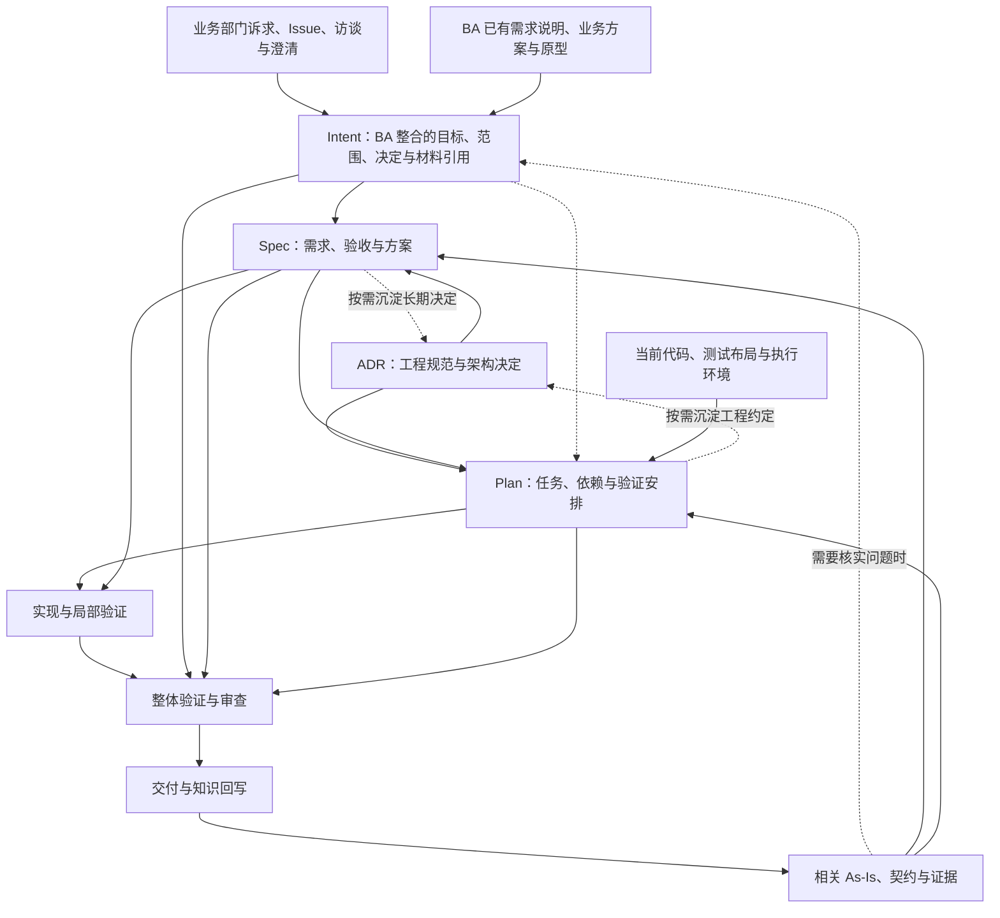

# AI SDLC 产物约定：Intent → Spec → Plan

[总览与下一步](../../README.md) · 方法正文 · 三产物、步骤交接与文档归属

更新日期：2026-09-16。状态：面向不同 Agent 的工具套件设计约定。本文是三个产物的用途、输入、内容、生成方式和交接条件的权威说明；术语见 [词表](../../CONTEXT.md)，操作顺序见 [执行流程](sdd-spec-to-commit-workflow.md)。

## 1. 三个步骤、三个产物

进入实现前固定按 **Intent → Spec → Plan** 组织工作。Design 是 Spec 的方案内容，Tasks 是 Plan 的执行工作内容。需求与验收条件直接写在 Spec 中。

| 步骤 | 主要产物 | 核心问题 | 必须交给下一步什么 |
| --- | --- | --- | --- |
| Intent：明确意图 | intent.md | 为什么改，希望得到什么结果，边界是什么，已有何种业务成果？ | 目标、范围、业务决定与约束、BA 材料采用说明及待澄清问题 |
| Spec：形成规格 | spec.md | 具体要实现什么，采用什么方案，怎样验收？ | 可验证要求、关键设计决定及其现状依据 |
| Plan：制定计划 | plan.md | 按什么顺序完成哪些工作，如何验证和交接？ | 有输入、依赖、完成条件和验证方法的 Tasks |

默认在 `docs/changes/<change-id>-<slug>/` 保存本范围负责维护的 intent.md、spec.md、plan.md；共享上游可以直接引用，详见下节。所有产出类型、完整路径与归属以 [统一文档体系](project-documentation-system.md#artifacts)为准；已有框架使用项目入口登记的实际位置。独立小变更采用三份简短产物；复杂内容以附件或权威文档引用承载。附件、As-Is、ADR 和过程记录提供依据，主产物类型仍是这三种。Plan 之后进入实现、验证、审查与交付。

已有 Issue、PRD 或其他材料作为来源引用，明确其被采用的版本和内容。已有框架的产物按职责映射到三份主产物；尚缺的 Intent 用来源和已确认决定补齐，未知项如实保留。复用已满足条件的产物，不重走已完成工作，也不反向虚构原始意图。

这一组织方式参考 Anthropic Playbook 的产物链与 Superpowers 完整规划路径的职责分工，是本套件的选择；上游框架的实际流程保持其原生含义。[Anthropic 对照](../../research/method/anthropic-playbook-sdd-comparison.md)、[其他框架对照](../../research/method/sdd-spec-design-crosscheck.md)。

<a id="feature-story"></a>
<a id="scope"></a>

### 需求范围与按需拆分

**核心流程采用 Intent → Spec → Plan，Feature / Story 是可选的外部分类。** Intent 是业务需求及意图的内容载体；Feature / Story 是已有需求系统对条目的组织方式。它们可以指向同一项需求，无需分别维护几套业务正文。Intent 可以覆盖一项小需求，也可以覆盖一块功能的整体设计，不预设固定层级。

默认一项边界清楚的需求对应一份 Intent、一份 Spec 和一份 Plan。开发者领取其中一部分时，先在 Spec/Plan 标明本次覆盖、剩余范围和依赖，直接引用有效上游。**三步表示三种职责，每次领取都可以复用已经充分的产物。**

#### 何时需要拆，拆在哪里

| 实际需要 | 处理位置 |
| --- | --- |
| 业务目标、优先级或范围需要分别决定和维护 | BA 按需形成多个 Intent，引用共同背景与约束 |
| 同一业务意图下，部分范围需要独立设计、验收、交接或安排交付 | 先在 Spec 中明确边界；确需独立维护时拆出 Spec/Plan，共享同一 Intent 与公共方案 |
| 方案已明确，只需分步实现、控制改动风险或安排多人/Agent 工作 | 在 Plan 内拆 Task，通常无需增加业务需求文档 |

AI 可以辅助分析、拆解和执行；本方法仍按业务结果、依赖、审查与验证能力控制每次工作范围。选择粒度时检查：能否说清预期结果，必要前提是否明确，改动能否有效审查和验证。仅因一次 Agent 会话放不下而拆任务时，可按需读取上下文和接续工作，不据此重建业务需求层级。

已有 Feature/Story 划分可直接作为来源标识或 Spec 章节沿用；没有时按场景和业务结果组织即可。BA 的整体原型无需先拆成逐 Story 文档。既有规则、流程和业务设计通过 Intent 引用，公共接口和工程机制在 Spec 中维护，需要跨变更长期复用的决定进入 ADR。

#### 拆分后怎样保持一致

- 每份 Spec 明确采用的 Intent 版本、相关业务材料、本次覆盖与剩余范围；每份 Plan 引用适用 Spec，维护本次任务和实际依赖。外部范围有方案，不代表所需代码或接口已经就绪。
- 同一正文和任务状态维护一处，其他范围用引用接续。公共规则或方案变化时复核受影响的活跃工作；局部细化留在本次范围，影响共同决定时回到其权威位置处理。
- 工程拆分在已有授权与确认范围内推进；若改变业务目标、交付承诺或验收含义，由 BA 协调相关决定。生成子级文件或分派 Agent 不自动改变授权。
- 部分范围完成后，明确哪些要求尚未完成；整体目标仍要有组合验证、必要公共工作的 Plan 安排和实际证据。换领取人或会话不产生新的需求副本。

例如，BA 提出“支持订单取消”，已有申请、审批、查看结果的整体原型。可以用一份 Intent/Spec/Plan 完成；若先交付申请能力，则在 Spec 明确本次结果、其余范围与依赖，在 Plan 安排工作。只有需要独立维护时才拆出单独 Spec/Plan，无需先给它命名为 Story。此为虚构范围示例。

落点见[默认布局与范围复用](project-documentation-system.md#scope-layout)。

<a id="flow"></a>

### 输入输出总览



箭头表示直接输入。下游继续读取相关原始约束与证据，避免仅依赖上一步摘要。As-Is 调查按问题加深：Intent 按需了解涉及的能力和系统边界，缺少工程证据时记录待调查项；Spec 核实行为、结构与关键机制；Plan 核实文件、执行依赖和验证条件。完整全仓初始化不是生成 Intent 的前置要求。[As-Is 实施指南](../knowledge/brownfield-as-is-implementation-and-reuse.md)

工程规范与架构决定统一以 ADR 表达，从 Spec 开始按影响导入，Plan 和实现继续使用，也可由 Spec、Plan 产生或演进。Intent 默认读取业务来源与确认内容，不要求 BA 检索 ADR 或先通过架构符合性检查。组织与生命周期见 [文档组织](../knowledge/sdd-context-and-project-knowledge.md#organization)，阶段选择与显式导入见 [读取与采用流程](../knowledge/sdd-context-and-project-knowledge.md#stage-inputs)。链接仅提供定位，Spec/Plan 还应体现适用内容如何落实。

### 三份产物共同记录什么

- **标识与范围：** 所属变更、覆盖范围、当前修订；可由变更目录统一标识。
- **输入依据：** 引用来源和上游产物的具体版本。Intent 记录业务来源与确认依据；Spec/Plan 补充实际采用的仓库状态和 ADR 章节、适用原因及本次处理。引用现状时包含实际使用的未提交修改。
- **决定与未知项：** 哪些内容已明确、依据是什么；未知项影响什么、下一步如何解决。
- **交接结论：** 哪些范围满足下一步条件，哪些仍受阻，依据与下一动作是什么。

公共基线可复用已有变更上下文；默认在三份产物的输入依据中记录，较长共享材料按需抽到同一变更目录的 context.md，原处保留引用。context.md 不另存目标、方案、任务状态或检查结果。产物写出、可以进入下一步、代码已经实现、结果已经验证分别判断。交接条件是内容和证据判据，按照用户及项目已有授权执行。

<a id="acceptance"></a>

### 工程接受责任与已有授权

内容与证据满足交接条件，和有权者接受相应决定，分别判断。已有充分的确认、项目职责和用户授权直接复用，不要求每个步骤重复签字。

- **责任归属：** 项目已有规定优先；没有规定时，由本次工程负责人承担 Spec 关键技术决定与 Plan 实施安排的接受责任，可以由实施开发者兼任。启动时记录实际责任人或可定位的项目职责依据；缺少必要责任归属时保留相关决定待定，不能默认赋予 Agent 权限。
- **明确委托：** 工程负责人可以委托开发者或 Agent 在指定范围内作决定，注明对象、允许决定的内容及超出范围时的处理人。委托不转移最终责任，也不能扩大委托者本身的权限；工具权限另按执行环境核验。
- **授权内继续：** 已接受范围内的普通文件细化、任务排序和实现修正，沿用已有授权。Plan 引用 Spec 的接受依据，只补自身新增的安排与限制，不重复维护一套审批记录。
- **变化复核：** 关键方案、共享架构或接口、其他团队承诺超出原授权时，交相关负责人处理；改变业务目标、交付承诺或验收含义时由 BA 协调业务决定。只暂停依赖该决定的范围。文字整理或不影响已接受内容的修订，不使接受依据自动失效。
- **记录落点：** 在所属产物的交接部分记录接受者或授权来源、适用修订与范围、委托边界、未决事项及下一动作。已有外部记录用稳定引用定位，按[权威映射](project-documentation-system.md#external-authority)使用；不另建审批台账。

Spec 记录本次关键技术方案的接受依据；Plan 继承该依据并补充实施范围的接受或授权。生成了文档、质量检查通过、工具允许写入，都不能单独证明相应决定已被接受。

<a id="granularity"></a>

### 默认按步骤交接，按需细化追踪

默认管理步骤的输入、产出、完成判断和未决事项，直接写在所属产物或已有报告中。下一步读取上游产物及必要原文，判断内容是否足以继续；不要求建立逐条 `AC → Task → 测试 → 运行结果` 关系表或专门的追踪系统。

- Spec 写清目标行为、方案与验收条件；AC 可以是自然语言条目，不强制统一编号。
- Plan 用工作清单表达顺序、必要依赖和验证安排。公共输入、ADR、环境和验证命令在步骤级写一次；Task 只补自己的特殊要求，不逐项重复全部字段。
- 实施产出代码、测试及必要文档改动，进度保留在 Plan；正常局部检查可合并记录，不要求每项 Task 独立生成证据文档。
- 验证与审查按整项变更记录对象、实际检查/发现、结论及未覆盖范围，引用已有报告。仍要对照 Spec 判断要求是否满足，但不强制保存逐项映射或每次尝试的独立 run ID。

只有特定范围需要正式追溯、多人交接容易混淆或已经出现遗漏时，再为该范围增加编号和细化关联。此为可选增强，不是首版工具选型或自研的默认要求。

<a id="intent"></a>

## 2. Intent：明确意图，形成 intent.md

### 2.1 用来做什么

Intent 是由业务侧负责的需求意图记录，也是后续规格工作的业务依据。BA 从业务部门接收诉求，整理问题、目标、范围、业务决定以及已有需求、方案和原型，生成并维护 `intent.md`，供整项需求或部分范围开发复用。BA 可以在形成 Intent 前或过程中做业务设计；不要求将材料预先分成 Feature / Story。

Intent 可以包含明确的业务规则和设计选择，也可以引用已经完整表达这些内容的原材料。重点是让接收者知道哪些成果已经确定、哪些仍是建议、下一步需要补什么；不要求把成熟需求退回成几句笼统目标，也不重复抄写整份 BA 方案。

**生成与确认职责：** BA 是 Intent 的主要维护者，负责组织生成、核对并确认业务表述；可以自己写，也可以让 AI 起草、读材料和检查遗漏。业务目标、范围、规则、成功方向及方案/原型的采用范围由业务侧确认；超出 BA 授权的取舍仍由现有业务负责人或 Product Owner 决定。工程人员按需提供技术约束，后续 Agent 依据所采用的 Intent 工作。

生成与确认分别记录。交接时注明已确认的版本/范围、确认人或已有确认来源、仍待决定的部分即可；直接复用充分的既有确认，不要求另建审批台账。未经确认的内容保持草稿或未决，不能由开发 Agent 猜测为已接受。工程调查可以先推进，但未决部分不能当作已确认承诺。BA 确认业务含义，技术可行性仍需 Spec 核验。

### 2.2 需要哪些输入

| 输入 | 从中确认什么 | 用于什么 |
| --- | --- | --- |
| 业务部门描述、邮件/会议纪要、Issue、缺陷或事件材料 | 谁遇到什么问题，现有业务如何处理，为什么发起变更 | 原始诉求、业务背景和受影响对象 |
| BA 的需求说明、业务规则、流程或已有 PRD | 角色、场景、规则、范围与已完成的业务分析 | 整合已有成果，识别缺口和冲突，避免重复分析 |
| BA 或协作者形成的方案、交互稿、原型 | 期望流程/交互、已选做法、讨论中的替代方案 | 引用具体版本和适用部分，明确业务决定与示意内容 |
| 澄清回答、评审结论与已明确决定 | 希望取得的结果、范围、优先级、硬约束及确认范围 | 沿用既有决定，保留尚未决定的问题 |
| 已有项目入口、业务说明、轻量 As-Is | 涉及什么能力和系统，哪些现状已有仓库证据 | 对齐术语与边界；缺少系统证据时交由 Spec 调查 |
| 业务侧已知并适用的规则与给定条件 | 已明确的业务权限、政策、时限、预算、兼容要求等及其来源 | 保留业务依据；历史技术选型的适用性与可行性在 Spec 核验 |

最低起点是可定位的原始诉求，方案和原型都不是必需输入。材料只有口头说明时记录来源与日期即可。BA 无需先具备源码访问或完整 As-Is；业务访谈表达的是诉求或业务侧观察，系统实现事实在 Spec 中按仓库证据核实。

### 2.3 必须包含哪些内容

| 内容 | 最低表达 | 怎样支持 Spec |
| --- | --- | --- |
| 来源与背景 | 原始材料、提出者或来源角色、触发原因；来源未知时明示 | 能追溯真实诉求，发现误解时有依据 |
| 问题与影响对象 | 谁在什么情境下遇到什么问题；系统陈述区分观察和推测 | 确定需要分析的用户场景与系统 |
| 预期结果与价值 | 希望发生的变化及成功方向；给定的量化目标保留条件 | 转化为具体行为与验收条件 |
| 范围与非目标 | 本次涉及的能力、对象与明确排除项 | 控制规格边界，避免加入无依据功能 |
| 已有范围关联（有则记录） | 原需求条目及其位置、已有拆分或共同约束；Feature/Story 名称可作为来源标签 | 复用现有材料，支持全部或部分范围开发，无需先补齐层级 |
| 已知约束与明确决定 | 必须保留的行为、给定条件、优先级或时限及来源 | 转化为规格约束与设计前提 |
| 已有业务方案与原型 | 材料位置/版本、用途与适用范围；其中已确定的规则或交互、候选想法及示意部分 | Spec 继承已确定成果、评估候选方案并补齐实现与验证细节 |
| 开放问题与假设 | 尚缺什么，是否影响目标或范围，如何补充 | Spec 有针对性地澄清、调查与设计 |

现状摘要只保留有助理解问题的说明，并注明来自业务观察还是已核验的仓库事实。技术细节的未知可以进入 Spec 调查；连目标对象或预期结果都不清楚时，继续澄清 Intent。上述内容可用短段落表达，无需每条需求单独编号或建立确认台账。

### 2.4 如何生成与交接

这是一个步骤内的整理与澄清过程，可以往返迭代；中间笔记可留在原材料或 Intent 草稿中，不要求每个动作产出新文档。

| 动作 | BA 与 Agent 怎样协作 | 写入或更新什么 |
| --- | --- | --- |
| 接收与读材料 | BA 指明本次业务来源及已有成果；Agent 阅读需求、方案和原型实际可访问的内容，记录版本与无法访问部分 | Intent 的来源与背景；必要材料继续保留原位置 |
| 还原问题与目标 | 从“加按钮/做页面”等做法中确认服务谁、解决什么问题、希望发生什么变化；保留已经明确的做法 | 问题、目标、范围与非目标 |
| 整合业务分析与设计 | BA 补充规则、流程或原型来澄清需求；Agent 比较文字、方案和交互表达的一致性，标出影响范围/行为的差异 | 已知决定及材料采用说明；不把所有原型细节自动升级为要求 |
| 解决关键歧义 | 只针对目标、范围和关键业务规则提出问题；由 BA 沿用已有沟通渠道取得尚缺的决定。技术可行性问题交工程调查 | 明确决定、尚未解决的问题与下一步；信息已足够时跳过重复澄清 |
| 生成与确认交接稿 | BA 组织成稿，可由 Agent 起草；BA 核对准确性、遗漏和范围，在职责内确认，超出授权的决定交现有决策人 | intent.md 或有效上游引用；已确认版本/范围、确认依据与未决事项 |

**交接条件：** 接收者能说明谁的问题、希望改变什么、本次范围、应继承哪些业务决定和材料、哪些业务内容已确认以及还有什么未知。目标或关键业务选择未定时标明受影响范围；技术可行性与实现细节可以进入 Spec。沿用已有确认与授权，不重复签字或审批，也不将资料充分视为已经获得业务确认。

### 2.5 已有方案和原型怎样交给 Spec

| 已有内容 | Spec 的处理 |
| --- | --- |
| 已确认的业务规则、流程、交互或视觉要求 | 作为输入约束沿用，并检查边界场景和可验证性；遇到技术冲突时说明影响并返回相关业务决定，不静默重选 |
| 尚未选择的业务/技术方案 | 结合 As-Is、ADR、代价和目标比较，再记录采用结论 |
| 原型中的示意数据、占位内容、未演示状态 | 按材料的用途说明处理；不能仅凭画面推导完整权限、异常、数据校验或视觉精确度要求 |
| 已有完整需求、AC 或技术设计 | 核验适用范围和版本后直接引用、补齐缺口；不为符合阶段名称重复生成同义正文 |
| 材料相互冲突、不可访问或确认范围未知 | 明确差异/缺口及其影响，由负责该决定的人澄清；不猜测或宣称已经读过 |

每份关键材料通常只需记录“位置与版本、用于说明什么、哪些部分已确定/仍待讨论”。不要求每张页面或每句话建立状态记录。需求与原型已有固定系统时引用原位置；需要稳定快照才放入本次变更的 sources/，自产附件按统一目录归属。

**Intent 与 Spec 的区别：** Intent 交接业务目标、范围和已有成果；Spec 将这些成果与仓库现状、ADR 结合，形成可实施、可验证的需求与方案。Spec 中的 Design 是工程交付所采用的方案表达，BA 的业务/交互设计可以发生在此前并被直接采用。Plan 再据 Spec 安排实施工作。

**示例（虚构）：** 业务部门希望运营自行取消已确认订单；BA 已形成流程与确认弹窗原型，并明确“仅运营可操作、不能重复释放库存”。Intent 保留目标、范围、这两项决定及原型版本，说明原型中的示例订单号仅作展示。Spec 继承这些业务决定，调查现有取消机制，补齐接口、失败处理和验收场景；是否复用事务、事件或去重机制由仓库调查和 ADR 支持。

<a id="intent-adr"></a>

### 2.6 Intent 与 ADR 的边界

**Intent 默认不导入 ADR。** BA 负责业务需求及其确认，工程侧在 Spec 中结合 Intent、As-Is 和 ADR 判断实现方式。历史架构选择是本次设计需要处理的工程依据，不能自动成为需求的上限；需求也可能成为修改历史架构决定的原因。

| 阶段 | ADR 的作用 |
| --- | --- |
| Intent | 无必读或符合性要求；业务来源、规则、约定条件和原型作为主要输入 |
| Spec | 读取相关工程规范与历史决定，核验适用性、可行性和冲突，决定沿用、例外或演进方案 |
| Plan / 实现 | 落实有效的工程决定、依赖和验证要求；发现方案冲突时回到 Spec |

业务明确给定的条件仍要进入 Intent，例如只覆盖指定角色、必须兼容既有业务接口、已确定的预算与时限。其依据来自适用的业务规则或明确决定。若历史 ADR 恰好引用了这类内容，可沿来源读取相关条款；按内容、权限和适用性判断效力，文件名本身不决定需求是否成立。可选的提前技术讨论也可以发现问题，不能静默把工程推测写成已确认业务约束。

Spec 发现冲突时保留原需求，比较可行方案与代价，按已有权限处理有效工程约定的例外或替代。确需调整业务目标、范围或验收含义时，由 BA 协调业务决定后修订 Intent。问题未解决的范围如实保留受阻状态；不能自动降低需求，也不能绕过有效约定直接实现。

例如，Intent 要求库存变更后立即可见，历史 ADR 选择定时批量同步。Spec 应核验实际延迟与同步机制，评估怎样满足可见性要求及是否需要演进架构；需求不能仅因历史方案采用批处理就被改成“次日可见”。此为虚构示例。

<a id="spec"></a>

## 3. Spec：形成规格，产出 spec.md

### 3.1 用来做什么

将 Intent 转为可以实施与验收的需求和方案。Spec 回答“目标行为是什么、关键方案是什么、为什么成立、如何判断符合要求”。Design 是本产物内的方案内容。

### 3.2 需要哪些输入

| 输入 | 从中确认什么 | 用于什么 |
| --- | --- | --- |
| 当前有效 Intent 及其原始来源 | 目标、边界、硬约束、明确决定与开放问题 | 行为范围、验收依据与方案取舍 |
| 本次开发范围与共享内容 | 本次领取的业务结果、共同规则/原型、已有公共方案及相关依赖；已有需求标签按需引用 | 只细化本次范围，同时保持整体流程、接口和数据的一致性 |
| Intent 引用的 BA 需求、方案、流程和原型 | 已确认业务内容、材料用途与版本、候选或示意范围 | 直接继承已有成果，检查冲突并补齐可实施、可验证的规格 |
| 相关 As-Is 与仓库证据 | 当前行为、状态、模块、数据、契约、配置与共享机制 | 区分已有与目标行为，确定复用和修改落点 |
| 适用 ADR 及其引用的规范、契约 | 当前采用的条款、有效决定及前提、兼容限制；必要的历史取舍 | 需求约束、AC、设计决定及例外依据；保留来源与采用记录 |
| 参考实现 | 可复用的模式及已知偏差，需与规范和现状核验 | 确定可复用部分，避免把历史实现直接当作规范 |
| 针对性的技术调查或原型结论 | 决定方案是否成立的关键前提 | 选择可行方案并限定未知风险 |
| 验证能力与澄清结果 | 可观察结果、现有测试层次、环境缺口、业务规则决定 | 可判定的 AC 与验证策略 |

关键机制没有证据时先完成针对性调查，调查结论回到 Spec。已有实现中的偶然行为是否必须保留，由契约、适用规范或本次明确决定支持。

### 3.3 必须包含的需求与验收内容

| 内容 | 最低表达 | 怎样支持 Plan |
| --- | --- | --- |
| Intent 承接与范围 | 采用的 Intent 修订与业务确认范围；本次覆盖、公共材料引用、目标与约束承接、剩余范围及外部依赖 | 识别本次全部实施范围，防止遗漏或扩大到整项需求 |
| 当前与目标变化 | 新增、修改、移除及明确保留的行为；引用 As-Is | 识别复用、迁移和回归工作 |
| 场景、规则与边界 | 参与者、触发、前置条件、输入、结果、副作用、适用异常与权限规则 | 拆出有意义的实现与验证任务 |
| 验收条件 AC | 可观察的前提、操作与预期结果，关联要求 | 每项要求有检查与完成判据 |
| 质量与兼容要求 | 适用场景、目标、测量条件或检查方法及来源 | 安排质量验证、兼容与环境准备工作 |

要求与 AC 默认使用清楚的条目或章节；需要精确引用时可加 REQ-01、AC-01 等编号。量化目标缺少依据时保留待澄清项；Plan 和实现者不能自行降低目标。

<a id="design"></a>

### 3.4 必须包含的方案内容（Design）

| 内容 | 最低表达 | 怎样支持 Plan |
| --- | --- | --- |
| 总体方案与落点 | 复用、修改、新增、删除哪些能力；关键模块与边界 | 确定工作范围及模块分工 |
| 关键交互与数据流 | 相关调用、事件、状态转换与副作用 | 识别技术依赖和集成工作 |
| 接口与数据设计 | 必要的输入输出、模型、存储、配置及兼容安排；引用权威定义 | 协调跨模块工作，明确提供者和消费者 |
| 关键决定及理由 | 影响正确性的机制、选定方案与重要替代方案的取舍依据；长期决定引用 ADR 并说明本次应用 | 实施者沿用关键决定，避免任务各自重选方案 |
| 风险与变更策略 | 适用的迁移、切换、失败处理、回退与未核实前提 | 安排前置调查、数据迁移及风险验证 |
| 验证策略 | 要求与风险在哪一层验证，观察什么，使用哪些数据和环境 | 细化为任务级检查和组合验证 |

内容按实际影响展开。与当前变更无关的维度无需扩写；对交付有影响但不适用的内容注明理由。精确局部函数和无实质取舍的文件细节可由 Plan 细化。

Spec 还要记录本步产生的 ADR 及其状态、适用范围和替代关系；无新增长期决定时直接复用已有记录。ADR 的采纳沿用已有授权与项目决策权限，不因文件生成而自动生效。

Spec 还要集中记录未决问题、假设与受阻范围。涉及跨模块协作的关键接口在相关任务开始前应足够明确。

### 3.5 如何生成与交接

1. 核验 Intent 及其引用的 BA 需求、方案和原型，读取相关现状与适用 ADR 原文，确认版本、适用范围和已确定内容；复用充分的已有成果，区分需要补查的问题。
2. 细化场景、行为、约束与 AC，保持与 Intent 的对应关系。
3. 结合仓库证据比较必要方案，选定关键机制、接口与验证策略；需求与方案可在本步骤内迭代。
4. 检查目标承接、方案可行性与可验收性，以及适用规范和有效决定是否落实；冲突与例外有处理依据。关键目标变化回写 Intent，技术细化保存在 Spec。
5. 形成 spec.md；按需形成或演进 ADR，同步采纳状态、索引与产物引用。记录适用范围、输入修订、关键决定和交接结论，影响下步的决定在交接前明确。

**交接条件：** 推进范围的行为、约束和 AC 可判定；每项要求有方案或明确复用依据；适用约束和既有决定有明确处理，新决定的状态与生效条件明确；关键前提和接口有证据；实现与验证方向足以拆任务。影响核心正确性或可行性的未知项已解决或隔离。推进所需的业务确认和关键技术决定具有[适用的接受依据或明确授权](#acceptance)，未决部分不当作已接受方案。

**下一步如何使用：** Plan 把 Spec 的行为和方案转成具体工作、依赖与检查。实现者、验证者和审查者继续直接读取 Spec，避免需求或关键设计在任务转述中丢失。

<a id="plan"></a>

## 4. Plan：制定计划，产出 plan.md

### 4.1 用来做什么

把 Spec 组织为可以逐步执行、验证和恢复的工作。Plan 维护实施安排与任务状态，引用 Spec 的关键方案；局部细化改变共享接口、模块职责、数据语义或关键机制时先更新 Spec。

### 4.2 需要哪些输入

| 输入 | 从中确认什么 | 用于什么 |
| --- | --- | --- |
| 当前有效 Spec | 要求、AC、方案、关键技术依赖、验证策略与风险 | 工作分解、验证覆盖与完成条件 |
| 共享工作与交接结果 | 当前负责范围、外部前提、已有共用任务及其实际结果 | 安排本次工作与整体验证，避免重复实现或假定依赖已就绪 |
| Intent 中相关目标、硬约束与来源 | 本次工作是否仍服务于原始目标，是否漏掉限制 | 检查范围、交付约束与整体符合性 |
| 当前源码和测试 | 实际路径、参考模式、文件职责及已有工作 | 确定真实修改位置与适当的任务粒度 |
| 适用 ADR 原文及其引用材料，以及 Spec 的采用记录 | 已采用的约束与有效决定；按实际模块、文件及共享依赖补选的执行规则 | 落实为任务输入、依赖、检查与完成条件；发现方案影响时先回写 Spec |
| 构建验证工具、数据与环境条件 | 命令是否可用、依赖如何准备、已知失败是什么 | 可执行检查、准备任务与受阻原因 |
| 已有计划与实际执行记录（修订时） | 已完成什么、代码如何变化、哪些证据仍有效 | 增量调整任务、重新打开受影响工作 |

Plan 中发现可复用的工程约定时可形成 ADR；若影响目标、需求、共享接口或关键机制，应先修订相应 Intent 或 Spec，再更新 ADR 与 Plan。普通文件细节和任务顺序保留在 Plan。

使用当前代码状态，包括实际采用的未提交修改。现状文档或索引不足时直接核验相关源码；文件位置、命令和前置条件不能仅凭模板猜测。已在当前上下文读取且版本、范围未变的 ADR 可以复用；Spec 的摘要不代替所需原文，Plan 也不能把 Spec 选取的材料当成完整的执行输入。

### 4.3 Plan 的整体内容

| 内容 | 最低表达 | 怎样支持执行 |
| --- | --- | --- |
| 输入修订与实施范围 | Intent、Spec、仓库状态、ADR 的采用版本；补充的执行来源及本计划范围 | 确定正在执行哪版决定，识别新增约束 |
| 文件职责与修改落点 | 真实文件、拟新增文件、用途与边界；共享修改位置 | 明确从哪里动手，协调工作冲突 |
| Tasks 与依赖顺序 | 每项工作及前置结果，当前下一项可执行任务 | 支持逐项执行和恢复 |
| 执行条件与风险安排 | 环境、数据、迁移顺序及其他前置条件；工作区已有修改与缺口处理；节点写入范围和审查方式 | 避免执行中临时猜测、覆盖已有工作或越过依赖 |
| 整体验证安排 | 对照 Spec 说明关键场景、必要本地检查、外部条件及审查点；无需逐项关联 AC、Task 与测试 | 确认没有重要漏项，检查组合后的行为，说明本地验证能覆盖的范围 |
| 状态与交接 | 各任务状态、本地结果结论、实际证据引用、受阻原因及下一步 | 换会话或换 Agent 时继续；整体结论不能只由 Task 完成数推出 |

<a id="tasks"></a>

### 4.4 Tasks：工作清单与必要细节

默认用有顺序的清单写清每项工作的动作、范围和预期结果，并更新进度。以下内容按需要补充；公共输入、环境和验证方法从 Plan 整体继承，不要求每项重复填写整张表。

| 内容 | 最低表达 |
| --- | --- |
| 名称、目的与预期产出 | 可判断的交付结果；需要跨任务引用时才加稳定编号或 Spec 章节定位 |
| 执行输入 | 必读来源及章节，包括相关 ADR；代码/接口和前置任务的具体结果 |
| 修改范围与动作 | 仓库、真实或拟新增路径、要完成的变化；必要局部实现细节 |
| 依赖与前置条件 | 不能仅靠清单顺序表达的依赖结果、数据或环境条件 |
| 验证方式 | 检查位置、数据/环境、命令或操作，以及预期判据 |
| 完成条件 | 必须满足的产出、检查及所需证据 |
| 执行状态与结果 | 待开始/进行中/完成/受阻；可共用阶段验证记录，特殊失败或受阻时附说明 |

任务按可验证的结果拆分，可以依赖前置任务。实现与对应测试通常放在同一工作单元，不预设分钟数、提交次数或独立上线要求。配置、迁移、集成、文档与知识回写按本次影响纳入。

生成 Plan 时写验证方法和预期结果；执行后才记录通过、失败或完成。拟新增测试入口须标明，并由相关任务先建立。

任务沿用四种状态，不将工作方式或每个内部检查拆成新的状态：

| 状态 | 语义与转换 |
| --- | --- |
| 待开始 | 尚未开始实施；依赖结果与必要输入满足后才可选取执行 |
| 进行中 | 正在实施、验证或修正；代码已生成但必要检查未完成仍属于此状态 |
| 完成 | 本任务的产出、必要检查与完成条件有证据支持；整项变更仍需组合验证和审查 |
| 受阻 | 缺少必要决定、依赖或环境，当前不能继续；记录原因、已完成工作和解除条件 |

可执行是依据输入和依赖计算出的条件，不另存一份 ready 清单。出现有效缺陷、上游修订或相关输入变化时，保留历史结果并把需要处理的任务重新置为进行中或受阻。运行暂停但输入有效时，状态可保持进行中并写明下一步；停止一次运行不能自动转为完成。

### 4.5 如何生成与交接

1. 核对 Spec 与原始约束，复核所用 ADR；按实际文件、模块和共享依赖补读相关规则，检查当前代码和环境是否仍支持关键前提。
2. 细化文件职责、工作分解和技术顺序，纳入准备、实施、验证与必要收尾工作。
3. 明确各任务输入、产出、依赖、验证方法和完成条件。
4. 检查所有要求、关键设计及适用规范和决定是否有任务或检查承接，依赖是否成环，是否存在共享修改冲突。
5. 形成 plan.md，记录本步涉及的 ADR 新增、补充或替代及来源关联；同步状态与索引，指出下一项可执行任务与未满足的条件。

**交接条件：** 范围内要求有实现或复用说明及验证安排；关键设计有任务承接，适用约束有执行与检查安排；依赖关系成立且无循环；下一项任务的输入、环境和前置结果有效。实施安排在继承的授权或本次新增接受范围内；超出部分先由相关责任人处理。受阻部分有明确边界，不虚构其可执行状态。

**下一步如何使用：** 执行者读取当前任务及相关 Intent、Spec、ADR 和源码，先核对工作区与环境，再逐项实施并取得证据。操作顺序和本地完成条件见[Plan 之后的流程](sdd-spec-to-commit-workflow.md#post-plan)。Task 完成证明该任务条件已满足；整项变更仍需按 Spec 完成组合验证和审查。

本轮执行结束时，Plan 的交接部分记录本地结果、当前有效证据、受阻/待验证范围及下一动作。本地源码、测试和配置留在仓库既有位置；实际结果进入 verification.md/review.md，Plan 引用这些记录。后续提交或交付再产生对应 delivery.md，不以 Commit 是否存在判定本地工作完成。

## 5. 权威内容、变化与恢复

### 5.1 同一内容只维护一处

| 内容 | 权威产物 | 下游如何使用 |
| --- | --- | --- |
| 原始目标、价值、范围边界与发起者硬约束 | Intent，引用原始来源 | Spec 明确承接，Plan 保留相关约束引用 |
| 本次细化行为、AC、关键方案与技术取舍 | Spec；已提炼的长期决定引用 ADR | Plan 引用并展开工作；验证与审查直接读取 |
| 执行拆解、依赖、具体检查与任务状态 | Plan | 实施者执行，接续者恢复 |
| 长期工程决定与规范 | ADR 正文及明确采用的引用材料 | Spec/Plan 及实现读取原文，说明本次应用，避免多处独立维护同一决定 |
| 当前系统实际行为 | As-Is 与仓库证据 | 三步按用途读取，并记录核验基线 |
| 实际检查、审查与交付结果 | 变更目录 evidence/ 中的 verification.md、review.md、delivery.md，或已映射的外部记录 | Plan 引用结果；交付时核对其适用代码状态 |

已给定的硬约束可以在下游摘录，但应保留来源；发生冲突时回到权威内容处理。Spec 的细化应位于 Intent 的边界内，Plan 的工程细化应满足 Spec。

### 5.2 变化回到哪里

| 变化 | 首先更新 | 随后复核 |
| --- | --- | --- |
| 问题、目标、范围边界或发起者硬约束改变 | Intent | Spec 的需求与方案，再到 Plan 和已有结果 |
| 边界内的行为规则或 AC 细化、纠错 | Spec | 相关设计、Tasks 与验证；若改变 Intent 承诺则先回到 Intent |
| 模块、共享接口、关键机制或兼容策略改变 | Spec 的 Design | Plan 的工作、依赖、验证与相关契约 |
| 文件细节、任务拆分、执行顺序或环境改变 | Plan | 受影响任务及验证；暴露方案问题时回到 Spec |
| 现状事实失效或出现新证据 | 相关 As-Is 与输入适用性 | 所有引用该事实的活跃 Intent、Spec、Plan 与结果 |
| ADR 决定、条款、状态、范围、生效条件或替代关系改变 | 核实 Spec/Plan 采用内容受到什么影响 | 复核方案和实施安排，保留原依据；需要调整业务承诺时先取得相应决定再由 BA 修订 Intent |
| 工作完成或检查产生新结果 | Plan 状态与验证记录 | 依赖任务是否可以继续，是否暴露上游问题 |

按实际影响复核。任务曾执行完但前提已改变时，保留历史结果并重新打开需要处理的工作。源文件 hash 变化只是复核线索，不能据此判定所有内容失效。

### 5.3 恢复与收尾

恢复时定位本次范围实际采用的 Intent、Spec、Plan（包括共享的父级产物）、输入修订、实际仓库状态、有效证据与下一项任务。对相关差异补查后，从最近仍满足条件的位置继续。

交付收尾用最终代码和实际验证结果更新受影响 As-Is；Intent、Spec 和 Plan 中尚未实现的目标与方案不能直接当作现状。原始基线与重要决定保留，当前有效内容通过版本和引用识别。

### 5.4 ADR 的产生与演进

Spec、Plan 都可在步骤内部按需沉淀 ADR。提议稿可直接迭代；已接受记录的非语义说明可原位补充；实质改变决定、范围或规则时新建替代 ADR，保留历史。新决定被采纳并满足生效条件后，同步索引及受影响产物；不要统一推迟到交付收尾。具体判据、权限与示例见 [ADR 演进规则](../knowledge/sdd-context-and-project-knowledge.md#adr-evolution)。

## 6. 示例：允许运营取消已确认订单

以下是虚构演练，不代表本仓库存在这些业务能力或路径。

| 产物 | 内容示例 | 下一步得到什么 |
| --- | --- | --- |
| Intent | 运营希望直接处理已确认订单的取消；本次只覆盖指定运营角色；已有 pending 取消行为保持；库存不能重复释放 | 问题、目标、范围和硬约束 |
| Spec | REQ-01：运营可取消 confirmed，其他角色仍被拒绝；REQ-02：重复请求只产生一次库存释放。AC 明确成功、拒绝、重复和回归结果。Design 在已有取消入口扩展判断，复用经核验的条件状态更新、事务性事件写入和消费者去重；用规则测试与集成测试验证 | 可拆解的行为与方案、关键机制和验证策略 |
| Plan | T-01 实现并验证权限/状态规则；T-02 实现状态与事件一致性，依赖 T-01；T-03 验证取消到库存释放的完整链，依赖 T-02；T-04 根据最终代码和证据更新受影响文档。每项补齐真实文件、输入、命令和完成条件 | 逐项工作、依赖、验证与收尾安排 |

实际方案的复用依据来自 Spec 的现状调查，不从 Intent 的诉求推断已有技术能力。上表的任务是内容演示，真实 Plan 按第 4.4 节补齐影响执行的必要信息即可。

这个例子用编号展示“库存不能重复释放”如何在后续方案、工作安排和验证中得到落实，编号并非必填追踪字段。也可以由各步骤正文和一份整体验证记录承接；验证通过只能在实际取得结果后确认。

### 用三种变化检查边界

- 把可取消角色扩大到普通用户：先修改 Intent 范围，再修订 Spec 与 Plan。
- 保持目标不变，发现现有事件机制不可复用：修订 Spec 的方案，再调整 Plan。
- 方案保持不变，只调整测试文件位置或任务排序：更新 Plan，复核受影响依赖与检查。

## 7. 可直接复用的文档骨架

下面的章节名对应上述内容要求。填写本次真实内容与引用；未知项说明影响和处理方式。小变更可以将每节压缩为一句话。

### intent.md

```markdown
# <变更名称> — Intent
## 业务范围与关联

- 本项需求的范围与关联来源：
- 已有需求条目或范围划分（有则引用，无需分类）：

## 来源与背景
## 问题与影响对象
## 预期结果与价值
## 范围与非目标
## 已知约束与明确决定
## 已有业务方案与原型

- 材料位置与采用版本（有则填写）：
- 用途，以及已确定的业务规则/交互：
- 候选、示意或不在本次范围的内容：

## 开放问题与假设
## 交接结论

- 已确认的版本/范围、BA 或有权确认者及依据：
- 本次可交给 Spec 的范围：
- 需要 BA/业务继续决定、或工程继续调查的事项：
```

### spec.md

```markdown
# <变更名称> — Spec
## 输入依据与 Intent 承接

- 本次开发范围：全部 / 指定部分；负责的业务结果与剩余范围：
- 采用的 Intent、父级/公共方案及原始材料版本与相关章节：
- 已有范围划分及实际外部依赖：

### 适用 ADR

- 来源章节、采用版本与状态：
- 适用原因、本次处理及 Spec 承接位置：
- 按需产生或演进的 ADR、状态与关系：

## 当前与目标变化
## 场景、规则与验收条件
## 质量与兼容要求
## 方案设计
## 风险与验证策略
## 未决事项与交接结论

- 本次工程负责人或项目职责依据：
- 已有接受/授权来源、适用修订与范围：
- 关键技术决定的接受依据、明确委托及超出范围的处理人：
- 未决范围及下一动作：
```

### plan.md

```markdown
# <变更名称> — Plan
## 输入依据与实施范围
### 适用 ADR

- Spec 采用记录及补充的执行来源：
- 对实施与验证的约束：
- 按需产生或演进的 ADR，以及涉及的上游修订：

## 文件职责与执行条件

- 继承的 Spec 接受/授权依据及本次实施范围：
- 新增实施安排的接受依据或明确委托（没有则沿用已有依据）：
- 超出授权的事项、处理人及受阻范围（有则记录）：

## Tasks
- [ ] <动作、范围与预期结果>
- [ ] <下一项工作；特殊依赖或检查按需补充>
## 整体验证安排

- 需要验证的关键场景与约束：
- 必要本地检查、数据/环境、预期判据与外部前置条件：
- 审查方式与必要的提前审查点：

## 状态与本地交接

- 本地结果结论及适用范围：
- 受检状态与实际验证、审查记录引用：
- 受阻/待验证范围、原因与解除条件：
- 下一步及接续所需输入：
- 后续实际提交或交付记录引用（发生后填写）：
```

## 8. 插件能力如何对应

三个主入口分别生成或修订 Intent、Spec、Plan，按步骤选择来源与交接检查。Intent 处理业务意图与确认；Spec 开始显式导入相关 ADR 与 As-Is，完成需求细化、Design 和技术调查；Plan 继续读取适用工程依据，组织 Tasks 与验证。ADR 在 Spec/Plan 按需演进。

BA 接收诉求、整合已有分析/方案/原型并形成 Intent 已属于主线；后续专业能力增强业务调查、建模和协作，并协助 Spec 内的业务规则与 AC。QA 直接读取 Spec 的要求和方案，结合 Plan 组织测试与证据。角色扩展不增加同义主产物。

M0 先演练三次交接：Intent 是否足以形成 Spec，Spec 是否足以生成 Plan，Plan 是否足以执行并取得证据；再检查一次中断恢复和一次上游修正。结构检查只能证明字段和引用完整，语义充分性需结合来源、仓库证据与实际试用判断。
