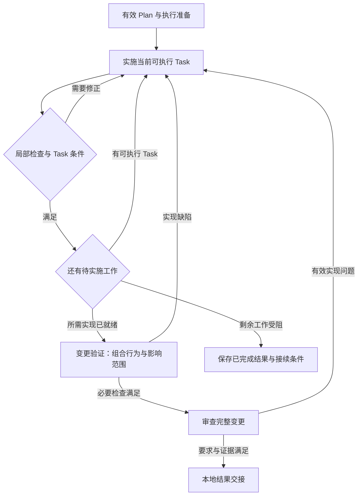

# AI SDLC 执行流程：Intent → Spec → Plan → 本地实现与验证

[总览与下一步](../../README.md) · 方法正文 · 三产物、步骤交接与文档归属

更新日期：2026-09-16。准备阶段固定三个步骤与三个主要产物：Intent、Spec、Plan；当前细化本地实施、验证、审查与结果交接。本文定义操作顺序，详细内容与交接判据见 [产物约定](sdd-artifact-contracts.md)，术语见 [词表](../../CONTEXT.md)。

项目知识组织沿用 [上下文方案](../knowledge/sdd-context-and-project-knowledge.md)，ADR 按 [选择、读取与采用流程](../knowledge/sdd-context-and-project-knowledge.md#import)从 Spec 开始进入工程工作；按需读取现状、交付后回写或恢复旧任务时，使用 [As-Is 实施指南](../knowledge/brownfield-as-is-implementation-and-reuse.md)。工程规范统一由 ADR 表达，Spec/Plan 的长期决定按 [ADR 演进规则](../knowledge/sdd-context-and-project-knowledge.md#adr-evolution)及时记录、采纳并回写。Intent 以业务来源为依据。

## 1. 整体流程与接入方式

各步由 Skill 定义操作与判断规则，Agent 执行推理和协作，脚本提供确定性检查与记录。全流程分工和首版实现范围见[实现机制分工](../tools/sdd-capability-implementation-map.md#matrix)。本地验证通过直接工具调用运行；Git hooks 作为后续 Git 操作的可选适配入口。

默认按步骤交接输入、产出、完成判断和未决事项，遵循[记录粒度](sdd-artifact-contracts.md#granularity)。Task 是 Plan 内的工作清单；局部验证继续执行，记录可汇总到步骤结果，不强制建立逐条 AC—Task—测试—运行结果关系。

```text
原始诉求、Issue 或业务材料
   ↓
Intent：明确意图 → intent.md
   ↓
Spec：形成规格 → spec.md
   ↓
Plan：制定计划 → plan.md
   ↓
本地实施：执行准备 + 按 Task 修改与局部验证 ↺
   ↓
变更验证：检查组合行为与影响范围
   ↓
审查与修正：按发现返回实施或上游 ↺
   ↓
本地结果交接：改动、证据、文档与 Plan 状态
   ↓ 按后续需要接续
本地提交
```

开始时先明确本次负责整项需求还是其中一部分。从原始诉求开始时依次形成三类产物；已有产物先核验来源、业务确认范围、修订与继续条件，补齐缺失的上游产物或引用，再从有效位置继续。只有 Spec 时，从可定位的来源整理或引用 Intent，由 BA 核对业务表述及确认依据，不能把实现细节反推为已确认意图。独立小变更采用三份简短产物。

### 按本次开发范围接入

1. 定位 BA 负责的 Intent、已有方案和原型，明确本次负责范围及已确认业务依据；Feature/Story 等已有名称可保留为来源标签。
2. 默认沿用一份 Spec/Plan；部分范围在相应章节和任务中标明。确需独立设计、验收或交接时，再拆出独立 Spec/Plan，共享有效 Intent 与公共方案。
3. Spec 明确可验证业务结果、边界和依赖，Plan 拆工程 Task；没有 Feature/Story 划分也可直接推进。工程拆分改变业务目标或交付承诺时，由 BA 协调相关决定。
4. 恢复时核验共享输入是否变化、依赖能力是否实际就绪。局部完成注明剩余范围，整体目标仍需组合验证。

完整复用、拆分和状态规则见[范围与复用约定](sdd-artifact-contracts.md#scope)。后续各节所称“本次变更”均指已明确的开发范围。

每步明确可推进范围与未决依赖，按已有用户授权和项目规则执行。业务确认与工程接受分别沿用有效依据；项目未规定时由本次工程负责人承担关键工程决定的接受责任，明确委托不转移最终责任，见[工程接受责任](sdd-artifact-contracts.md#acceptance)。记录未知项、调查与适用性是步骤内部工作；需要新的业务或工程决定时只暂停依赖该决定的范围。

<a id="loops-and-routing"></a>

### 闭环与阶段路由

按本项目采用的理解，Loop engineering 设计单 Agent 的调查、计划、执行、验证与停止循环；Graph engineering 将多个有明确职责的节点或闭环组合起来，定义各自的上下文、交接数据、路由，以及需要时的并行汇合。阶段前进与回退只是其中一部分。三份主产物与步骤名称保持不变，指定文章的解释及采用边界见 [调研与落地分析](../../research/method/loop-and-graph-engineering.md)。

每个闭环需要明确以下内容；初版写进相应流程或 Task，不要求引入独立调度平台：

| 内容 | 在本流程中的表达 |
| --- | --- |
| 启动与目标 | 用户发起的阶段或可执行 Task；采用的 Intent/Spec 修订与预期产出 |
| 输入与范围 | 相关 ADR、As-Is、源码和工具；可修改的产物、文件与已有授权 |
| 单轮动作 | 读取当前状态，完成有明确结果的一项调查、生成或修改 |
| 检查与反馈 | 实际结果、结构检查及必要语义审查；指出未满足项和证据 |
| 继续条件 | 本轮有新证据、有效修正或已解除的依赖，可以说明下轮将解决什么 |
| 停止与转交 | 达到交接条件；缺少决定或外部条件；持续无新进展；达到本次约定的时间、成本或轮次上限 |
| 恢复依据 | 输入修订、已完成工作、实际结果引用、受阻原因及下一步 |

Spec 的方案质量需要按要求和来源审查，不能仅凭章节齐全或评分通过结束；代码验证使用适合变更的检查与行为证据。对影响较大的判断可使用独立审查，但不要求每个步骤都启动另一个 Agent。修改验收条件或项目决定需要回到权威产物处理，不能为了让检查通过而静默降低要求。

速度和 token 成本优化以质量为前提，人工可以参与质量审核。达到时间、成本或轮次上限时，应如实交接已完成与未完成范围；不能通过降低质量要求、省略必要检查或把未完成标成完成来满足上限。配置优化的比较与采用遵循[质量优先的回归规则](../roadmap/ai-sdlc-plugin-roadmap.md#configuration-evaluation)。

阶段间的判定只决定下一动作，任务状态仍按 Plan 维护：

| 判定 | 下一动作 | 记录位置 |
| --- | --- | --- |
| 条件满足 | 进入下一步骤；任务完成后选择前置条件已满足的 Task | 当前产物交接结论或 Plan 状态；关联证据 |
| 当前产出有可定位缺陷 | 在当前步骤修正，再检查受影响部分 | 当前产物或 Task；相应 evidence 记录 |
| 上游目标、约束、事实或关键方案不成立 | 按第 10 节回到受影响的上游步骤，再复核下游 | 上游产物、相关引用与原结果适用性 |
| 缺少必要决定或外部条件 | 等待所缺输入，继续不依赖它的范围 | 当前产物未决项或 Plan 受阻原因 |
| 没有新进展或达到运行上限 | 停止本次运行，保存尝试、证据与接续条件；不标成完成 | 当前产物或 Plan 的交接；已有运行记录 |

是否继续运行，取决于是否有新信息、有效变化或明确可检验的新尝试。同一失败再次出现且没有新依据时，应重新诊断检查本身、实现或环境，避免原样重试。范围扩大或输入变化时，重新核验适用性；暂停不等于任务失败，也不等于成功。

恢复到一个步骤时，先核对该步骤的副作用是否已发生。例如提交或文件生成已成功但状态未写入，应确认实际结果再更新记录，避免重复执行。运行状态保存到既有产物与证据；未来宿主需要 checkpoint 时，它保存恢复指针，不另立一份权威任务清单。

**执行控制图允许回到先前步骤；Plan 内的任务前置依赖仍应无环。** 前者表达修正和重试，后者确保能选出下一项可执行任务。开放的技术调查可在节点内部灵活展开，固定需要遵循的交接边界即可。

### 专业节点、上下文与交接

采用多个节点时，按独立职责、输入和检查方式划分，例如现状调查、方案生成或审查；阶段、节点、Agent 和文档不是一一对应关系。一个 Spec 步骤可包含调查、生成与审查节点，最终仍维护一份 Spec。同一会话中的角色切换不视为已经隔离上下文。

每个节点明确职责、所需原文、工具、可写范围、产物和完成条件。独立审查使用新的上下文，从项目入口和交接引用重新加载必要材料；优先读取要求、适用 ADR、待审产物及其版本、实际代码或来源证据，再检查作者结论。不能只接收作者摘要，也不能为了保持上下文简短而省略判断所需依据。

跨节点交接的最小内容如下；复用现有产物和记录中的字段，运行工具可以组合这些引用，不要求每条边生成一份新文档：

| 交接内容 | 最低要求 |
| --- | --- |
| 对象与范围 | change ID、阶段或 Task ID、接收节点需要完成什么 |
| 版本与依据 | 输入产物修订、相关源码状态、必要原文和 ADR 的位置 |
| 结果与证据 | 已生成或修改的产物、可定位发现、实际检查结果及来源 |
| 未决与覆盖 | 已核验和未核验范围、缺失输入、假设及其影响 |
| 下一动作 | 通过、需要修正、返回上游或等待的建议及原因；按既定条件决定实际路线 |

建议先试点“执行节点 → 独立审查节点 → 修正”的小组合。审查输出可定位发现和证据，执行节点修正后交接新的修订；未发生变化的有效证据可以复用。比较漏检、返工和成本，质量收益足以覆盖新增协作成本时，再扩大节点拆分。

并行调查或审查时，预先列出分支对象、读取/写入范围和汇合条件。汇合者检查预期结果是否齐全、版本是否兼容、结论是否冲突；缺失或失败分支保留状态，不能从结果集合中静默丢弃。冲突按原文和实际证据处理，不能用多数意见直接覆盖。共享文件指定写入者；Plan 继续统一维护 Task 状态。

### 贯穿过程的记录

| 记录 | 保存内容 | 维护时机 |
| --- | --- | --- |
| Intent | 问题、目标、范围、业务决定、约束、BA 材料采用说明与开放问题 | Intent 步骤建立；目标、边界或采用的业务决定改变时修订 |
| Spec | 需求、AC、Design、证据与未决项 | Spec 步骤建立；具体要求或关键方案变化时修订 |
| Plan | 实施范围、文件落点、Tasks、依赖、验证与状态 | Plan 步骤建立；执行安排或结果变化时更新 |
| 本次变更上下文 | 公共仓库基线、事实与来源索引、调查入口；引用目标、决定与任务状态 | 默认在三份产物中记录；较长共享材料按需抽出 context.md |
| 验证与审查记录 | 检查对象、实际结果、发现及处理 | 实际检查后记录；修正后更新受影响结果 |

默认在 `docs/changes/<change-id>-<slug>/` 保存 intent.md、spec.md、plan.md。调查、附件与实际结果分别落在 research/、attachments/、evidence/；原始材料按需落在 sources/。完整落点与内容见 [统一文档体系](project-documentation-system.md#artifacts)。支持文件按实际活动创建，关键内容和任务状态各维护一处。

## 2. Intent 步骤：明确意图

**输入：** 业务部门诉求、BA 已有需求分析/流程/方案/原型、澄清与已有决定；相关项目入口、轻量现状和边界约束按需补充。方案和原型不是必需输入。先判断能否直接复用已有 Intent 与确认记录。

**职责：** BA 负责组织生成、维护并确认 Intent 的业务表述，Agent 辅助阅读、比较、提问和成稿；超出 BA 授权的业务决定沿用现有决策渠道，工程人员按需协助调查技术问题。工程调查与计划生成不代替业务确认。

**动作：**

1. 接收并阅读实际可访问的业务来源与 BA 成果，保留材料位置、采用版本及访问缺口。
2. 明确问题、影响对象、预期结果、范围、非目标与约束；已有充分内容直接采用，缺少时由 BA 澄清。
3. 整合 BA 已有或本步形成的业务设计、方案和原型，说明已确定的规则/交互，以及候选或示意内容；比较材料之间的重要差异。
4. 解决影响交接的关键业务歧义，沿用已有确认；ADR 从 Spec 开始导入。需要了解现状时可参考项目说明，涉及实现事实则保留证据或待核验项，将技术可行性问题交给 Spec，不以历史技术选型直接限制需求。
5. BA 组织形成 intent.md 并核对准确性、遗漏和范围，确认职责内业务内容；注明已确认版本/范围、依据、可交接范围与未决事项。已有确认直接引用，AI 草稿不自动视为已确认。

**产出与完成条件：** Intent 能说明谁的问题、目标、边界、业务决定与约束，接收者知道应读取和继承哪些 BA 成果；关键冲突已处理或隔离。技术可行性调查可交由 Spec 完成，已有确认不重复审批。生成细则与模板见 [Intent 约定](sdd-artifact-contracts.md#intent)。

## 3. Spec 步骤：形成规格

**输入：** 本次开发范围、当前采用的 Intent 及业务确认依据、BA 需求/方案/流程/原型，必要公共方案和外部依赖，相关 As-Is、仓库代码、ADR 及其引用的契约与规范和必要技术调查。

**动作：**

1. 按 Intent 选择参与仓库、模块和 Topic，读取相关 ADR 原文及前提，判断状态、范围和替代关系；记录提交、工作区与暂存修改，Submodule 按固定和实际版本分别核验。
2. 核实相关行为、状态、接口、数据、配置及测试，识别已有能力、兼容要求和关键未知项。
3. 读取并继承 Intent 所采用的 BA 成果，核对版本和适用范围，补齐场景、规则、异常边界、质量要求与可判断的 AC；充分的已有正文通过引用复用。已确认设计遇到冲突时显式处理，不静默改写业务决定。
4. 确定 Spec 内的 Design：复用和修改落点、关键机制与接口、取舍、风险和验证策略。决定方案是否成立的前提先调查。
5. 对照 Intent 检查目标承接，记录 ADR 的采用版本、适用原因、本次处理及在需求/AC/Design 中的承接位置。按需形成或演进长期决定 ADR，同步状态、索引和引用，形成 spec.md；冲突与例外有依据。若需改变目标、范围或硬约束，先修订 Intent，再调整规格。

**产出与完成条件：** Spec 的需求与方案有来源和事实依据；要求与 AC 可判定；关键技术前提足以支撑工作拆解。未决部分明确，不依赖它的范围可继续。具体内容见 [Spec 约定](sdd-artifact-contracts.md#spec)。

## 4. Plan 步骤：制定计划

**输入：** 当前 Spec 及其采用记录、Intent 中相关约束、适用 ADR 原文、实际代码/测试布局、执行环境与已有工作状态。

**动作：**

1. 检查 Spec 依赖的事实、ADR 是否仍有效，确认相关文件职责、真实路径与拟新增位置；按实际模块、路径和共享依赖补读执行规则。已在当前上下文读取且版本、范围未变的内容可复用。
2. 细化实施落点、局部实现与顺序，将代码、测试、配置、迁移、集成和必要文档工作组织为 Tasks。
3. 为每项任务明确输入、预期结果、范围、依赖、验证方法和完成条件；相关 ADR 定位到所需章节，验证命令及环境条件有实际依据。
4. 检查目标、需求、方案、适用约束是否有任务和验证承接，排除循环依赖和未协调的共享修改冲突。
5. 形成 plan.md；新发现的可复用工程约定按需形成 ADR，同步状态、索引和引用。若改变核心行为、共享接口或关键机制，先回到 Spec，再处理 ADR 与 Plan。普通任务顺序保留在 Plan，记录下一项可执行任务及受阻范围。

**产出与完成条件：** Plan 中的任务有清晰产出与验证安排，要求和关键设计工作有承接，下一项任务的输入与前置条件有效。具体内容见 [Plan 约定](sdd-artifact-contracts.md#plan)。

<a id="post-plan"></a>

## 5. 本地实施：接收 Plan，逐项生成与验证代码

Plan 之后先覆盖四项工作：**本地实施 → 变更验证 → 审查与修正 → 本地结果交接**。执行准备属于本地实施的入口检查，任务检查属于实施闭环；它们不增加主产物。当前终点是可定位的本地改动、实际验证与审查证据，以及 Plan 中的结果和接续位置。第 9 节保留本地提交的后续接入规则。



图中返回实施时定位对应 Task，涉及目标或关键方案的问题按第 10 节返回上游；任一阶段缺少必要条件或达到运行停止条件时，保存已有结果和接续位置。图表示阶段及结果流转，Agent 分工见第 5.3 节。

### 5.1 Plan 交给执行者什么

**输入：** 当前 Plan、其依据的 Spec/Intent、适用 ADR 原文、相关 As-Is 与源码、已有任务和检查结果。

| 必须拿到的内容 | 执行前确认什么 |
| --- | --- |
| 本次对象与依据 | change ID、Intent/Spec/Plan 修订及所需原文位置；本轮实施范围与已有授权 |
| 当前 Task | 清单位置或名称、目的、文件落点、必要依赖、验证方法与完成条件；公共信息继承 Plan |
| 仓库状态 | 原始基线、实际工作目录、相关已修改/暂存/未跟踪文件；哪些修改属于本次 |
| 工程规则 | 适用 ADR 条款、模块接口、测试与构建入口；检查实际读取内容及版本 |
| 执行环境 | 工具、锁定依赖、必要配置、本地服务和测试数据；缺失条件及补齐方式 |
| 已有结果 | 哪些检查已执行、针对何种状态；已知失败的证据、受阻范围和下一步 |

入口检查逐项处理以下问题：

1. **核对输入。** 重新定位必要原文，确认相关实现和约束仍支持 Plan。事实、接口或关键方案变化按第 10 节返回；普通命令、路径或准备事项调整 Plan。
2. **识别本地修改。** 记录已有工作，保留他人的修改；本次变更与原有修改混合时说明关联及范围。使用现有工作区或按项目需要隔离工作，不把工作区干净、创建分支或提交代码设为通用前置条件。
3. **确认验证能运行。** 从仓库说明、脚本、配置和锁文件确定真实命令。必要时运行最小相关检查确认环境与既有失败；不默认先跑全仓测试。没有基线证据的失败先标为待归因。
4. **选出可执行 Task。** 前置结果和必要环境均满足才开始；缺失项由准备工作解决或记录受阻。不能因为另一个范围受阻而停止所有独立任务。
5. **记录当前输入状态。** 复用 Plan 或共享 context 中的基线位置；每次实际检查另外绑定当时的受检状态。Git HEAD 不能独自代表包含未提交修改的工作区。

**输出：** 可执行 Task、确认过的输入与环境、相关基线和受阻项。准备过程中产生的实际工具检查写入 verification.md；准备安排仍由 Plan 维护。

### 5.2 单个 Task 的实施闭环

| 顺序 | 动作 | 输出与下一步 |
| --- | --- | --- |
| 1. 理解任务 | 读取 Task 关联的 Spec/AC、ADR、目标文件与相关测试；确认要改变及保留的行为 | 对本任务输入与完成条件形成一致理解；缺口返回对应产物 |
| 2. 确立检查 | 复用适合的测试；行为变化补有意义的场景、边界或回归检查 | 检查可以识别预期行为，且有明确判据 |
| 3. 实施修改 | 按现有接口与项目约定生成或修改代码、测试、配置及必要文档 | 可检查的本地差异；拟新增文件进入范围记录 |
| 4. 局部验证 | 运行任务要求的检查，阅读真实输出，核对 diff 和范围 | 有代码状态、命令、预期/实际结果的证据 |
| 5. 处理发现 | 根据证据诊断并修正；按问题归属决定局部重试、上游修订或等待 | 有明确理由的下一轮动作 |
| 6. 更新进度 | 核对任务完成条件，更新 Plan；实际检查可共用步骤验证记录，特殊问题单独说明 | 完成当前 Task，或保留进行中/受阻及接续信息 |

对缺陷修复，优先形成能复现缺陷的检查，再修复并确认检查通过；行为新增可逐个场景进行测试—实现—修正。是否采用严格 TDD、需要哪些检查遵循项目约定。文档或其他低影响修改采用相应检查，不为增加测试数量编写无意义的测试。

不因测试通过就默认要求已经覆盖。检查应验证可观察行为；Mock 或本地替身的结果只证明所覆盖的边界。修复过程中如需改变 AC、共享接口或关键机制，先回到对应 Spec/Intent，不能通过删除断言、跳过必要检查或降低标准来消除失败。

<a id="reproduction-test-correction"></a>

#### 缺陷复现检查的保护与更正

保护对象是本次修复用于判断缺陷的有效复现检查及其关键判据，包括相关断言、样例、预期结果和必要测试配置。先保留采用版本与需求依据；不能仅因实现未通过就删除或削弱检查。保护不等于锁死所有测试文件，普通功能开发按项目约定新增和调整测试即可。

发现复现检查可能写错时，按下表处理：

| 情况 | 处理 |
| --- | --- |
| 检查符合有效需求，实现不符合 | 修代码，保留能暴露缺陷的判据 |
| 检查与有效需求冲突 | 提出更正、原检查的问题及 Intent/Spec 依据，由工程负责人或其明确授权的独立复核者确认后修改 |
| 需求本身有歧义或需要改变 | 返回 Spec；涉及业务目标、范围或决定时交 BA 处理，再更新检查和实现 |

修复 Agent 不能以自己的更正建议替代独立复核。复核可以复用已有审查环节和授权，不为每次正常测试修改增加审批；缺少该项确认时保留更正建议，其他不依赖它的已授权工作可以继续。项目要求执行前限制时，按[必要动作限制](../tools/sdd-capability-implementation-map.md#action-controls)保护检查，不能仅靠事后发现测试被改动。

在现有验证/审查记录中保留旧、新检查版本、需求依据、确认来源及重跑结果。存在真实代码缺陷时，核验更正后的检查在旧实现上暴露缺陷、在修复后通过，无法重现则注明未验证范围；如果实际只有测试写错、代码本来就符合需求，应记录为测试更正或误报，不能为了制造失败而修改正确代码。检查版本变化后，旧通过结论只在仍适用的范围复用。

**任务级完成条件：** Task 规定的产出与相关检查满足要求，结果可定位，没有阻碍其依赖者继续的未解决问题。代码已生成但必要检查未完成，任务保持进行中或受阻。Task 完成不等于整项变更完成，后续审查发现问题时重新打开受影响任务。

任务状态只在 Plan 维护，状态语义见[产物约定](sdd-artifact-contracts.md#tasks)。首版按依赖顺序串行实施；并行是后续按独立读写范围引入的能力。

### 5.3 节点怎样分工和交接

首版先稳定一个实施闭环，再试点独立审查。下面是逻辑职责；验证能力可以由执行节点或主 Agent 调用，不要求另建一个专用 Agent。

| 职责 | 读取与判断 | 写入与返回 |
| --- | --- | --- |
| 协调职责，由主 Agent 兼任 | 当前输入、Task 依赖与状态、检查和审查结果 | 统一更新 Plan，选择下一动作，组合必要输入和证据引用 |
| 执行节点 | Task、原始要求、适用 ADR、当前代码和检查反馈 | 修改所属代码/测试/配置/必要文档，返回修改范围、实际结果与未决项 |
| 验证能力 | Spec/AC、Plan 检查安排、准确的受检状态与环境 | 执行命令或操作，生成实际结果；按证据约定写入 verification.md |
| 审查节点 | 独立读取必要原文、完整受审差异及验证证据 | 输出可定位发现和结论到 review.md；由执行节点处理代码修正 |

同一时间为共享文件和记录指定一个写入者。审查期间受审代码应保持稳定；若发生相关修改，审查者重新定位版本并复核受影响范围。自查应注明自查；独立上下文审查是首版推荐试点，具体采用方式记在 Plan 和 review.md，按项目要求判断是否充分。

本地交接沿用第 1 节字段，至少包括：**Task/change ID、输入修订、受检代码状态、变更文件与产物位置、检查结果引用、未决项、建议下一动作**。不依赖完整聊天记录交接，也不另外复制一份权威任务清单。

<a id="local-verification"></a>

## 6. 变更验证：检查多个 Task 组合后的结果

**输入：** 已完成任务的组合实现、当前 Spec/AC 与 Design、相关 Intent/ADR、Plan 的覆盖和检查安排、任务级证据及执行环境。

### 6.1 验证哪些内容

| 层次 | 要回答的问题 | 适当的检查例子 |
| --- | --- | --- |
| 工程有效性 | 修改是否满足项目执行要求 | 适用的格式、静态检查、类型检查和构建 |
| Task 局部行为 | 单项工作是否满足自身完成条件 | 单元/组件测试、针对性回归、配置或文档检查 |
| 组合行为 | 多个修改一起工作是否满足 AC | 本地集成/端到端场景、接口契约、状态与数据一致性 |
| 影响与兼容 | 本次变更是否破坏相关既有能力 | 受影响回归、兼容路径、迁移、适用的权限与异常场景 |

这是一张选取检查的表，不要求每项变更执行所有类别。采用哪些检查由 Spec、Plan、ADR 及实际影响决定；关键验收条件必须有支持结论的证据。

按以下顺序执行：

1. 对照 Spec 的验收条件和适用约束，读取 Plan 的验证安排，识别尚未覆盖的关键场景和组合行为。
2. 核对已有检查结果对应的代码、输入和环境是否仍适用；沿用有效结果。
3. 在当前组合状态运行缺少或失效的必要检查；修复时返回实施，必要时返回上游。
4. 汇总本步骤的实际检查与结论，说明覆盖范围、未执行项及原因，再交给审查；仅对需要解释的问题补充具体 AC 或条款引用。
5. 多仓库或子模块变更记录实际版本组合；各仓库单独通过不代替组合行为验证。

### 6.2 什么才算有效证据

验证记录采用[统一文档体系的证据字段](project-documentation-system.md#artifacts)，首次实际检查后写入 `<change>/evidence/verification.md`。最低应能回答：

- **检查什么：** 本步骤的变更范围、关键场景与采用的 Spec；需要说明特定问题时再定位具体 AC、ADR 条款或 Task。
- **针对什么状态：** 各仓库基线、相关未提交差异和未跟踪文件；受检源码、测试、配置及所采用输入的可定位版本或内容指纹。
- **怎样检查：** 实际工作目录、命令或操作、必要环境与测试数据；不要写入凭据值。
- **实际发生什么：** 检查与实际结果、通过/失败/未执行、时间及必要报告；需要区分多次运行时沿用工具 run ID 或其他定位，不强制为每次尝试生成记录。
- **还有什么限制：** 未覆盖或不适用范围及理由、外部前置条件、既有失败证据。

可在原有记录中给受检状态一个引用标识，并保留足以复核差异的文件或报告。未跟踪的新代码和生成配置也属于受检对象；只记录 HEAD、只贴终端末行或只勾选 AC 都不足以定位结果。

Spec/Plan 保存验证安排，verification.md 汇总步骤的实际结果并引用已有报告，Plan 通过链接定位。默认保留当前适用结论、未解决问题和必要的失败/修复依据，不要求保存每次正常尝试；需要比较不同轮次时再保留其范围与记录。

### 6.3 结果如何判定与复用

- **通过：** 在记录的条件下，实际观察符合判据。
- **失败：** 检查已执行且不符合判据，记录实际失败并诊断。
- **未执行：** 缺环境、数据或其他条件导致检查未发生，记录原因及接续要求。

没有证据时不能把失败归为既有问题。环境错误、测试自身错误和实现错误先诊断再路由；同一失败没有新依据时，不原样反复重跑。

存在有证据支持的既有失败时，按项目规则判断它是否妨碍本次要求的验证；实际失败仍记录为失败。只有能够证明其不影响本次必要完成条件，才可继续形成相应范围的完成结论。

源码、测试、相关配置、要求、适用 ADR 或环境输入变化时，按影响复核并重跑必要检查。仅追加运行记录或更新 Plan 进度，不使无关代码检查自动失效。有效检查通过后，不因换了节点或流程进入下一节就重复执行。

**输出与完成条件：** 本次必要检查均有实际结果和覆盖结论，满足条件的范围可以进入审查。若关键条件需要远端服务或其他当前无法验证的环境，则记录“本地已执行哪些检查、哪些条件仍待验证”；不能将本地替身测试推断成真实外部集成已经成功。审查可提前进行，但整项变更尚不能据此宣布完成。

<a id="local-review"></a>

## 7. 审查与修正：判断实现是否满足要求

**输入：** 当前 Intent/Spec/Plan、适用 ADR 原文、代码基线与完整受审差异（含相关新增文件）、验证记录及未决项。审查者按需读取周边代码和相关契约，不能只检查执行者提供的片段。

### 7.1 验证与审查的分工

验证给出实际运行、操作或静态检查的结果；审查对照要求和代码判断遗漏、偏差及未被测试揭示的问题。测试通过不能代替审查，审查意见也不能代替未执行的必要测试。

| 审查方面 | 具体判断 |
| --- | --- |
| 意图与范围 | 是否承接 Intent，是否遗漏硬约束或扩大范围 |
| 要求与方案 | Spec/AC、Design 是否落实；有没有未经处理的行为或机制变化 |
| 项目符合性 | 是否遵循适用 ADR 和接口约定，已有模式是否适合本次使用 |
| 正确性与影响 | 异常、兼容、共享依赖以及适用的状态、权限、并发或数据问题 |
| 检查充分性 | 测试是否覆盖关键行为，断言是否有效，替身边界和未验证范围是否如实说明 |
| 产物一致性 | 最终实现、Spec、Plan、文档和证据是否对应同一有效状态 |

独立审查从必要原文与实际代码开始，使用单独上下文；作者的说明可作为线索。首版默认在完整本地变更上做一次审查；高影响 Task 可以在 Plan 中明确提前审查点，无需给每个微小修改都增加一个 Agent。

### 7.2 发现怎样交回执行者

审查后写入 `<change>/evidence/review.md`。每个实质发现记录：

| 字段 | 用途 |
| --- | --- |
| 稳定发现 ID 与位置 | 在修正和复查时指向同一个问题，包含文件/符号及受审状态 |
| 关联要求与证据 | 指向 AC/ADR/关键方案或具体失败场景，解释为什么成立 |
| 影响与处理建议 | 区分影响完成条件的问题、一般改进与需要上游决定的问题 |
| 处理状态与依据 | 待处理、已修正待复查、已核验解决；不采纳或延期时记录理由和适用的项目依据 |

无发现时注明范围、方式与依据；“未发现问题”只描述已查范围，不证明未执行的行为检查已通过。

协调职责核对发现是否成立，再决定下一动作。有效实现问题交回原执行节点；不成立的意见保留解释与证据，不能机械修改。需求或关键方案问题按第 10 节处理；有必要的新工作进入 Plan，不通过审查意见隐式扩大任务范围。

### 7.3 修正后怎样结束闭环

1. 执行节点修复相关实现，记录受影响文件和要求；需要时重新打开相应 Task。
2. 重跑受修改影响的局部与组合检查，追加实际证据。
3. 审查者核对原发现及修改涉及的周边影响，更新发现状态与受审版本。
4. 已满足且未受影响的检查和审查结论可以复用；停止条件沿用第 1 节。

**输出与完成条件：** 影响本次要求正确性和必须遵循约定的发现已解决，其他发现按项目约定处理，相关复验与复查有证据。延期或不采纳不能静默豁免未满足的硬约束。缺少必要决定时保留受阻范围，继续不依赖它的工作。

<a id="local-handoff"></a>

## 8. 本地结果交接：核对最终改动与有效证据

**输入：** 修正后的本地实现、有效验证与审查记录、当前 Plan/Spec、实际工作区状态，以及需要同步的 ADR、Topic 和使用说明。

### 8.1 收尾动作

1. 核对最终源码、测试、配置及必要文档是否齐全，说明本次改动和原有修改的边界。受审版本之后有变化时，复核受影响的检查与发现。
2. 同步契约、使用说明及需要长期保留的决定。ADR 沿用既有采纳与演进规则；Spec/Plan 中已产生的决定及时维护，不等收尾才处理。
3. 将已核验的稳定事实更新到受影响 As-Is Topic，注明仓库状态；未提交实现只能作为该工作区版本的事实，不能写成默认分支或已部署系统的事实。
4. 核对要求—任务—实现—证据的承接，Plan 引用验证与审查记录，列出尚未满足条件和接续位置。
5. 写明本地结论和完成范围。记录本身的追加不触发无关代码测试；影响契约、行为或执行方式的文档修订仍需检查相关内容。

### 8.2 交付给下一位执行者什么

| 产出 | 落点 | 至少包含什么 |
| --- | --- | --- |
| 本地实现 | 仓库既有源码、测试、配置和必要文档位置 | 可定位差异与新增文件，明确采用的工作区状态 |
| 任务结果与接续 | plan.md 的状态与交接部分 | 已完成/受阻任务、本地结论、结果引用、剩余事项、下一动作 |
| 验证证据 | evidence/verification.md；原始报告按需进入 evidence/runs/ | 检查对象与状态、操作、预期/实际结果、覆盖和限制 |
| 审查证据 | evidence/review.md | 受审范围、方式、发现与处理、复查结果 |
| 项目知识更新 | 已有 ADR/Topic/契约/说明 | 已采纳决定或已核验事实及其来源版本 |

此时的交接摘要保存在 Plan，不新增 implementation.md、独立 Tasks 或另一份测试结果清单。delivery.md 留给后续实际提交或交付活动；其存在不是本地完成的条件。

**“本地完成”的判据：**

- 本次约定范围内的 Task 满足各自完成条件；
- 必要局部、组合及影响检查通过，证据适用于当前本地状态；
- 必要审查和修正完成，没有阻碍要求正确性的未解决发现；
- 必要配套文档已同步，修改范围及下一步可复核。

未执行的必要检查、未解决的阻塞发现或前提变化会阻止上述结论。可以交接部分成果，但要明确“已完成的本地工作”和“仍待验证/受阻的范围”。本地完成不推断已经提交、合并、发布或变更关闭。

## 9. 后续接续：提交、团队交付与发布

本节为后续选择提交及团队交付时的目标设计；第 5～8 节的本地代码生成与验证不以创建 Commit、PR 或发布为完成条件。进入相应操作按已有用户授权与项目规则处理，本节不表示相关连接已经实现。

Git hooks 复用可独立运行的检查脚本，按本次候选快照执行，保留项目已有安装方式；不在 hook 内生成代码、采纳 ADR 或启动审查闭环。适用事件、部分暂存与结果边界见[Git hooks 接入约定](../tools/sdd-capability-implementation-map.md#hooks)。

### 9.1 提交准备

1. 确定需要纳入本次提交的代码、测试、配置和文档，任务数与 Commit 数无需一一对应。
2. 按文件或修改块暂存，区分已有暂存项与混合修改，审阅完整暂存 diff。
3. 核对验证证据是否适用于拟提交内容；部分暂存或依赖其他未提交代码时，先拆分或对拟提交快照补做相关验证。
4. 准备准确概括行为变化且符合项目惯例的 Commit Message。

### 9.2 创建提交并核对

1. 执行项目规定的提交前检查和 git commit，遵循已有 Hooks 及约定。
2. 检查失败时修复并复验；Hooks 修改文件时重新核对 diff、暂存范围和受影响结果。
3. 提交成功后核对 Commit、实际文件与差异，以及剩余工作区和暂存状态；保留其他工作的修改。
4. 在 evidence/delivery.md 或映射系统记录实际提交、有效证据与剩余事项。结果在提交后产生，不要求该提交包含自己的 hash 记录，也不为此循环修改提交。

多个仓库分别准备和提交，记录完整版本组合；各自的 Commit 不构成跨仓库原子提交。涉及 Submodule 时先完成子仓库提交，再记录父仓库的引用变化，验证最终组合并提交父仓库。

<a id="team-delivery"></a>

### 9.3 团队交付：自主推进到 PR 就绪

本文 PR 也包括当前团队称为 MR 的合并请求。项目沿用原名称；就绪、审核批准与实际合并仍分别判断。

**输入：** 已接受范围内的 Spec/Plan、本地结果、实际工作分支与目标分支、可访问的证据、项目 CI/审查规则，以及覆盖本次远端操作的授权。首次接入先核验[动作限制及降级](../tools/sdd-capability-implementation-map.md#action-controls)，外部记录沿用[权威映射](project-documentation-system.md#external-authority)。

1. 在已授权的工作分支提交并推送，创建或更新对应 PR，关联采用的产物版本、有效验证与审查证据及剩余限制。
2. 对有效审查意见和失败检查诊断、修正并复验。影响目标或关键方案时返回原权威产物；不通过忽略有效发现或放宽必需检查使 PR 就绪。
3. 每轮根据实际 PR 版本及检查对象复核证据。新提交、目标分支变化或合并组合变化使相关结果需要复核；旧分支上的通过结论不能直接代表当前待合并结果。
4. 所需检查、发现处理和项目合并前条件满足后，记录“PR 就绪、待代码负责人批准”。实现 Agent 的自查、独立 Agent 审查和 CI 成功均不替代代码负责人的批准。
5. 代码负责人批准后，由项目已有授权的人员、Agent 或流水线执行合并并核对结果；后续相关变化按项目规则复核批准是否仍适用。Agent 不自行授予批准，也不以直接更新受保护主分支绕过该条件。

代码负责人可与工程负责人由同一人兼任，其批准仍绑定实际对象和范围。PR 就绪、已批准、已合并分别记录实际事实。远端结果进入原 PR/CI 系统，delivery.md 引用实际版本、检查和批准；Plan 保留接续位置，不复制远端评论和检查清单。

### 9.4 环境分级与发布交接

| 环境 | 默认自主范围 | 继续条件 |
| --- | --- | --- |
| 开发/测试 | 项目可以预授权 Agent 或流水线自动部署、验证 | 明确目标环境、制品及操作范围，必要检查和权限机制有效；没有预授权时先取得相应依据 |
| 生产 | Agent 准备发布对象、检查、变更说明、回滚路径和待办 | 发布负责人对本次发布授权后才能执行；范围外变化重新复核，不从 PR 合并推断生产授权 |

发布负责人和代码负责人可以由同一人兼任，批准合并与授权生产发布仍是不同含义。发布准备需绑定实际制品和目标环境，注明配置/迁移顺序、发布后验证方式、回滚目标与操作条件；优先复用现有流水线与权限系统。

执行后核对实际运行版本和发布后检查，分别记录成功、失败或尚未验证。失败时按已具备的发布/恢复授权转交或执行恢复，保留日志和影响范围；事故触发的自动恢复权限在运行维护约定中另行明确。回滚路径应在适合的非生产环境演练，不能仅凭存在回滚命令宣称可恢复。

交付证据记录目标环境、实际制品、授权来源、发布/回滚操作及核验结果；继续引用已有交付系统，不新建同义发布台账。无法满足必要控制时，只暂停相应操作，按动作降级规则交接。

<a id="mr-closeout"></a>

### 9.5 当前团队的 MR 与 Colla 收尾场景

已确认的业务场景是：BA 生成 Intent，经 MCP 同步到 Colla 管理进度；MR **实际合并成功**后触发收尾。审核批准、CI 成功、MR 被关闭但未合并，都不能代替实际合并。产物与状态归属见[Colla 映射](project-documentation-system.md#colla-mapping)。

这里的事件来自代码托管平台，具体采用平台事件通知还是流水线入口，需在接入时核验；不能由本地 Git hook 推断远端 MR 已合并。当前尚未指定平台、接口及状态字段，也未配置任何 hook。

**输入与触发约定。** 接入时明确仓库与目标分支、事件来源校验、MR 标识、实际合并版本、对应 Intent/Plan 范围、Colla 事项，以及可更新状态和可清理分支的授权。事件仅提示需要核对状态，处理者重新读取平台实际结果、有效产物与关联；事件中的评论或描述不构成新增指令或权限。未能确定版本、范围或关联时先记录待核对，不猜测关闭对象。

| 收尾对象 | 处理与完成条件 |
| --- | --- |
| 本次 MR 交付范围 | 记录实际合并版本与有效证据，更新本次范围的进度；必要检查或验收仍缺失时保留待办 |
| Colla 对应事项 | 一份 Intent 对应多个 MR 时汇总全部范围；只有全部范围完成且项目要求的验收条件满足后才关闭。项目要求发布或业务验收时，合并不能代替这些条件 |
| Intent 与 Plan | “关闭 Intent”是标记完成/归档并保留正文和原路径，引用 Colla 实际状态与交付证据；Plan 保留工程结果与剩余事项，不再维护另一份独立的整体状态 |
| 本次源分支 | 只清理已合并、没有遗留工作且没有其他使用需求的源分支。删除前再次检查实际分支版本，并将删除绑定已核对的版本，采用平台支持的条件删除或可验证的写入排他机制，防止检查后又有新提交。出现版本变化、无法证明内容已纳入目标，或平台无法保证这一条件时保留分支交人工处理。保留合并版本与关联，不连带删除本地工作区或其他分支 |

**多对象收尾与失败。** MR、仓库文档、Colla 和分支不是一个原子操作。先保留可定位的版本、关联与证据，再逐项核对和执行；分别记录已合并、已更新、已归档、已清理或待同步。Colla 更新失败时保留候选状态和待同步原因，不能宣称整体已同步关闭；合并事实继续有效，不因为写回失败自动撤销合并。

**重复、乱序与并发。** 用项目、MR、实际合并版本及收尾动作识别已经完成的工作，优先复用平台原生事件/任务标识和现有交付记录。收到重复或过期事件时先读实际状态，只补未完成动作，不重复生成事项或删除分支；同一 Intent 的多个 MR 并发收尾时，采用已有串行化或条件更新机制重新汇总。无法可靠处理冲突时转为待人工核对，不把“最后一条事件”当成“全部范围完成”。

**中断恢复与文档写回。** 重试先确认上次动作是否实际成功，再基于当前权威修订继续。若归档标记需要在合并后更新仓库，走项目已有受控文档更新路径，引用已发生的合并；不重写已合并提交来补写它自己的结果。该文档更新不得重复触发同一业务范围的关闭。失败及下一动作留在既有流水线/交付记录，由工程负责人或其委托者接续，不另建通用运行台账。

上述为 MR 收尾的目标流程，实际接入仍需核验平台能力与适用授权。其他事件自动启动 Spec、Plan、实施或生产操作，需要项目另行配置入口、范围与已有授权，不能由“接入了 hook”推断整个生命周期可自主推进。

<a id="operations-feedback"></a>

### 9.6 后续运行维护：从问题信号回到变更

当前生产环境没有告警，也没有已确认的自动恢复方案。以下定义后续扩展的工作交接；实际接入条件见[路线图第 7.6 节](../roadmap/ai-sdlc-plugin-roadmap.md#operations-extension)。未具备的监测、扫描、值班及恢复能力不得计为已经运行。

| 环节 | 输入、责任与结果 |
| --- | --- |
| 接收与分流 | 从选定的人工反馈、运行监测或定期扫描取得问题，保留时间、来源、服务/版本、影响和证据。沿用既有事件/工单记录，由明确的运行或值班负责人判定优先级、重复关系和调查范围 |
| 调查 | Agent 在已授权可读范围内整理日志、指标、近期变更及复现证据；区分已核实事实、原因假设与未知项，给出下一项可验证判断。缺少数据或访问条件时记录缺口，不凭仓库代码推断生产状态 |
| 处置 | 沿用实际具备的操作权限；当前没有生产自动恢复授权。没有适用依据时只形成建议并交运行负责人决定。需要代码或需求变更的，经 BA 接入或修订 Intent，回到 Spec/Plan、验证、审查及发布流程 |
| 恢复确认 | 处置后核对实际版本、受影响行为及约定观察期内的结果，由负责该事件的人确认恢复。命令执行成功、MR 合并或工单关闭本身不证明业务已恢复；未恢复则继续调查或升级 |
| 复盘与回写 | 将原因、有效/无效处置及遗漏落实到修复 Intent、项目规则/As-Is、相关操作说明或 Agent 回归案例；每项后续工作复用既有负责人和事项关联。恢复状态与后续改进完成状态分别保留 |

扫描是另一种问题入口：接入前由项目负责人明确仓库/分支或制品范围、工具与规则版本、运行频率、报告位置、发现分流责任及处理时限。先复用已有扫描器和 CI/调度；发现进入同一核实、处理与验证流程。修复后的结果需复验；判为误报、重复或不适用时保留依据、处理人和适用版本，相关代码或规则变化后重新评估，不能永久静默忽略。

用于生产自动处置的触发条件、操作清单和恢复授权仍留待实际场景决定。后续评估必须覆盖漏报/误报、调查准确性、升级及时性与恢复结果，并沿用质量优先原则；不能仅按自动关闭数量或 token 节省判断效果。

## 10. 发现变化时回到哪里

返回粒度以受影响部分为界，其他仍有效的事实、产物和验证结果可以继续复用。

| 发现的问题或变化 | 返回位置 | 同步处理 |
| --- | --- | --- |
| 问题、目标、范围边界或发起者硬约束改变 | Intent | 更新来源与决定，复核 Spec、Plan 和相关结果 |
| 边界内的具体行为或验收条件有误 | Spec / 需求 | 复核 Spec 内相关 Design，再调整 Plan 的 Tasks 和验证覆盖 |
| 现状事实过期、依赖版本变化、新增参与仓库 | 引用该事实的 Intent / Spec / Plan 步骤 | 复核事实和规范适用范围，再判断下游影响 |
| ADR 决定、条款、状态、范围、生效条件或替代关系变化 | Spec/Plan 的采用记录与受影响工程内容 | 关键方案从 Spec、执行细则从 Plan 开始复核；保留原依据。需改变业务承诺时由 BA 协调决定后修订 Intent |
| 接口、模块边界、数据设计或兼容方案需要改变 | Spec / Design | 修订技术方案，再在 Plan 步骤调整相关任务与验证安排 |
| 文件位置变化、任务遗漏、执行依赖不成立 | Plan / Tasks | 核实是否仅为拆分问题，再调整任务；涉及方案时复核 Design |
| 普通代码错误或实现未满足已明确要求 | 实现 | 修复并重跑受影响检查 |
| 检查环境或测试数据不足 | 执行准备或变更验证 | 补齐条件；按实际状态保留未验证项 |
| 文档与最终实现不一致 | 本地结果交接及所属任务 | 同步文档；影响行为、契约或要求时复核相应验证 |
| 后续提交时暂存范围错误 | 提交准备 | 整理提交内容，核对验证证据是否适用 |

更新上游记录时，标明受影响的需求、设计、任务和验证结论。此前已完成的任务若因变化不再满足条件，应重新打开，不能只改说明而保留过期的完成状态。

## 11. 换会话或换 Agent 时如何继续

接续工作先定位 Intent、Spec、Plan 的当前版本、本次变更上下文、当前阶段产物，以及待执行任务直接依赖的材料。

恢复时检查三件事：

1. 当前仓库及工作区状态与记录相比发生了什么变化？
2. 这些变化是否影响当前任务的前提、规范或已有验证结果？
3. 下一项可执行动作是什么，满足什么条件才算完成？相关接受依据和委托是否仍覆盖本次范围？

确认后从有效的最近阶段继续。变更上下文的活跃期仍覆盖后续审查和最终验收；本地完成后保留 Plan 的交接与证据，后续实际提交或交付时增加相应记录，待变更实际关闭后再归档。
