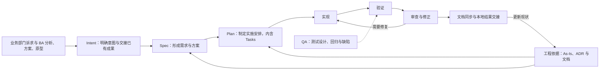

# AI SDLC 工具套件：产品设计与插件路线图

[总览](../../README.md) · [行动路线图与当前进度](action-roadmap.md) · 产品规划草案

更新日期：2026-09-16。状态：产品设计草案。本文沿用已确定的方向：以 AI-native SDLC 组织整体能力，以 Intent → Spec → Plan → 实施与验证为开发主线，包含 BA 业务材料到 Intent 的基本交接，配套项目知识、文档维护和工具初始化能力，后续增强 BA、QA 专业能力；先定义通用流程与产物约定，暂不绑定具体 Agent。

**当前试点落地方式已具体化：** 在 Claude Code 中验证“原版 Superpowers + 独立项目上下文 Hook 插件 + 项目知识入口配置”。宿主无关是核心方法的设计目标，不表示首个试验宿主仍待选择。行动、依赖和状态统一见[行动路线图](action-roadmap.md#a4)；当前处于部分协议验证阶段，完整流程尚未通过。

**2026-09-17 修正：** H1 已有部分诊断证据，Claude 运行验证转到用户另一台机器。先使用项目级 Hook 配置验证功能，独立插件是按分发需求采用的包装方式，不要求包含 Skill。以下目标能力保持；涉及首次打包的工作可延后至 M2/A7，不作为 M1 本地闭环的硬前置。

术语以 [AI SDLC 词表](../../CONTEXT.md)为准：准备阶段按 Intent、Spec、Plan 三个步骤组织，分别形成三份主产物；Design 属于 Spec，Tasks 属于 Plan。

设计或实现各生成能力、检查产物是否足以支持下一步时，读取 [Intent、Spec、Plan 产物约定](../method/sdd-artifact-contracts.md)：其中集中定义用途、直接输入、必要内容及交接条件。

## 1. 产品定位与推荐路线

**建议沉淀为可通过插件交付的工具套件：通用开发流程核心 + 共用支撑能力 + 角色扩展 + 宿主适配。** 工作名为 `AI SDLC`，正式名称和插件标识在发布准备阶段确定。

核心服务对象首先是开发者和技术负责人，并覆盖 BA 向开发交接业务成果的入口。首版支持一次变更从明确意图、形成规格、制定计划，到本地实现、验证、审查和结果交接，并能在中断或前提变化后继续；本地提交保留为后续接续。Intent 由 BA 整合目标、边界、业务决定及已有需求/方案/原型，Spec 结合项目依据形成可实施的需求与方案，Plan 展开实施工作。

**目标设计范围与首版交付范围分别维护。** 2026-09-16 已确认补齐全生命周期的目标设计，包括团队交付、治理与生产维护；首版仍保持上述本地 MVP 边界。补充约定分别标明当前必需、团队化前必需和后续扩展，设计覆盖不自动成为首版实现承诺。九项缺口的设计处理与保留边界见[对照审计的覆盖结论](../../research/method/anthropic-playbook-gap-audit.md#resolved-coverage)。

产品有三种可选组织方式：

| 方式 | 优势 | 代价 | 建议 |
| --- | --- | --- | --- |
| 逐个发布独立技能 | 单点交付快，方便实验 | 上下文、产物和状态约定容易分散 | 用于早期试验单项能力 |
| 一个核心包，内部按职责分层 | 能完整试用，产物约定集中维护 | 需要控制入口和共享逻辑的边界 | 保留为确有统一包装需求时的选项，不作为当前前置条件 |
| 原版方法插件 + 独立上下文扩展 | 项目知识可插拔，保留上游方法文件 | 需分别验证宿主事件、兼容版本及流程差异 | **当前试点路线**；先完成最小扩展，再验证完整主线 |
| 多个角色插件 | 不同角色按需安装，发布节奏独立 | 增加版本兼容和跨包调用成本 | QA/BA 专业扩展成熟后再拆分 |

**先验证完整开发流程，再扩展使用频率和角色覆盖。** As-Is 是共用能力，随开发主线一起验证价值。第一版 As-Is 仍限定为仓库内可验证信息；Intent 已可引用外部业务材料，但这些材料表达诉求、业务观察或决定，不自动证明仓库实现现状。

**实现采用复用优先路线。** 当前依据[工具选择](../tools/existing-tools-reuse-plan.md)：OpenWiki 已获用户试用认可，codebase-memory-mcp 已排除，检索沿用 Codegraph 或原文读取。A3 只比较 OpenSpec / Spec Kit，结果保留；最新实施路线转入 Superpowers 上下文接入及完整流程验证。按[正式验证方案](../superpowers/plans/2026-09-17-a4-context-validation.md)先比较项目规则与额外 Hook；只有质量证据和实际分发需要支持时，才按[候选设计](../tools/project-context-hook-plugin-design.md)打包有限扩展。不复制上游方法，不要求先自建通用流程核心。

插件负责包装、发现与接入。流程规则、项目数据和验证逻辑保持可迁移。例如 Codex 官方将插件定义为可打包技能和 MCP 能力的安装单元，并建议在需要打包相关流程、分享或团队分发时采用插件；这支持将插件作为交付方式，但不决定本产品的流程设计。[官方插件说明](https://learn.chatgpt.com/docs/build-plugins)

## 2. 产品能力地图



贯穿上述流程的共用能力还有：项目初始化、工具检测与配置、变更状态、证据引用、任务恢复和上游变化后的影响复核。

### 2.1 四层职责

| 层次 | 负责什么 | 产出 |
| --- | --- | --- |
| 通用流程与产物约定 | 阶段输入输出、完成条件、引用关系、状态和变更影响 | 可供不同 Agent 执行的流程及数据约定 |
| 可复用能力实现 | Agent 操作指引、模板、确定性检查与文件维护工具 | 工作流能力和检查结果 |
| 外部工具与框架适配 | 代码检索、测试工具、既有 SDD 产物和来源系统接入 | 规范化的结果与来源指针 |
| 宿主与分发适配 | 插件清单、技能发现、工具调用映射和安装升级 | 经过实际验证的宿主安装包 |

通用流程可以由 Agent 按文档和模板执行，也可以调用本地脚本完成检查。先复用现有 CLI、MCP、模板和宿主机制，必要能力函数只补方法差异；自有能力确有跨进程、远程访问或共享工具服务需求时，再增加 MCP 接口。

每项能力如何组合 Skill、脚本、Agent 机制与 Git hooks，以[实现机制分工](../tools/sdd-capability-implementation-map.md)为准。入口和能力分组用于划分职责，具体哪些由现成配置承担、哪些需要编写，由实测决定；不预定 Skill 或自研脚本数量。Git hooks 按后续提交需要接入，不成为本地流程前提。

### 2.2 产品管理什么

**流程核心管理：** 项目入口、一次变更的输入版本、各阶段产物引用、事实与要求的来源、验证记录，以及当前可继续的工作范围。

**项目继续拥有：** 源码、契约、ADR、知识文档和变更记录。项目工程规范与架构决定统一用 ADR 管理，详细规则可引用配置或已有材料。插件升级或卸载后这些材料仍可读取；可重建的索引和临时缓存独立存放。

**宿主继续提供：** 会话、模型调用、基础文件与终端操作、实际权限执行和可用的协作机制。核心流程不依赖某个宿主的会话 ID、专用路径或特定模型名称来解释项目事实。

## 3. 主线能力：围绕交付结果定义

以下名称表示逻辑能力，尚不是已安装命令。宿主适配时再确定技能名称与调用语法。

| 能力 | 输入 | 核心动作 | 输出与完成条件 |
| --- | --- | --- | --- |
| Intent：明确或修订意图 | 业务诉求、BA 分析/方案/原型与澄清；按需补充边界依据 | BA 与 Agent 整合目标、范围、业务决定和材料采用范围，核对缺口 | intent.md；足以交接目标和已有成果，明确待决定/调查范围 |
| Spec：形成或修订规格 | Intent 及引用的 BA 成果、相关 As-Is、ADR 及引用材料、必要技术调查 | 继承已确定成果，补齐需求与 AC，确定 Design；按需沉淀或演进 ADR | 包含需求与方案的可追溯 Spec；关键未知项已解决或隔离，关联 ADR 状态明确 |
| Plan：制定或修订计划 | 有效 Spec、Intent 中相关约束、As-Is、ADR、实际代码和测试布局 | 细化文件与执行条件、拆 Tasks；新工程约定按需进入 ADR，方案变化先回写 Spec | Plan 含任务、依赖、验证及 ADR 引用；下一项任务可执行 |
| 实现任务 | 当前任务、前置结果、局部上下文 | 实施代码与配套变化，进行相关局部验证，记录新发现 | 符合任务完成条件的实现和证据 |
| 验证变更 | Spec/AC、最终实现、验证策略 | 验证组合行为、相关回归和质量要求 | 绑定代码状态的通过、失败或未执行结果 |
| 审查与修正 | 完整差异、要求、规范、验证记录 | 检查需求符合性、正确性、项目适配性和产物一致性 | 可定位发现及处理结果；修正后补验受影响部分 |
| 本地结果交接 | 已核验实现、产物和当前工作区 | 同步必要 As-Is/文档，核对最终改动与证据，更新 Plan 结论 | 本地改动及有效证据、待验证/受阻范围和下一步 |

Intent 保留业务依据与确认，必要时参考轻量现状；Spec 开始导入适用 ADR 并调查代码，Plan 和实现继续按影响补查。基本测试与验收证据属于首版开发主线。

阶段完成依赖实际输入和结果。Spec 文件存在不表示已适配项目，Task 状态已勾选不表示完成，测试文件存在不表示测试通过。审查可以先由当前 Agent 完成，独立审查按项目需要接入。

### 3.1 接入与复用

- **从原始诉求开始：** 读取来源与项目入口，依次形成 Intent、Spec、Plan。
- **从已有产物开始：** 定位 Intent、Spec、Plan，核对输入引用与充分性；缺失部分按来源补齐，复用已有效的内容。只有 Spec 时补齐 Intent 的目标与来源，不反向编造原始意图。
- **恢复或调整变更：** 检查当前工作区和上游差异，从最近仍有效的阶段继续。
- **领取范围：** 可以处理整项需求或其中一部分，默认复用当前 Intent/Spec/Plan；确需独立设计、验收和交接时再拆分范围，共同依据引用复用。Feature/Story 只作已有项目的可选分类。

三步职责保持不变；独立小变更采用三份简短产物，共享上游直接引用。跨模块或高影响变更展开必要方案与验证细节。范围与复用规则以 [需求范围约定](../method/sdd-artifact-contracts.md#scope)为准。

### 3.2 三个步骤、三个产物

```text
原始诉求 / Issue / 业务材料
   ↓
Intent：明确意图 → intent.md
   目标、边界、约束与开放问题
   ↓
Spec：形成规格 → spec.md
   具体需求、验收条件与方案设计
   ↓
Plan：制定计划 → plan.md
   文件落点、Tasks、依赖与验证安排
   ↓
实现 → 验证 → 审查 → 交付与知识回写
```

**默认组织：** 一项边界清楚的需求采用一份 Intent、Spec、Plan；按独立维护需要拆分，共享上游引用原文与采用版本。Feature/Story 标签不决定文档数量或层级。复杂内容作为所属产物的附件，Design、Tasks 和需求内容均不增加主线步骤或主产物。

**内容边界：** Intent 是目标、范围、业务决定和约束的交接记录，标明采用的 BA 需求与设计成果；Spec 是本次具体要求、AC 和关键方案的权威记录，完整的已有内容通过引用复用；Plan 是实施安排和任务状态的权威记录。提炼为 ADR 的长期决定与规则在 ADR 维护，Spec 写本次应用，Plan 展开工作。生成方式、输入、字段、交接条件和可复用骨架集中在 [产物约定](../method/sdd-artifact-contracts.md)。

**维护规则：** 目标或边界变化先更新 Intent，再复核 Spec 与 Plan；具体行为或关键方案变化更新 Spec，再复核 Plan；任务排序、粒度和状态变化更新 Plan，并检查依赖与证据适用性。

**外部适配：** Anthropic Playbook 提供三份产物的参考链路；Superpowers 的 spec/design 与 implementation plan 主要对应 Spec、Plan，其前置讨论和明确来源用于整理 Intent。其他框架按实际内容映射，保留原生名称、ID 与版本。外部缺少独立 Intent 时补齐来源记录，不增加同义需求层。[Anthropic 对照](../../research/method/anthropic-playbook-sdd-comparison.md)、[框架对照](../../research/method/sdd-spec-design-crosscheck.md)

### 3.3 Plan 之后：先交付本地实现与验证能力

正式操作约定见[Plan 之后的流程](../method/sdd-spec-to-commit-workflow.md#post-plan)。流程按“本地实施 → 变更验证 → 审查与修正 → 本地结果交接”推进，复用 Plan、仓库改动和 verification/review 记录。

首版从一个“执行或接续当前 Plan”的逻辑入口开始，由主 Agent 兼任协调职责。它核对输入与工作区，选择前置条件满足的 Task，调用执行与检查能力，根据结果进入下一任务、审查、修正或等待。恢复时先核对已有状态，避免把同一阶段从头重做。此处没有指定宿主命令或创建独立运行服务。

| 实现部分 | 首版职责 | 验证它是否有效 |
| --- | --- | --- |
| Agent 指引 | 理解要求、确定相关检查、实施代码、诊断失败、评估审查发现与上游影响 | 行为及边界满足要求；关键方案变化会返回上游 |
| 确定性工具 | 定位文件/版本/工作区变化，执行已有检查，保存真实结果与引用 | 未跟踪文件不会遗漏；失败和未执行不会被写成通过 |
| 执行节点 | 在明确范围内修改代码、测试、配置与必要文档，进行局部验证 | Task 有可定位产出及完成证据 |
| 独立审查试点 | 从所需原文和受审版本判断要求、正确性及检查充分性 | 能发现漏项并给出可复核依据；不依赖作者自述 |
| 协调与记录 | 串行维护 Plan 状态和接续，关联检查/审查结果，处理受阻范围 | 中断后可继续；Task 完成与整项本地完成分别判断 |

自动检查是可调用工具能力，不要求专门占用一个 Agent。首版先串行实施 Tasks，在完整本地变更上审查；必要提前审查点写入 Plan。独立审查不可用或项目选择自查时如实记录，并按项目要求判断充分性。

首版完成结果是本地差异、相关测试/配置/文档、有效验证与审查证据、Plan 的本地结论。存在必要外部检查时保留待验证范围。本地提交、PR 与发布能力按后续需求接入，不作为当前本地完成的判据。

## 4. 共用支撑能力

所有能力的产出按 [统一文档体系](../method/project-documentation-system.md)落到方法层、项目知识层、变更层或证据层。项目入口登记实际路径；能力复用同一权威位置，支持文件按需要创建。

| 能力组 | 初始必须具备 | 后续增强 |
| --- | --- | --- |
| 项目初始化与诊断 | 发现项目指引、仓库和文档布局，生成/复用项目入口，识别缺少的执行条件 | 多仓库配置、模板版本迁移、团队项目模板 |
| As-Is 与知识维护 | 复用项目入口与相关知识页；使用前核对、变更后回写；来源和更新状态优先交已有工具 | 仅对实测漏更问题补现有工具配置，必要时增加检查；不预设自研影响图或覆盖状态机 |
| ADR 管理与复用 | 一套模板和索引；按步读取、采用，并在 Spec/Plan 中按需新增、补充或替代 ADR | 索引生成、关系及引用检查、生效范围与变更影响筛选 |
| 文档一致性 | 检查本次影响的契约、ADR、使用说明和主题 | 基于引用的更新候选、不同文档载体的适配 |
| 工具初始化与检测 | 发现可用检索/构建/测试工具，检查版本和实际可用性 | 按需安装或配置、兼容矩阵、升级诊断 |
| 变更状态与恢复 | 保存产物位置、原始和当前基线、已知问题及下一步 | 局部失效传播、多并发变更和版本迁移 |
| 闭环与节点协作 | 明确生成/检查/修正及停止条件；定义节点职责、所需上下文和交接引用 | 独立审查、并行汇合、条件路由、恢复与运行观测 |
| 产物检查与评估 | 必要字段、有效引用、要求到验证的覆盖检查；代表性流程评估 | 回归案例集、效果与维护成本统计 |

ADR 共用能力遵循 [统一组织与模板](../knowledge/sdd-context-and-project-knowledge.md#organization)、[阶段读取](../knowledge/sdd-context-and-project-knowledge.md#stage-inputs)与 [决策演进规则](../knowledge/sdd-context-and-project-knowledge.md#adr-evolution)。首版用 Markdown 索引、模板及生成步骤内的读取和回写动作落地；M0 演练 Spec 产生决定、Plan 补充工程约定、历史决定替代，M1 随真实变更验证。后续自动化索引与关系检查；ADR 按需维护，主线仍是三步三产物。

### 4.1 工具初始化的边界

按“发现 → 检测 → 补齐 → 复验”工作。记录工具用途、版本、配置位置、能力范围和缺失时的替代方式。

检测应验证实际能力：可执行文件存在只证明安装线索，索引可查询也不等于相关源码已覆盖。初始化按当前工作需要补齐依赖，复用已满足要求的配置；受管理的修改有明确归属并可重复执行。宿主授权与用户已有授权在实际变更时共同适用。

Codegraph 作为可替换的检索与影响候选提供者；缺少它时可使用代码搜索和直接读取完成同一流程。其工具定位与限制见[调研笔记](../../research/code-intelligence/codegraph-as-is-role.md)。

### 4.2 Loop 与 Graph 的采用顺序

Loop engineering 设计单 Agent 的工作周期、验证与停止条件；按用户指定文章的实践重点，Graph engineering 将专业节点或闭环组合起来，明确各自的上下文、节点间交接数据、路由和按需并行汇合。Codegraph 和文档追溯关系提供调查与影响线索。来源及采用边界见 [研究记录](../../research/method/loop-and-graph-engineering.md)，节点和交接约定见 [执行流程](../method/sdd-spec-to-commit-workflow.md#loops-and-routing)。

| 阶段 | 本项目落地 | 验证依据 |
| --- | --- | --- |
| M0 | 为现有步骤和 Task 明确检查与停止条件；定义候选节点的职责、上下文、交接字段及返回规则 | 能说明每个节点实际读写什么；接收者能靠交接引用读取必要原文并继续 |
| M1 | 先跑通单 Task 闭环，再试点执行与独立审查两个节点；用现有产物及证据传递带版本的结果 | 完成、可修正失败、阻塞和无进展状态真实；审查能发现预置缺陷，交接不丢约束；与单节点比较收益及成本 |
| M2 | 按实际需要增加专业调查/审查分支与汇合、持久恢复和重复动作检查；用实际收益决定继续拆分 | 分支缺失、旧版本、相互冲突会被识别；恢复不重复动作；汇合后仍有组合验证 |

首版用可复用节点指引、按需读取的上下文、交接引用与检查脚本实现；节点可由不同会话或宿主支持的独立 Agent 执行，不绑定具体框架。Intent、Spec、Plan 是产物边界，一个步骤可以包含多个节点；角色名不自动产生新文档或独立插件。后续按长时间运行和复杂协作的实际需要选择运行机制，定时/事件调度作为可选入口。

BA、QA 和知识维护复用节点约定：调查节点交付带来源的结论，生成节点维护所属主产物，审查节点交付可定位发现；各自读取任务所需的原始依据。专业差异通过输入、工具、检查方式和可写范围体现。

评估关注实际完成率、错误宣告完成的比例、修正次数、重复副作用、人工介入原因及每次成功任务的耗时/成本。使用相同的代表性案例比较逐步执行与闭环执行，不以循环次数或 Agent 数量作为效果指标。

## 5. 最先稳定的产物约定

这里的“约定”指不同能力交接时共同理解的字段、引用和有效性规则。下表是对象导航；Intent、Spec、Plan 的完整内容要求以 [产物约定](../method/sdd-artifact-contracts.md)为准。先稳定这些，再拆插件。

| 主产物 | 最小内容 | 权威位置 |
| --- | --- | --- |
| Intent | 问题、目标、范围、约束与业务决定、BA 成果采用说明、来源与开放问题 | intent.md |
| Spec | Intent 修订、需求与 AC、关键方案、现状依据与未决项 | spec.md 及其引用的附件 |
| Plan | Intent/Spec 修订、实施落点、Tasks、依赖、验证与状态 | plan.md 及其引用的附件 |

项目入口保存仓库与工具导航，变更上下文保存基线与接续位置；现状和实际验证结果沿用各自的证据记录。三份主产物引用这些材料，已有记录直接复用。

自然语言正文供人和 Agent 理解，结构化元数据支持检查和定位。可先采用 Markdown 加少量 YAML/JSON 索引；具体格式在 M0 确定。每项重要内容只维护一处，索引引用权威内容，格式投影由工具生成。

默认按[步骤级产物与交接](../method/sdd-artifact-contracts.md#granularity)运行。Plan 内用工作清单管理实施，验证/审查记录步骤结果与未决事项；逐项 AC—Task—测试—运行结果追踪为可选增强，不预设关系数据库、统一运行台账或专用追踪代码。初版可以主要由配置、模板、流程指引和案例组成。

### 5.1 有效性与继续条件

执行状态与证据有效性分别表达：工作可能已执行完，但其依据在上游变化后需要复核。对产物记录 `based_on` 引用及版本/指纹，按依赖判断受影响范围。原始输入基线继续保留。

每次转换都回答：输入是否足够、依据是否仍适用、本阶段结果有什么证据、下一步是什么。结构缺漏由确定性检查报告；语义前提由相关证据核验。常规技术选择按已有授权推进，需要业务取舍时只暂停依赖该取舍的范围。

### 5.2 状态写入与升级

项目数据与插件安装目录分离。初始化和重复执行应保留已有内容；写入前检查实际文件修订，避免覆盖另一项工作的更新；出现冲突时保留候选与差异并重新协调。

项目数据记录 schema 版本，插件包记录自身版本，两者独立。升级前检测兼容性，需要迁移时提供明确变更和恢复方式。首版覆盖基本中断恢复，团队使用前补齐并发写入与迁移回归。

## 6. 如何复用已有工具和流程

具体工具的采用顺序、数据落点和待验证差异集中在[已有工具选型与复用路线](../tools/existing-tools-reuse-plan.md)。当前优先验证知识维护和三产物组织；确定性检查直接复用成熟组件。框架的文件存在、checkbox、会话完成等状态只按其实际含义使用，本项目完成条件仍以要求和有效证据判断。

### 6.1 与 SDD 框架协作

产品提供两种逻辑使用方式：

- **独立执行：** 使用本套件的通用流程和模板组织主线。
- **接入已有流程：** 复用框架管理的阶段和产物，由本套件提供现状准备、项目约束、检查、维护和交接能力。

每项产物内容指定一个主要维护者。已有框架负责生成 Design 或 Tasks 时，本套件准备输入并检查结果；需要由本套件生成时，其他流程通过产物引用接续。已有的评审、权限和完成条件记录来源并协调，避免多个入口同时改变同一产物。

框架适配器只负责发现位置、映射字段/引用、读写结果和解释不支持的内容。映射过程中保留源 ID 和修订依据；暂时不能映射的语义显示为待处理，避免静默丢失。首版支持人工提供已有文档路径，专用自动适配根据真实需求增加。

### 6.2 已有 AI SOW 能力的复用边界

当前可读取的 AI SOW 包展示了多阶段指引、数据约定、验证器和宿主打包等组织方式，可以借鉴这些工程模式。实际代码复用需另行检查接口、许可、运行依赖和耦合程度。

SDD 中的实施 Task 与 SOW 中的估算/结算 Task 具有不同目的，建立显式映射并保留来源。SOW 的业务范围、承诺和估算作为可选输入输出；开发主线维护自身的代码基线、实施状态和验证结果。

### 6.3 插件内部先按职责分层

逻辑目录见[实现资产的落点](../tools/sdd-capability-implementation-map.md)。workflows/contracts/templates 保存共用方法，skills 提供入口，runtime 保存确定性能力，adapters 映射宿主与可选 Git hooks，evals 与 packaging 负责评估和分发。Git hooks 只调用共享实现，不独立维护另一套检查规则。

核心逻辑共享一份源文件；宿主入口、格式和调用语法分别适配。发布包应能定位其使用的核心版本。上面的目录是通用职责分层，不要求先建齐所有模块；当前独立上下文插件按自己的最小布局实现，并记录与外部 Superpowers 的兼容范围。后续角色拆分仍以真实复用和兼容需求为依据。

## 7. 分阶段路线图

按完成条件推进，暂不承诺日期。版本标识是规划标签，尚未发布。M0 到 M2 优先建设包含 BA→Intent 交接的开发主线；M3、M4 增强角色的专业能力。

| 里程碑 | 要解决的问题 | 交付范围 | 进入下一步的依据 |
| --- | --- | --- | --- |
| **M0：通用流程与复用试点** | 各步骤如何交接、恢复；现有工具能覆盖哪些 | 步骤约定与精简模板；完成候选筛选后，对入围组合做知识维护和三产物同题演练 | 同一变更能沿主线流转；复用能力与实际缺口明确；能演示一次中断恢复和上游修正 |
| **M1：开发核心最小可用版，v0.1** | 一次真实变更能否完成本地实现与验证 | 上下文 Hook 最小试验、条件打包、阶段契约、三产物和 Task 闭环、组合验证、审查修正、知识同步与交接 | 在真实 Brownfield 变更中得到满足要求的本地代码与证据；插件局部通过不能替代业务闭环 |
| **M2：日常可用与可复用分发，v0.2** | 能否重复使用，维护成本是否可控 | 复用 M1 的已验证实现，按需要打包并补齐安装分发、初始化/诊断、升级退出、增量知识维护与第二项目适配 | 在不同结构项目上完成闭环；安装/升级和项目数据可验证；缺少可选工具时可继续 |
| **M3：QA 辅助，v0.3** | 如何系统验证变更及管理缺陷 | 测试设计、回归范围、测试数据/环境计划、缺陷复现、验证与验收证据组织 | AC 能追踪到测试和实际结果；失败可复现并回到修复流程；需求变化会提示相关测试复核 |
| **M4：BA 专业增强，v0.4** | 如何支持更复杂的业务调查、设计与跨部门协调 | 在基础 Intent 生成之上，增强访谈设计、领域/流程建模、方案与原型协作、优先级权衡及业务变更分析 | 能在复杂业务案例中减少遗漏和返工；成果仍交接到 Intent/Spec，不增加重复主产物 |
| **M5：团队稳定版，v1.0 候选** | 多角色、多项目和升级如何长期运行 | 验证过的兼容矩阵、角色包拆分、迁移与并发处理、按实际需求增加 Issue/PR/CI 等连接 | 跨角色完整案例、升级与恢复检查通过；支持范围和剩余限制明确 |

### 7.1 M0：优先定什么

按顺序完成以下设计工作：

1. 按已有产物约定与执行流程，核验各阶段输入、输出、完成条件和回退位置，补齐实际试用发现的缺口。
2. 定义项目、变更、产物引用与证据的最小约定，以及它们的权威位置。
3. 核验 BA 组织生成与确认 Intent 的方法，以及整项需求、部分范围两种复用方式；覆盖共同输入变化、依赖和中断恢复，无 Feature/Story 分类也能使用。
4. 用一项小变更走通 Intent → Spec → Plan → 执行，检查三次交接；制造一次 Intent 修正，复核相关下游。
5. 按统一工具比较形成入围名单，再用相同案例验证步骤产物、知识维护与接续；有明确自研缺口时才安排实现工作。

M0 完成时应能回答：每个阶段拿到什么、产生什么、何时可以继续，以及换一个执行者如何接续。具体宿主、发布清单和工具调用语法可以后置。

### 7.2 M1：首版的明确边界

首版围绕一个已有项目和一项范围清晰的变更提供本地完成路径。包含 Intent、Spec、Plan 的生成/复用，执行准备、逐 Task 实施与局部检查、组合验证、审查修正、必要知识回写和本地结果交接。优先稳定第 3.3 节入口及证据链；创建 Commit 不作为 M1 验收条件。

支撑能力做到够用：项目入口能定位材料，相关 As-Is 能支撑本次决策，状态记录支持中断恢复，工具检测给出可执行的验证路径。自动化程度以消除重复、易错的机械步骤为准。

当前分为 A4.1–A4.6，其中 A4.3 是条件打包，可延后到 A7。宿主协议、规则/Hook 对照、阶段契约、计划/审查接入和实际业务闭环均可先由项目级配置验证；M1 完成以本地闭环为准，跨项目产品化留到 M2/A7。

现成 Wiki 生成与维护能力可以在 M0/M1 试用；全仓覆盖不是首版完成前提。多框架自动转换、远程服务端、独立可视化平台和角色套件进入后续里程碑。M1 的成功依据是一项真实变更的完成质量；实际验证应涵盖至少一个会影响方案的现状事实和一条有意义的失败或边界场景。

### 7.3 M2：让工具套件进入日常工作

按试点中出现的重复成本优先推进：

1. 项目初始化可重复执行，能复用已有文档和配置。
2. As-Is 变化筛选与更新范围可解释，包含共享配置、新模块和未跟踪文件。
3. 阶段检查能发现缺失引用、过期输入和未满足的验证条件。
4. 工具健康检查与按需配置分离，检索提供者可以替换。
5. 沿用 M1 已验证的 Claude Code 实现，按实际需要首次打包或复用已有包，补齐稳定分发和安装维护；重新验收与真实运行范围有关的配置变化。
6. 将 M0/M1 试点通过的 SDD 工具适配固化为可复用配置，验证版本兼容和升级；其他框架按真实需求接入。
7. 按试点需要接入本地提交，验证暂存范围与已核验代码一致，并在提交发生后记录实际结果。

当前先完成 Claude Code 的真实适配；第二宿主按 E2 的实际需要推进，并重新验证事件与上下文机制。只有经过实测的组合进入支持列表，不能从设计可迁移推导运行配置通用。

### 7.4 M3 与 M4 的推荐顺序

建议先扩展 QA：开发主线已有 Spec、AC、实现和验证结果，能够直接承接测试设计、回归和缺陷处理，扩展边界更清楚。

BA 专业增强随后扩大业务调查、建模和协作深度；基础的材料读取、必要澄清与 Intent 生成已包含在开发主线。若试点显示主要返工来自复杂业务语义，可优先增强相应 BA 能力，QA 的基本验证仍由开发主线承担。角色扩展按已观察到的瓶颈调整。

### 7.5 团队交付扩展的进入条件

本地 MVP 保持原范围。需要团队自动交付时，在对应试点或团队阶段接入[提交、PR 与发布流程](../method/sdd-spec-to-commit-workflow.md#team-delivery)：Agent 在授权内自主推进到 PR 就绪，代码负责人批准合并，发布负责人授权生产发布；开发/测试环境可以采用项目预授权。

验收使用一条真实交付链：工作分支与 PR、有效意见和失败检查的修正、批准与受检版本一致性、实际合并、环境发布、发布后验证及非生产回滚演练。另演示一次必要限制不可用时的局部降级，确认其他独立工作可以继续。尚未接入的环节注明范围，不把插件安装或本地检查成功记为团队交付已经完成。

当前团队已明确使用 Colla 管理进度，由 BA 先生成 Intent 再经 MCP 同步。首个外部接续场景采用[MR 与 Colla 收尾](../method/sdd-spec-to-commit-workflow.md#mr-closeout)，并遵循[正文与进度的权威映射](../method/project-documentation-system.md#colla-mapping)：实际合并触发，全部范围及必要验收满足后关闭，Intent 保留正文，源分支无遗留工作才清理。其他外部事件不因这一场景自动获得执行授权。

接入验收还需覆盖：批准但未合并不关闭、同一 Intent 的部分 MR 合并、多 MR 并发与重复事件、源分支新增提交、Colla 写回失败后的恢复。预期结果是各对象状态真实、重复执行不产生额外副作用、不误关整体范围；配置存在或单次正常路径成功不足以宣称自动收尾可用。

<a id="operations-extension"></a>

### 7.6 运行维护扩展的现状与进入条件

2026-09-16 用户说明当前生产环境没有告警，也尚无生产自动处置方案。因此目前没有可据以启动自动恢复的已确认信号和处置约定；生产告警接入、值班自动化与自动恢复保留为后续能力，不加入本地 MVP 的实现条件。

全生命周期目标仍包含运行维护。[运行问题到变更的流程](../method/sdd-spec-to-commit-workflow.md#operations-feedback)定义接收分流、调查、处置、恢复确认、复盘与扫描发现处理。进入这一扩展前，选定实际问题入口（人工反馈或后续监测信号），明确负责分流的人、可读取的运行证据、调查与处置权限和恢复判据；不能由 As-Is 已更新或开发测试通过推断运行维护已覆盖。

自动恢复是否采用预先批准的操作手册，以及具体动作和停止条件，留待有真实运行场景与负责人时决定。本轮没有接受生产自动恢复授权，也没有将相关连接标为已经实现。

该扩展单独验收，不以 M5 插件发布通过代替：用一个真实或受控演练事件验证分流、调查、转入修复、恢复确认和复盘回写；再验证一次扫描发现的修复或有依据的误报处理、规则/版本变化后的复核。未来选择自动恢复时，另验证操作范围、停止与人工接管及恢复结果。

### 7.7 本轮补充约定的分期

| 分期 | 必需内容与边界 |
| --- | --- |
| 当前本地试点（M0/M1） | 工程接受责任与授权引用、相关动作限制及降级、复现检查的保护与更正、规则读取与验证、质量优先的配置回归和步骤度量。Colla 已用于现有进度管理，其关联与手动/MCP 同步遵守权威约定；M1 仍不以新增远端 hook 为完成条件 |
| 团队自动交付接入前（按实际试点，可在 M5 前验证） | 共享版本和证据、MR/CI/发布责任、适用权限控制、Colla 字段与版本映射、合并收尾的去重/并发/恢复及回滚演练；实际接入哪些环节，就验证哪些环节并标明其余限制 |
| 运行维护扩展（独立后续验收） | 真实问题入口、运行负责人及证据、调查与处置、恢复确认、定期扫描与复盘反馈；告警建设和自动恢复按第 7.6 节的实际条件再决定 |

## 8. BA 与 QA 如何共享同一套产物

### 8.1 QA 的范围

| 能力 | 输入 | 输出与交接 |
| --- | --- | --- |
| 可测试性检查 | Spec、AC、现状约束 | 验收歧义、缺少前置条件和观测方式的发现，交回 Spec 的需求处理 |
| 测试设计 | Spec 的 AC 与 Design、Plan、影响范围 | 场景、用例、测试层次、数据与环境需要 |
| 回归选择与执行组织 | 变更差异、契约、已有测试与风险 | 有理由的测试选择和实际执行结果；未执行项保留原因 |
| 缺陷复现与分流 | 失败记录、版本和环境 | 复现步骤、预期/实际结果、影响和证据，交给修复任务 |
| 验收证据整理 | 有效需求版本、测试与缺陷状态 | 要求覆盖、剩余缺口和验收材料 |

QA 默认对照 Spec 汇总场景覆盖、实际结果与缺口，记录相关代码状态和环境。特定项目需要正式逐项追溯时，再增加 AC 与测试的关联；不将该要求扩展为所有变更的默认记录粒度。QA 发现需求问题时提出修订依据，修订 Spec 后复核下游；验收结论按项目已有职责作出。

### 8.2 BA 的范围

**当前主线：** BA 接收业务部门诉求，负责组织生成、维护并确认 Intent 的业务表述；Agent 读取已有需求分析、方案和原型，辅助澄清与成稿。超过 BA 授权的取舍由现有业务负责人决定，已有确认直接引用。Spec 再与工程现状和 ADR 对齐，复用已确定的需求与设计。完整生成方法由 [Intent 约定](../method/sdd-artifact-contracts.md#intent)维护。

BA 设计可覆盖大小不同的需求，并供多次开发复用。Spec 明确本次业务结果、边界和 AC，Plan 拆工程 Task；需要独立设计或验收时才拆出独立范围。Feature/Story 分类沿用已有项目约定，首版不要求建立固定需求层级。

以下职责可以由现有人员、宿主和模板支持；M4 增加专业工具深度，不推迟基础交接能力。

| 能力 | 输入 | 输出与交接 |
| --- | --- | --- |
| 来源整理 | 已授权的业务文档、会议记录、需求条目等 | 来源清单、版本、业务事实和待确认描述 |
| 业务分析 | 来源、相关领域知识与现状 | 参与者、术语、流程、规则、问题与目标 |
| 业务设计与原型整合 | 已有或本步形成的方案、流程、交互原型 | Intent 引用采用版本与用途，保留已确定内容并标明候选/示意部分；Spec 继承并补齐工程细节 |
| 澄清与范围 | 业务分析、利益相关方回答 | 决策、假设、范围、优先级和未决问题 |
| 业务结果与验收意图 | 已明确的业务目标与规则 | 可交接的需求/AC 及来源关系；已有 Story 表达可复用 |
| 业务变更影响 | 来源或业务决定变化 | 更新 Intent 中受影响的目标与约束，再传递给 Spec、Plan 和 QA |

原始来源、业务解释、已确认决定和仓库事实使用不同的证据类型。BA 的业务背景和来源记录进入 Intent，Spec 内的业务要求引用这些来源；若两者表达同一条要求，明确其权威位置，避免产生两个需要人工同步的版本。

### 8.3 角色之间最重要的共同约定

```text
业务部门诉求 + BA 分析/方案/原型
                 ↓
           Intent：目标、边界、决定与材料采用说明
                 ↓
           Spec：需求与 AC ↔ Design
                 ↓
           Plan：Tasks 与验证安排
                 ↓
             实现与验证

As-Is / ADR / 契约为相关阶段提供依据；Spec、Plan 按需回写长期决定到 ADR。
测试用例、执行结果和缺陷引用相应 AC、代码状态与环境。
上游变化沿引用关系触发受影响部分的复核。
```

扩展模块明确自己创建或更新的产物，以及向其他模块提交什么修改请求。原始来源和历史验证记录保留版本；当前有效状态由项目记录表达。

## 9. 何时拆成多个插件

当前先验证外部 Superpowers 配合项目规则是否足够；额外 Hook 的采用取决于 A4 对照结果。若证明确有价值且有统一分发/启停需求，其明确的输入输出及项目 opt-in 可支持独立包装。它不要求把所有 As-Is、文档维护和工具准备都自建进一个核心包。QA、BA 等角色能力仍先按模块验证。

新增角色或基础能力满足以下条件时再独立打包：

- 有明确的一组使用者只需要该能力。
- 输入输出约定已经能独立说明并验证。
- 有不同的外部依赖、授权范围或发布节奏。
- 能识别其支持的产物版本并解释不兼容情况。

届时可以形成开发核心、QA 扩展、BA 扩展三个安装单元，共用产物约定和必要的运行库。是否发布独立基础插件取决于宿主依赖机制与实际需求；可采用构建时打包兼容运行库或显式前置检查，不假定宿主自动安装插件依赖。

AI SOW 等商业交付能力保留其独立目的，通过来源、需求、Story 与交付映射接入。SOW 的批准与结算规则按其适用范围生效，不自动成为每次代码修改的阶段要求。

## 10. 每个里程碑都要验证什么

### 10.1 产品回归案例

评估同时检查实际产物、代码行为和执行过程中的关键边界。初始案例可覆盖：

1. **已有能力被重复要求：** Intent 核实问题与目标，Spec 结合已有实现界定真实变化。
2. **过期现状：** 修改关键契约或配置后，Spec 中受影响的 Design 与 Plan 的 Tasks 前提进入待复核。
3. **验证未执行或失败：** 保留真实状态，避免形成无依据的交付完成结论。
4. **中断恢复：** 换会话后找到同一变更、有效产物和下一步，识别工作区新变化。
5. **重复初始化：** 保留已有项目文档和用户配置，能报告受管理内容的实际变化。
6. **可选工具缺失：** Codegraph 不可用时仍能完成有依据的现状调查。
7. **业务变更传播：** Intent 目标改变后找到相关 Spec、任务和测试；AC 的边界内细化只影响相关下游，历史结果保持版本边界。
8. **任务通过但组合失败：** 单项检查均通过，端到端行为仍失败，流程返回相关实现而不宣布本地完成。
9. **测试通过但审查发现遗漏：** 存在未覆盖的 AC 或 ADR 条款时，返回修正并复验；不以测试通过覆盖审查发现。
10. **受检状态漂移：** 新增文件、未提交修改或审查中的代码变化被纳入核对，旧结果只在仍适用的范围复用。
11. **本地替身覆盖有限：** 本地接口测试通过，真实外部条件尚未验证时，保留实际覆盖和待验证范围。
12. **记录更新不导致空转：** 只追加证据或更新任务状态时，不重跑无关测试；同一失败重现时先诊断而不盲目重试。

用人工核实的关键事实和可观察行为作为判定依据。检查产物标题或固定措辞只能证明结构，不能证明流程质量。

### 10.2 发布前增加的验证

宿主包装检查安装、发现、调用和升级；框架适配检查来源 ID、修订和未映射语义；团队版检查并发写入冲突、schema 迁移和恢复。每个声明支持的宿主、运行环境与工具组合都需要实际验证记录。

### 10.3 衡量产品价值

**质量是采用与优化的前提。** 无论优化速度、token 成本、工具组合还是自动化程度，都必须先满足既定质量要求，且不能以已知质量退化换取效率收益。质量包括需求与事实正确、必要范围完整、验证有效、权限与流程约束得到遵守，以及结果可交接、可维护。人工可以参与审核和修正；评估对象是实际采用的完整工作方式，人工投入也需计入时间与成本。

跟踪代表性变更中的重复调查、现状误解造成的返工、无效或遗漏任务、首次验证结果、维护耗时和接续成本。有条件时记录工具调用、耗时和 token，但只对任务与环境可比的结果作比较。

根据失败案例修订流程与约定，优先减少重复来源和无效步骤。技能数量、提示词长度和自动化命令数量不作为成熟度指标。

#### 阶段等待与处理时间的口径

在既有步骤记录中补充可取得的时间与原因，避免把节省的实现时间转成未观测的交接等待：

| 度量 | 起止与判据 | 来源 |
| --- | --- | --- |
| 步骤历时 | 本次范围进入该步骤，到形成该范围有效交接结论 | 产物修订与交接记录；尚未交接的记录为进行中 |
| 等待时间 | 因缺少决定、外部输入、环境或队列而暂停推进的实际区间，注明原因 | Plan/交接中的受阻与恢复记录；可用时引用宿主或外部系统时间 |
| 人工处理量 | 实际澄清、审查、修正和手动操作的次数与可取得耗时 | 既有评审记录、人工登记或工具事件；机器运行时间不算人工时间 |
| 返工 | 已交接后因有效问题重新打开的工作，区分上游变化、方案遗漏、实现错误和环境问题 | 产物修订、Plan、审查及验证记录 |
| 交付效果 | 本地先比较必要检查、审查漏项、错误完成和接续结果；接入团队交付后再比较 PR/发布历时、交付失败和重复事故 | verification/review、PR/CI、交付及事件系统 |

同一变更的时间轴由现有记录串联，项目工程负责人或其委托者核对口径。重叠等待不能重复求和，并行步骤的历时不能直接相加当总耗时；没有测量值时标为未知，不能按零处理。只有时间事件足够完整时，才从总历时扣除等待推算处理时间。

每次比较注明范围、代码/环境、方法及模型配置版本、成本计量方式。先以同条件案例建立基线，确认质量满足要求且没有已知退化，再比较等待、人工投入与总成本；仅因样本少时更快，不能据此宣告整体提效。首轮人工记录即可，团队化后优先复用已有系统，不建设逐任务统一运行台账。

<a id="configuration-evaluation"></a>

### 10.4 开发 Agent 配置回归与采用

这里的配置指开发 Agent 使用的模型、提示词、Skill、权限与 hook、宿主及工具组合；业务代码和应用配置仍执行项目本身的变更验证。通过业务测试不能单独证明开发 Agent 会遵守流程，通过 Agent 回归也不能代替业务测试。

**先确定比较依据，再运行候选。** 在既有样例与验证记录中明确适用任务、人工核实的正确结果、必要检查、允许的人工参与方式、现用配置及候选版本。质量要求来自有效 Intent/Spec、项目规则与已确认的方法约定；现用方案已有缺陷不构成降低标准的理由。案例包括正常任务、失败与恢复、权限边界，以及与本次变化相关的真实遗漏；不能运行后删掉失败案例或放宽标准来获得更好成绩。

| 变化 | 必须复核的范围 |
| --- | --- |
| 模型、全局提示词或通用执行 Skill 改变 | 当前支持范围内第 10.1 节的适用案例，以及已收录的真实失败案例 |
| 专用 Skill、模板或规则映射改变 | 受影响步骤的语义、规则触发与不触发、上下游交接及相关失败案例；无法确定影响范围时扩大回归 |
| 权限、hook、宿主或工具版本改变 | 实际允许与阻断效果、调用与结果解释、失败降级和恢复；同时检查受影响的业务行为与交接 |
| 出现新遗漏、错误完成或事故复盘结论 | 将已核实的问题加入可复现案例；复核现用配置及候选，避免同类问题再次出现 |

尽量固定任务、输入修订、初始工作区、工具与环境，只改变待比较因素；无法固定的差异必须说明。模型输出存在波动时重复运行并保留失败样本，不能只挑一次成功结果。用实际产物、执行行为和检查结果判断；语义与维护性等需要判断的部分可以由有资格的人审核，不能只依赖同一生成者自评或一个汇总分数。

采用规则如下：

1. **质量未满足就不采用。** 越权操作、错误完成、跳过必要检查等关键失败直接阻止采用；其他已知质量退化同样先修正并复评，不能由速度或 token 节省抵消。
2. **人工参与必须是可持续的正式安排。** 候选需要人工审核或修正才能达到要求时，将其纳入待采用流程，验证审核与修正后的质量，并记录原始缺陷、返工和人工负担；不能把临时救场隐去后宣称 Agent 能独立达到同等质量。人工事后审核不能补救必须事前生效的动作限制。
3. **证据不足先限于受控试验。** 说明尚未验证的范围，不直接替换正式配置或扩大授权；比较通过只能支持已经验证的适用范围，不能推断所有项目均有收益。
4. **采用由工程负责人或其明确委托者确认。** 在既有采用记录中引用基线、候选版本、案例结果、人工参与、限制与退回方式。实际使用出现退化时停止受影响范围的推广，按已验证的退回方式处理并补回归；旧配置本身不满足要求时转为满足条件的人工或受限流程。

首轮试点即可手动或离线运行这些回归，不等待 M3 QA 扩展。团队化后再按实际变更频率接入 CI 或定期运行；新增接入方式必须保持相同的质量要求，不强制首版建设独立评估平台。

## 11. 现有材料如何进入产品

| 已有材料 | 在产品中的角色 | 下一步转换 |
| --- | --- | --- |
| [统一文档体系](../method/project-documentation-system.md) | 文档分层、产出目录、路径与归属 | 转为初始化的路径映射和各能力的写入约定，检查是否重复生成同义产物 |
| [上下文与知识管理方案](../knowledge/sdd-context-and-project-knowledge.md) | 共用上下文原则 | 提取项目入口、读取条件和知识引用约定 |
| [本地实现、验证与交接流程](../method/sdd-spec-to-commit-workflow.md) | SDD 开发主线基础 | 提取执行入口、Task 闭环、组合验证、审查交接和完成条件 |
| [实现机制分工](../tools/sdd-capability-implementation-map.md) | 各能力的实现归属 | 用实测确定可复用配置与必要连接代码，按需接入宿主及 Git hooks |
| [Intent、Spec、Plan 产物约定](../method/sdd-artifact-contracts.md) | 生成、检查与交接的共同依据 | 转为模板和能力接口，验证要求到设计、任务与实际结果的流转 |
| [Brownfield As-Is 指南](../knowledge/brownfield-as-is-implementation-and-reuse.md) | 知识能力的实施细则 | 提取初始化、阶段消费、增量维护和证据模板 |
| [Codegraph 调研笔记](../../research/code-intelligence/codegraph-as-is-role.md) | 工具适配依据 | 定义可替换的检索提供者能力和限制 |

这些文档继续作为设计依据。进入实现时，把共用约定提取到权威位置，具体技能通过条件明确的指针读取相关流程；长文档中的解释和案例按需引用。

## 12. 当前进度与下一步入口

三产物、步骤交接、项目知识和文档组织已有草案；A1–A3 已完成，试点为 explicit-architecture 的定价币种一致性校验。上下文插件设计已形成，下一项为 [A4.1 / H1：Claude Code 双入口协议核验](action-roadmap.md#a4-1)，随后按六个检查点推进；不重新选择试点或重做候选横评。

当前行动、状态与接续记录集中在[行动路线图](action-roadmap.md)，总览提供导航；候选比较与采用结论集中在[工具选型页](../tools/existing-tools-reuse-plan.md)。本文维护产品能力、阶段目标和进入条件，不另维护一套行动进度。两类路线图的对应关系见[行动路线图第 12 节](action-roadmap.md#12-与现有规划的对应关系)。

首个 Hook 试验宿主为 Claude Code，脚本按设计使用现有 Node 运行时，仍须核验实际 Hook 进程环境。最终发布名称、支持版本、发布时间和其余必要自研项由实测确定。长文中的角色、适配、并发与发布章节按相应阶段需要读取。
