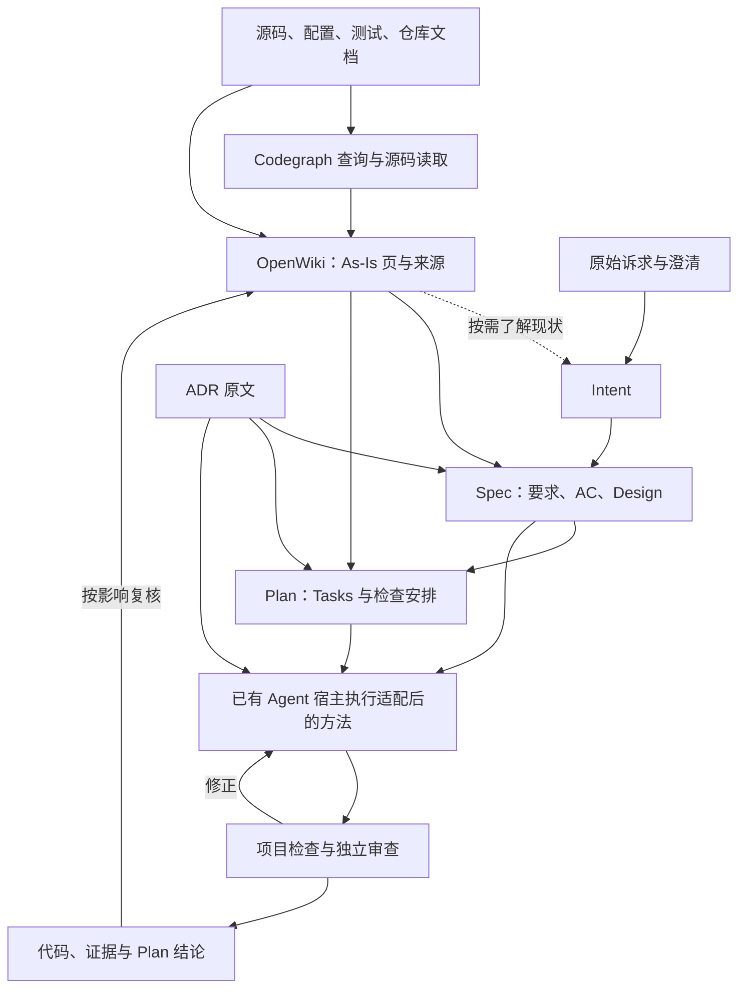

# AI SDLC 已有工具选型与复用路线

[总览与下一步](../../README.md) · 工具决定与实施参考 · OpenWiki 试用符合预期，完整组合待验证

更新日期：2026-09-16。状态：**A1–A3 已完成；A3 只比较 OpenSpec / Spec Kit 两组。下一步 A4.1 / H1，验证 Superpowers 上下文接入。** 原文档试验及补充的原生机制、较简适配、维护操作和隔离实施均已独立复核，未证明质量优胜者，撤回优先 OpenSpec 的建议。原项目仍未修正，31 项通过是 A2 历史基线；两组隔离实现的 58/58、59/59 另有证据。OpenWiki 沿用，codebase-memory-mcp 已排除；正式本地接续和采用留到 A4。产品约定为 Intent → Spec（含 Design）→ Plan（含 Tasks）。

## 1. 核心结论

**先广泛调研，再按统一需求精选工具，最后决定插件复用哪些能力。** 插件的目标仍是方法配置、工具适配、必要缺口代码和回归用例。工具名称或某次深入调研不决定产品路线。

**质量优先于速度与 token 成本。** 入围工具及配置只有满足既定质量要求、没有已知质量退化，才进入效率比较；允许人工参与审核，但需评估完整流程并计入人工负担。具体基线、回归范围与采用条件统一见[开发 Agent 配置回归与采用](../roadmap/ai-sdlc-plugin-roadmap.md#configuration-evaluation)。

**当前选择：知识维护使用用户已试用认可的 OpenWiki；代码检索沿用 Codegraph 和原文读取；SDD 两组在本题均达标，正式工具尚未选定。** 原生机制与适用取舍见 [A3 结果](#a3-result)及[完整比较](openspec-speckit-comparison.md)。codebase-memory-mcp 不再进入测试或接入安排；用户给出的原因是 star 太少，此处记录选型决定，不将其推导为已证实的质量缺陷，也不自行设定通用 star 门槛。FSoft-AI4Code/CodeWiki 留作后备，不安排为选定 OpenWiki 而重复横测。文档检查缺位时补测 markdownlint-cli2 + lychee；宿主和项目检查沿用现状。

**当前实施路线已转入 Superpowers：** 以 Claude Code 为首个 Hook 试验宿主，保留原版技能，通过项目级 Hook 补充上下文，按分发需要再打包为独立插件，并验证完整主线。该路线按 A4 的六个检查点推进，尚无运行通过或正式采用结论；不改写 A3 的历史比较结果。

**2026-09-17 接续：** H1 已取得部分本机诊断证据，用户在另一台机器补齐 Claude 运行验证。上下文先通过项目级设置和脚本接入；A4.3 插件打包改为条件步骤，可延后至 A7，Skill 不作为插件的必备组成。已有证据和当前状态以[行动路线图](../roadmap/action-roadmap.md#a4)为准。

本页维护统一选型方法、候选覆盖与后续收敛；研究笔记保存能力事实、固定源码提交、边界及待核验项：[仓库知识](../../research/tools/tool-reuse-knowledge.md)、[SDD 与执行方法](../../research/tools/tool-reuse-sdd.md)、[Agent 宿主](../../research/tools/tool-reuse-agents.md)、[检查与验证工具](../../research/tools/tool-reuse-validation.md)、[代码索引横评](../../research/code-intelligence/codegraph-tools-comparison.md)。专题中的接入方案用于估算适配成本，不代表决定采用。

Graphify 的[专项研究](../../research/code-intelligence/graphify-assessment.md)补充了代码/SQL/文档关联、分层更新及 hooks 的证据。它列为混合资料关联存在实际缺口时的条件候选；被用户点名和研究较深均不构成首轮入围理由。

### 1.1 调研到精选怎样推进

1. **按需求扩展候选池。** 覆盖不同实现路线和相邻能力，记录发现范围与遗漏；不用单一产品的功能清单定义全部需求。
2. **统一核验。** 对同层工具比较输入、输出、证据性质、更新机制、接口、运行与维护成本、许可、成熟度和退出成本；未查到的能力标为未知。
3. **形成少量入围候选。** 根据必需能力、已证实的适配障碍及相对优势说明入围/排除理由；先补齐影响排序的证据差异，不因 README 更丰富或研究更深而加分。
4. **同题实测。** 入围后用相同仓库、工作区状态、问题和 Agent 条件验证初始化、日常更新、失败恢复以及对 Spec/Plan 的实际帮助。
5. **精选最小组合。** 同时比较单工具、互补组合与沿用现状；记录采用/条件采用/不采用的理由、剩余缺口及复评条件，再进入适配开发。

| 状态 | 表示什么 | 当前使用原则 |
| --- | --- | --- |
| 已发现 | 找到相关工具，尚有关键能力待核验 | 不据宣传作优劣结论 |
| 已核验 | 指定版本的部分能力已有一手依据 | 逐项记录核验范围，不等于入围或运行通过 |
| 入围待测 | 跨候选比较后，明确值得投入同题实测 | 必须有统一比较与入围理由 |
| 用户试用认可 | 用户已测试并确认符合预期，作为后续集成选择 | 复用已有成果，不替用户补写测试版本、范围或通过项 |
| 沿用基线 | 目标项目已有方式，作为共同对照 | A2 核对实际配置；沿用不代表已证明质量达标 |
| 条件候选 / 不进首轮 | 有明确触发条件再比较 / 当前投入理由不足 | 写明原因，不等于该工具整体不合格 |
| 已排除 | 用户明确决定不考虑 | 不安排安装、比较或接入；除非用户重新提出，否则不自动重开 |
| 当前缺口 | 所需能力尚无足够的覆盖证据 | 指定核验/人工接续办法，不假设必须自研 |
| 已采用 | A4 验证满足需求并按责任确认，纳入支持范围 | 记录版本、适配成本、限制及退出方式 |

本页第 2 节为当前选择；研究笔记中的早期优先级按本页理解。OpenWiki 已有用户试用认可，A2 已记录 explicit-architecture 中的 0.5.2 版本和现有知识成果；A3 的原生调用、正常产物和场景结果见[项目证据](/Users/yuan.li/Documents/projects/explicit-architecture/docs/project/evidence/ai-sdlc-a3.md)。用户试用、配置运行、三产物质量和 A4 本地闭环分别判断。

执行顺序和当前进度见[行动路线图](../roadmap/action-roadmap.md#progress)，下一项是 [A4.1/H1 的协议核验工作单](../roadmap/action-roadmap.md#a4-1)；实际整合、知识刷新、组合验收与采用在 A4.6 完成。本页维护比较结论；A3 隔离实现可作输入，后续接入设想不当作已实现能力。

## 2. A1 统一比较与首轮名单

本节保留 A1 名单与 A3 两组试验的历史范围；其中“只取局部 Superpowers 方法”描述当时配置。后续已转入第 4 节的全流程评估与独立上下文插件路线，当前动作以 A4.1–A4.6 为准，不重新扩大 A3 分组。

### 2.1 如何理解证据和版本

证据区分为 **D：上游文档声明、S：已读源码/配置、U：用户试用反馈、P：本路线图的目标项目实测记录**。D/S 不代表运行效果；OpenWiki 的 U 为“已测试，符合预期”。A1 没有代用户执行测试，不预填工具比较案例的通过项。A2 的项目检查与环境证据见[试点入口](#a2-pilot)，不等同于 A3/A4 工具或完整流程通过。下表研究专节保存完整 SHA、许可和一手来源，阅读版本不自动等于用户测试版本。

固定提交用于阅读；表内包版本不自动等于发布包。A2 已核定目标项目的 Java/Gradle、OpenWiki 版本和可恢复输入；A3 已按下列固定来源实际安装并冻结 OpenSpec 1.13.0 和 Spec Kit 1.0.7.dev0 的适配配置，精确模型设置和 token 仍未知。成熟度按现成接口、实验性配置、依赖和版本变化判断，不按星数或上游 benchmark 排名。

### 2.2 每项首版能力的处理

| 必需能力 | A1 处理 | 覆盖边界与下一步验证 |
| --- | --- | --- |
| As-Is 调查与增量维护 | **K1 OpenWiki：用户试用认可，按此集成** | 复用已有知识和试用结果，后续验证与 Spec/Plan、实现收尾的衔接；K2 后备，不安排重复选型 |
| 源码定位、关系与影响 | **沿用 Codegraph/原文；排除 codebase-memory-mcp** | 在实际变更中核对必要影响和来源；不新增检索替换试验，图的空结果不代表没有依赖 |
| BA 材料/设计/原型 → Intent | **沿用宿主读取 + 当前覆盖证据缺口** | 无专用新工具入围。分别测原始诉求、已有 BA 成果、静态/交互原型；无法访问的部分交 BA 补依据，不猜确认状态 |
| Intent / Spec / Plan 组织 | **沿用 Markdown 模板 + 入围 S1/S2** | Design/Tasks 内嵌；单一正文和状态权威，文件存在或勾选不代表质量完成 |
| ADR 与工程规范 | **沿用原文/既有模板** | 可参考 MADR/Agent OS 的内容与选择方法；不新增 ADR CLI，工程决定依已有责任采纳 |
| 执行、独立审查、修正与交接 | **沿用现有方法 + 选择性方法复用** | Superpowers 只取适用的交接/审查方法；审查读取完整未提交及新增文件，失败不可宣告完成 |
| 宿主上下文、动作限制与恢复 | **沿用宿主 + 具体能力待 A2 核验** | 新上下文/人工审查可承担独立复核；不足仅限制相关动作，OpenCode 为条件替代 |
| 项目环境与命令准备 | **沿用项目包管理/任务入口** | 真实命令、环境和既有失败由 A2 核验；mise 仅在环境问题明确时引入 |
| 文档结构与引用检查 | **沿用等价检查；缺位时入围 D1** | markdownlint-cli2 + lychee；结构、可达性与语义分别判断，不预建元数据框架 |
| 本地实现验证 | **沿用项目测试/lint/类型检查/build** | 有具体技术栈缺口再补专项 QA 工具；人工审核和有效复现测试更正规则保持 |
| 后续 Git 提交入口 | **沿用已有 hooks；本地 MVP 无强制新增项** | 需要提交时再核验 index/working-tree 区别；不让工具默认 commit 改变完成边界 |
| 方法/配置质量回归 | **沿用真实案例、文件/命令断言与人工审核** | 先比较完整工作结果；promptfoo 仅在重复评测需求出现时加入 |

外部系统权威、Colla 和实际 MR 合并后的收尾已有设计，但接口核验属于 A5、实现属于 A6；当前无已验证的外部连接。生产告警/自动恢复继续后置。A1 不把这些能力归给任一候选工具。

### 2.3 首轮对象与源码条件候选：比较什么、为何值得测

下表保留 A1 的接口与依赖判断；[A3 结果](#a3-result)补充实际配置维护面、调用及观测窗口，完整人工工时、token 和费用仍未知。两组接受相同质量要求，先判断质量，再比较适配成本。

| 编号 / 路线 | 来源版本、许可与成熟度依据 | 入围理由及关键未知 | 适配、重复依赖、维护与退出 |
| --- | --- | --- | --- |
| **B0：现有方式（本轮不运行）** | 实际宿主/模型、Codegraph 与项目命令版本在 A2 核定；三产物约定已在本仓库 | 用户已将 A3 缩减为 OpenSpec / Spec Kit 两组；本项仅保留方法参考，不产出第三组结果。可直接读源文件和维护知识 | 新增依赖最少；人工调查/修正也计成本。保持普通 Markdown、原生报告和原文引用，允许一直沿用 |
| **K1：OpenWiki（用户试用认可）** | 研究基线 `799938757fe5` / 包 0.5.2 / MIT；A2 核实试点当前安装 0.5.2，已有 `openwiki/` 与同 HEAD 的 init 完成记录；完整调用方式/覆盖不据此推定。[试点证据](#a2-pilot)、[知识研究](../../research/tools/tool-reuse-knowledge.md#a1-comparison)、[用户决定](../../research/tools/tool-reuse-knowledge.md#user-tool-decision) | 用户已测试并确认符合预期，作为知识维护选择；不重新证明其基础价值。已有测试覆盖范围尚未逐项记录，后续只补三产物读取、实现后更新及适用恢复场景的衔接 | 复用实际已用入口、配置和知识页；登记唯一知识位置，避免重复初始化。维护与退出沿用实际接入方式；普通 Markdown/历史来源保留 |
| **K2：FSoft-AI4Code/CodeWiki 细粒度 MCP（后备源码路线）** | `a08926662eb1`，源码元数据 1.0.1、MIT、Beta、Python ≥3.12；未见版本化软件 release，官方提供 Git 源码安装方式。[发布复核](../../research/tools/tool-reuse-knowledge.md#codewiki-release-check) | 保留模块/依赖分析与本地变化检测研究，当前不安排测试。只有 OpenWiki 出现明确缺口且需要比较时，才先验证固定依赖安装、启动、工具发现及最小读写 | 额外承担源码固定、分支依赖、解析器、Node/npm 与图表配置的维护；不阻塞 K1。未来试验退出时保留正文/来源、撤配置，缓存可重建 |
| **S1：OpenSpec 自定义 schema + 适配入口** | `9d4e5974e5c0` / CLI 1.13.0，MIT；自定义 schema 为实验接口；D/S：[SDD 比较](../../research/tools/tool-reuse-sdd.md#a1-sdd)，P：[补充比较](openspec-speckit-comparison.md) | schema/模板定义三文件、依赖和 Plan task 读取，已接续隔离实现与审查；原生状态不能证明交接完成，仍需入口约束和语义复核 | 本次三文件路线不调用 archive/spec sync，因而未取得原生长期规格增量维护收益。保留 native specs/design/tasks 并映射职责是另一种有源码依据、未端到端验证的路线。源配置与生成技能分开维护 |
| **S2：Spec Kit preset + 命令/模板；workflow 可选** | `fd490fac952cc` / CLI 1.0.7.dev0、MIT；公开覆盖接口，开发快照需核对发行差异；D/S：[SDD 比较](../../research/tools/tool-reuse-sdd.md#a1-sdd)，P：[补充比较](openspec-speckit-comparison.md) | 较简 preset 已将 implement 接到 Spec/Plan，无需额外 workflow / overlay / runner 即完成本题；项目模板 override 可即时读取。第一轮另测持久化编写阶段，本轮未启用 | 维护方法源、分层模板与生成命令；刷新会检测 preset 造成的技能修改，强制重建会覆盖直接写入生成技能的内容。退出保留 Markdown/证据；完整卸载及跨版本升级未测 |
| **D1：Markdown/链接小检查组合** | markdownlint-cli2 `55d5a6c74127` / MIT / 包 0.23.2；lychee `4e065481e857` / MIT OR Apache-2.0 / 0.24.2；D/S：[检查比较](../../research/tools/tool-reuse-validation.md#a1-validation) | 仅在项目无等价工具时测，结构和链接能力互补；中文锚点、模板规则、报告兼容未测，不证明内容质量 | 新增 Node ≥22 及 lychee 二进制/规则；无需自研 runner、不默认 auto-fix。退出移除新增配置，正文和标准链接不变；已有等价工具达标即可跳过新增项 |

**共同的方法参考：** MADR 取内容结构；Agent OS 的导入方法留作漏读规范时的后备；Superpowers 取适用的交接、审查、验证方法。固定来源为 MADR `ba75bb1b20d4`（MIT OR CC0-1.0）、Agent OS `475b0cac4c7c`（MIT）、Superpowers `b36e0829c6d0`（6.3.0 / MIT），详见[方法比较](../../research/tools/tool-reuse-sdd.md#a1-sdd)。它们不作为并列顶层流程，也不预设复制脚本。每 Task commit、强制额外批准/普遍 TDD、BASE..HEAD 审查范围、独立状态台账及固定修复轮数后的自主裁决均需按本项目约定改编；不能因修复次数耗尽把未解决要求记为完成。原版整套启用不属于本轮入围配置。

### 2.4 条件候选与不进首轮的理由

**CodeWiki 同名与发布状态更正（2026-09-16）：** 上表 K2 指 FSoft-AI4Code 的开源项目。Google Code Wiki 的网页已有公开预览，但面向私有仓库的 Gemini CLI 扩展在本次核验时仍显示[官方等待名单](https://developers.google.com/profile/badges/community/sdlcagents/gca-agents)，不列作现成接入工具。FSoft 官方说明源码安装，GitHub release 当前只有素材项；源码中的 1.0.1 不能写成已发布软件版本。PyPI 同名 `codewiki` 指向另一个项目，不能混用。此前将 K2 不加条件地列入首轮实测不够严谨，现改为源码条件候选；详见[发布证据](../../research/tools/tool-reuse-knowledge.md#codewiki-release-check)。

| 对象 | 当前处理与理由 | 何时重新比较 / 证据 |
| --- | --- | --- |
| codebase-memory-mcp（原 R1） | **已排除**：用户明确表示 star 太少，不考虑；没有执行质量测试，不作质量失败判断 | 不安排安装、对测或接入；仅在用户重新提出时重开。保留[历史源码研究](../../research/code-intelligence/codegraph-tools-comparison.md#a1-retrieval) |
| RepoAgent、DeepWiki-Open | 不进首轮：前者 Python/暂存区维护语义待适配，后者额外门户与缓存服务的必要性未成立 | Python 专项文档或交互门户需求；DeepWiki 支持本地路径/导出，不以不存在的缺陷排除。[版本、许可与退出](../../research/tools/tool-reuse-knowledge.md#a1-comparison) |
| BMAD、GSD Core | 不进首轮：默认权威载体、额外规划产物及 commit 流程与本地三产物存在更多改编面 | 真实需求需要其完整工作流且有适配收益时；不把原生恢复/审查能力忽略。[机制与成本](../../research/tools/tool-reuse-sdd.md#a1-sdd) |
| Graphify、Serena | 条件候选：混合资料关联 / 目标语言符号消歧有具体缺口才加测 | Graphify 的结构/语义更新分别判断；Serena 按实际版本区分应用/组件/IDE 后端许可。[本次来源](../../research/code-intelligence/codegraph-tools-comparison.md#a1-retrieval) |
| CGC、Code-Graph-RAG、Lordymine/codegraph | 条件候选：SCIP/Cypher、资源/运行关系、Go/TS 专项尚非已知必需 | 真实技术栈或查询要求成立；额外工具链/服务纳入成本。[版本与差异](../../research/code-intelligence/codegraph-tools-comparison.md#3-直接同类候选) |
| code-index-mcp、CocoIndex Code、Repomix | 条件候选：分别解决轻量符号搜索、语义检索、上下文导出；避免重复现有检索 | 出现对应缺口；不当作完整影响图。[索引比较](../../research/code-intelligence/codegraph-alternatives-indexes.md)、[相邻工具](../../research/code-intelligence/codegraph-tools-comparison.md) |
| GitNexus、SCIP/Zoekt、托管检索 | 不进首轮：GitNexus 当前非商业许可适用性未明；开放组件需集成服务，托管产品需实际账户/数据条件 | 使用范围明确、已有部署或确切检索缺口时复评；不宣称质量落后。[来源](../../research/code-intelligence/codegraph-tools-comparison.md#a1-retrieval) |
| OpenCode；Pi/Goose/Aider/OpenHands SDK | OpenCode 为条件替代；其余后置。先验证现有宿主，避免同时更换宿主与方法；SDK 接入并非本地 MVP 必需 | 现有宿主出现无法由配置/受控人工方式补齐的缺口。权限、上下文、工作区隔离和恢复分别验证。[完整版本/许可/成本](../../research/tools/tool-reuse-agents.md#a1-hosts) |
| adr-tools、mise、schema/QA/hook 工具、promptfoo | ADR 先用模板；其他按环境、元数据、测试或重复评测缺口引入；不建立重复运行/状态平台 | 按技术栈选择 Playwright、Schemathesis、Semgrep CE、dependency-cruiser 等；引擎和规则许可分开核验。[检查研究](../../research/tools/tool-reuse-validation.md) |

### 2.5 首轮试验安排与判据

**按组试验，不穷举组合。** A2 先固定试点、已知正确结果、原文访问条件、人工审核方式、模型与工具版本；运行从同一可恢复起点开始，候选的生成文件和会话上下文不相互污染。案例编号只用于本次选型，不新增逐项 AC/Task/run 强制追踪制度。

1. **A3 知识衔接：** 使用用户已认可的 OpenWiki，复用现有知识页和测试成果，核对 Spec/Plan 读取与实现后维护。只补已有结果未覆盖、与本次变更相关的场景；不重新做知识工具横评。K2 保留后备，出现 OpenWiki 的明确缺口且有比较需要时再核验源码运行条件。
2. **A3 三产物组：** 用人工核实过的同一知识/业务输入，仅分别试 S1、S2；用户已取消 B0 比较组，每次只有一套主入口。配置未能消除已知流程冲突时，该候选先修配置或退出，不继续形成误导性的评分。
3. **沿用检索与检查：** 保留 Codegraph/原文入口，不再安排 R1 替换对测。D1 缺位时单独验证，不把文档检查收益计入某个知识/流程工具。
4. **A4 最新执行安排：** 按[正式验证方案](../superpowers/plans/2026-09-17-a4-context-validation.md)先做宿主协议及 brainstorming 规则/Hook 两组对照，再明确 Superpowers 全流程契约与差异处理；独立插件按分发需要打包，扩展计划/审查，最后跑实际业务闭环、恢复和组合回归。复用有效旧材料与测试；新配置的交互行为另验。不把 Superpowers 追加为 A3 第三组，也不因投入试点就预定采用。

以下是贯穿后续步骤的 12 组案例目录，不代表均已通过。A2 保存真实基线；[A3 结果](#a3-result)覆盖正常三产物、受控 BA/修订/恢复/假完成、无 CLI 阅读，以及补充的维护探针和隔离实现/代码审查。实际项目整合与知识刷新、宿主强制权限、真实原型、跨版本升级及完整退出仍待各自验证。用户对 OpenWiki 的试用认可单独记录；K2 无当前测试安排，R1 已排除。

| 案例 / 对象 | 输入或受控变化 | 通过判据 / 失败时的处理 |
| --- | --- | --- |
| T01 材料到 Intent；S1/S2 | 同一诉求分别提供原始描述、已确认 BA 方案及原型；加入无法访问附件、无 Story 标签与部分范围 | 保留目标/已确认成果和引用；未知不伪装成确认，分类可选，共享依据不复制；静态读取与交互验证分开。材料不足返回 BA 的具体问题，不阻塞独立范围 |
| T02 知识语义；K1/三产物衔接 | 复用已有 OpenWiki 成果，选一条业务主流程、异常/配置分支、一个已采纳但尚未实施 ADR | 核实关键结论、限制、来源、验证入口足以形成 Spec/Plan；已有试用覆盖的部分直接复用，决定不冒充现状，缺项按需补查 |
| T03 工作区与间接影响；K1/Codegraph | HEAD 不变的暂存/未暂存/新文件；只加调用者或改配置；重命名、删除、ADR frontmatter 变化 | 读取最终工作区，发现受影响结论或明确需补查；旧图/页不得称最新。没有命中不等于无影响；必要人工核对算入正式流程和成本 |
| T04 三产物与完成语义；S1/S2 | 文件齐全、任务已勾选，但检查失败/缺证据；只完成共享 Intent 的部分范围 | 不误报整体完成、自动归档或提交；只有三个权威准备产物，Tasks 内嵌 Plan；无强制额外批准/需求层级。框架状态仅作进度提示 |
| T05 上游修订；K1/S1/S2 | 修改一个业务规则，再修改一项工程约束；分别保持其他范围有效 | 指明受影响 Spec/Plan/知识和检查，保留有效内容/人工编辑；业务取舍回 BA，技术决定依既有授权；不把旧证据带成新通过 |
| T06 中断与恢复；全流程 | 生成/实现一部分后中断；关闭工具重启并改一项源文件，保留无关用户修改 | 找到有效产物和下一步，重查变化来源；缺失子结果、session close、缓存存在都不等于完成；不覆盖新修改或静默回滚。测工具原生恢复与文件接续各自成本 |
| T07 独立审查/测试保护；选定配置+适用方法 | 设置未提交修改和未跟踪文件中的受控缺陷；另设有效复现失败，以及代码正确但测试有误的样例 | 审查者独立读原文/完整差异并发现缺陷，修正后复验；有效测试不得削弱，错误测试依已定独立复核更正；测试有误的样例不为获得失败复现而修改正确代码 |
| T08 宿主控制；实际宿主 | 对项目确需限制的动作，测试允许/拒绝/子调用或 MCP 失败 | 必要限制事前生效；提示词、权限询问与 OS 隔离不混为一谈。缺能力停用该自动动作并保留受控接续，独立工作继续；不为通过而降低权限要求 |
| T09 文档检查；现有工具/D1 | 缺章节、坏本地链接、中文/显式锚点、有效排除及网络/鉴权不可达 | 格式/引用问题可定位；未检查与失败分开，既有有效文档不被自动改坏；章节语义仍由审查核实，不能以排除所有链接取得通过 |
| T10 既有检索的实际使用；Codegraph/原文 | 本次变更涉及的调用链、别名/同名符号、项目框架注册与相关测试；适用时核验索引中断后的读取 | 必要影响和来源可核对，陈旧/未解析结果不当成不存在；检索有遗漏时直接读源码补查。不安排新检索工具横评 |
| T11 配置回归与质量成本；最终流程 | 正常变更 + 已知失败样例，用固定起点重复执行；重复次数/样本在 A2 预定 | 质量达标且无已知退化后才比较历时、等待、人工修正、模型用量及适配成本；无法取得的值为未知。保留失败样本，不能临时删案例或放宽标准 |
| T12 配置维护与退出；拟采用工具 | 重复初始化/更新、保留人工内容、工具停用；后续升级另用同一案例复评 | 声明工具会修改哪些文件/配置；不覆盖原文，不遗留第二权威/强制后台依赖，退出后能从 Markdown/证据接续。未知迁移能力列限制；完整安装升级验收仍在 A7 |

K2 未来若有必要重开试验，还须核验源码运行与图表校验条件。当前 S1/S2 记录改编配置与上游差异；OpenWiki 沿用用户实际配置。来源更新、退出行为及完整流程质量一起评价，不能只比较一次生成的回复。

### 2.6 A1 结果与 A2 输入

A1 已完成能力分组、统一比较和案例设计，并纳入用户决定：**OpenWiki 已试用符合预期；codebase-memory-mcp 已排除，检索沿用 Codegraph。** BA 材料/原型覆盖、宿主必要控制、三产物组织和本地闭环仍按 A2–A4 推进，不把单项工具认可写成完整组合通过。

A2 的实际输入与执行记录如下；Colla/MR 接口仍留到 A5 核验。

### 2.7 A2 试点与比较起点

用户已选定 [explicit-architecture](/Users/yuan.li/Documents/projects/explicit-architecture)，选择**定价服务币种一致性校验**，并明确由用户担任工程负责人。[项目 A2 记录](/Users/yuan.li/Documents/projects/explicit-architecture/docs/project/evidence/ai-sdlc-a2.md)保存实际源码状态、检查日志、环境、质量表与比较安排。

- **变化边界：** `Order.create` 已拒绝混合币种；缺口在先执行的 `OrderPricingService.calculate`，以及商品币种与传入币种不符的独立调用。保留已有订单校验和折扣，不将现有能力重做。
- **共同起点：** HEAD `a7228303cfbd` 加上用户现有修改及未跟踪文件，共 562 个文件；逐文件哈希和本地归档可恢复。各候选使用独立副本/上下文，不重置用户工作区。
- **已有环境：** Codex desktop、Java 21.0.10、Gradle 9.3.1、OpenWiki 0.5.2。当前会话未发现 Codegraph 可用入口，本轮以 `rg` / 原文核验；不会因此重开 codebase-memory-mcp。精确模型设置/token 尚未知。
- **比较安排：** 按用户最新决定，仅 S1 / S2 共用核实后的诉求、源码事实、知识和质量表；每候选先做一次正常三产物案例，再做适用的修订、恢复、审查和退出场景。实际工具版本及适配配置在执行前固定，失败与修正保留。
- **基线实测：** 依赖缓存准备后，原生 Gradle 测试 31/31 通过（定价 11、Money 1、Order 17、下单 Handler 2），业务代码未改；独立行为探针复现混币和请求币种不符仍返回金额。原联网解析等待和缓存缺项记录完整，本机离线检查路径已可用。
- **当前边界：** A3 两组文档、受控场景及补充的隔离实现/维护操作已独立复核，见[实际记录](/Users/yuan.li/Documents/projects/explicit-architecture/docs/project/evidence/ai-sdlc-a3.md)；实际项目接续、知识刷新及正式采用待 A4。真实 BA 文档/交互原型和外部连接未提供，受控文本材料的通过不能代替这些路径的验证。精确模型/token 未取得，不排名速度/token；新环境仍需核验依赖准备。

### 2.8 A3 两组实测与 A4 建议

**两轮比较已完成，撤回优先 OpenSpec 的建议。** 第一轮证明两组文档和受控场景可行；补充轮按执行前固定的协议，分别调查原生机制、冻结同要求的较简配置，运行三类维护操作和隔离实现，再统一独立审查。完整操作、来源与边界集中在[OpenSpec / Spec Kit 比较报告](openspec-speckit-comparison.md)，两轮历史保留在[项目 A3 记录](/Users/yuan.li/Documents/projects/explicit-architecture/docs/project/evidence/ai-sdlc-a3.md)。

| 比较项 | OpenSpec / S1 | Spec Kit / S2 |
| --- | --- | --- |
| 原生价值 | change / delta / specs / archive：按领域积累长期行为规格；本次三文件路线未取得这项完整收益 | preset / override / integration：分层定制命令、模板和宿主 Skills；可选 workflow 保存编写阶段 |
| 较简接续配置 | 项目 config、schema、模板及方法入口，原生 apply 读取三产物和 Tasks | preset 覆盖命令/模板，包括 implement；无需额外 workflow / overlay / runner |
| 修改规则 | 修改项目 Plan 模板，下一次指令读取新字段 | 本地模板 override 即时解析，无需重装；外部分发包另走同步 |
| 切换变更 | 具名 change，显式选择；原正文保持 | 编号 feature / 路径定位及当前指针；本次无需切换 Git 分支，原正文保持 |
| 同版刷新 | 普通 update 因版本相同未重写；force 会覆盖直接写入生成技能的内容 | 普通 integration upgrade 拒绝覆盖检测到的修改；force 重建技能且采用 preset |
| 真实代码与质量 | 7 个有效反例先失败；修正后四类测试 58/58，通过独立审查 | 同样 7 个有效反例先失败；修正后四类测试 59/59，通过独立审查 |

两组均保留原31项测试，只修改一个领域服务和四个测试文件；其他557个基线文件保持。58 与 59 的数量差异来自检查粒度，未证明质量高低。方法源、业务正文与生成技能必须区分：两组强制刷新均保留源定制及业务正文，均会覆盖直接写入生成技能的探针标记。不能用文件数量、单次 CLI 耗时或本题结果推导普遍维护成本、速度或 token 优势。

[最终独立审查](/Users/yuan.li/Documents/projects/ai-native-sdlc/.local/pilots/explicit-architecture/a3-followup-20260916/review/final-review.md)无阻断缺陷，两组已据实关闭本轮审查/本地证据交接任务。原项目业务代码未整合、生成 Wiki 未刷新、工具未正式采用；实验结束不等于 A4 完成。

**取舍依据：** 需要长期规格增量积累时，重点利用 OpenSpec 的原生机制；需要可分发和分层覆盖的团队方法及宿主命令时，重点考察 Spec Kit 的 preset/integration。只需当前三文件、本地实施时，两组已测配置都能接续，没有默认优先者。现有方法允许附件，保留 native specs/design/tasks 的职责映射另有源码依据，但尚未完成同等端到端验证，不能认定它零适配或成本最低。

**下一步 A4：** 按最新 Superpowers 方向从 [A4.1/H1](../roadmap/action-roadmap.md#a4-1)开始，依次验证上下文接入和完整流程；实际业务整合时复核原项目状态，复用有效隔离代码和证据，完成知识刷新、组合回归与工程采用。真实 BA 原型、跨机、跨版本升级、完整卸载、完整原生流程和远端交付仍未验证，精确模型/token 与完整人工投入未知；不将这些维度计为通过或胜负。

## 3. OpenWiki：知识维护的接入安排

### 3.1 它补上 Codegraph 的哪一层

Codegraph 提供找到源码、符号关系和影响线索的入口。OpenWiki 在代码之上组织可被后续 Agent 阅读的解释性知识，并维护其来源。它的 code 模式保存仓库内 Markdown，能通过 CLI 更新，也能由已有 coding Agent 经 MCP 参与生成。[OpenWiki 官方入口](https://github.com/langchain-ai/openwiki)、[Codegraph 定位核验](../../research/code-intelligence/codegraph-as-is-role.md)

已核验的 OpenWiki Claim 机制将结论关联到文件/行范围及内容版本；来源变化或无法解析会产生复核项。当前来源指纹还考虑工作区和未跟踪文件，逐页运行支持恢复与来源变化处理。[证据解析源码](https://github.com/langchain-ai/openwiki/blob/fd8794bc43f4583ba54cbf8d3ca883c37447dbfa/src/claims/evidence/repository/resolver.ts)、[来源指纹源码](https://github.com/langchain-ai/openwiki/blob/fd8794bc43f4583ba54cbf8d3ca883c37447dbfa/src/agent/utils.ts)、[运行核心](https://github.com/langchain-ai/openwiki/blob/fd8794bc43f4583ba54cbf8d3ca883c37447dbfa/src/generation/repository-run.ts)

其内置调查指令已要求按系统与跨组件流程组织知识，追踪行为、状态、异常、配置和测试；内容方向与本项目 As-Is 相符。不能将它描述成只生成模块摘要，也无需预先自研另一套行为知识生成器。[规划与写页指令](https://github.com/langchain-ai/openwiki/blob/fd8794bc43f4583ba54cbf8d3ca883c37447dbfa/src/agent/repository-prompts.ts)、[Claims 内容要求](https://github.com/langchain-ai/openwiki/blob/fd8794bc43f4583ba54cbf8d3ca883c37447dbfa/src/claims/guidance.ts)

因此，原设想的 Wiki 生成、Claim 侧文件、来源指纹、逐页队列与恢复，均先按已有能力试用。需要的补充集中在项目调查重点与上下游使用规则。来源未变不能证明 Claim 正确，新增的间接依赖也可能改变结论；这些仍需调查和审查。

### 3.2 文档如何放，避免两份 As-Is

采用时在项目入口登记实际路径：

| 内容 | 建议落点 | 使用者 |
| --- | --- | --- |
| 项目导航、工具与路径映射 | 既有项目入口，默认 `docs/project/README.md` | 所有步骤 |
| As-Is 知识正文 | OpenWiki 原生 `openwiki/`，入口指向 `openwiki/index.md` | Intent 按需、Spec/Plan/实施按影响读取 |
| 事实来源与工具维护元数据 | 原生 Claim 侧文件及页面元数据 | OpenWiki 维护；阶段读取引用其依据 |
| 项目规则和长期决定 | 既有 ADR，默认 `docs/adr/` | Spec、Plan 必须选取并直读适用原文 |
| 本次目标、规格、实施状态 | 映射后的变更目录中的 intent.md/spec.md/plan.md | 对应生成/执行入口 |
| 实际检查、审查与基线 | 同一变更的 `evidence/` | 验证、审查、恢复与交接 |

采用原生路径时不再把同一知识正文复制到默认 Topic 目录。调查要求写在 `openwiki/INSTRUCTIONS.md`；复核工具更新的 Agent 指引区块与项目现有入口。日常调用 update；重复 init 会重建生成内容，不作为维护动作。[OpenWiki 使用说明](https://github.com/langchain-ai/openwiki/blob/fd8794bc43f4583ba54cbf8d3ca883c37447dbfa/README.md)

OpenWiki 内部的页面工作 plan、.run.json、verified 元数据分别服务知识生成和自身校验，不能替代业务 Plan 或测试证据。新 ADR 被采纳后仍可能尚未实现，Wiki 必须同时表达决定和核验到的事实。

### 3.3 覆盖判断与最小接入

**用户已测试 OpenWiki 并确认符合预期，后续直接按此接入。** 复用现有成果，不再手填另一套 Topic YAML、事实编号、来源指纹、页面状态或影响图；实际版本和三产物衔接在试点中对齐。As-Is 的简化要求见[最小方案](../knowledge/brownfield-as-is-implementation-and-reuse.md#minimum)。

| 本项目的需要 | OpenWiki 覆盖情况 | 接入时保留的工作 |
| --- | --- | --- |
| 可读、可导航的仓库现状 | 原生 Wiki、quickstart 与页面关联 | 在现有项目入口链接原生目录 |
| 行为、流程、数据和重要限制 | 内置指令已要求相关语义调查 | 补本项目重点；用真实需求核对缺口，不强套八章模板 |
| 结论有来源，来源变化可发现 | Claims、来源解析与指纹、更新窗口 | Spec/Plan 仍核对关键源码和间接影响 |
| 后续增量维护与中断接续 | 原生 update 与逐页运行机制 | 实施收尾按影响触发并核对输出；安装本身不保证更新自动发生 |
| 为当前 Spec/Plan 提供合适输入 | 提供知识材料与导航 | 由阶段指引选择相关页、补查并记录有效引用 |
| 真实测试结果、生产状态、跨仓库全貌 | Wiki 内部校验不能单独证明 | 使用真实执行证据；仓库外内容保持边界，跨仓库另核双方 |

前四项的机制依据见上文及[来源与更新研究](../../research/tools/tool-reuse-knowledge.md)。默认只增加三项配置/约定：知识调查重点、Spec/Plan 读取规则、使用前与实现后维护时机。`--init` 原生会规划 Wiki 并包含 quickstart；“先评估一个相关主题”不表示 CLI 已证实只生成一页。

## 4. 三产物与执行：选一个组织底座，按需复用方法

**新增评估方向：** 用户正在考虑以 Superpowers 贯穿开发全流程，详见[阶段输入输出与 Agent 内置控制](superpowers-full-workflow-assessment.md)。建议试验“Superpowers 方法 + 现有产物契约 + 原生执行控制”；本轮仅完成研究与设计建议，尚未替换采用决定或安装新配置。此前对原版默认规则的差异仍需处理，但不据此排除其作为经适配的完整主线。

**知识接入的 Hook 候选设计已形成：** [原版 Superpowers + 项目上下文 Hook + 项目知识入口配置](project-context-hook-plugin-design.md)。先按[正式验证方案](../superpowers/plans/2026-09-17-a4-context-validation.md)比较简短项目规则与额外阶段 Hook，允许依据质量结果采用较简单的规则方案；再扩展计划和审查。无需修改原 Skill，插件打包后置；本比较属于 A4，不是 A3 的第三组。

### 4.1 两组三产物适配方式

OpenSpec 的自定义 schema 支持 artifact ID、输出文件、模板及依赖，并可让 `apply.tracks` 读取 `plan.md`。可定义 intent → spec → plan，Design 放 Spec、Tasks 放 Plan。[schema 字段](https://github.com/Fission-AI/OpenSpec/blob/9d4e5974e5c0d9a09b9c6c1e1eb0975e80ec4461/docs-lab/reference/schemas/schema-yaml.md)

本次 OpenSpec 三文件适配包含：

1. 模板及指令采用现有三产物内容约定，显式导入 ADR、As-Is、原始来源与依据版本。
2. 将工具的文件存在/checkbox 计数解释为发现与进度提示；四种 Task 状态及实际完成条件仍由 Plan 和证据表达。
3. 优先在项目入口映射 `openspec/changes/<id>/` 为唯一变更位置；schema 的输出路径受 change 根约束，不能假设可以任意跳到 `docs/changes/`。
4. 本地交接不自动执行默认 archive/spec sync；目标规格被同步不证明代码实现或 As-Is 已更新。
5. 原版 apply 在全勾后宣告完成，且项目 guidance 不得覆盖内置 workflow/CLI 指令；因此还需独立主入口或明确改编 apply，不能只靠 schema/rules 改变完成语义。[A1 源码复核](../../research/tools/tool-reuse-sdd.md#a1-sdd)

Spec Kit 本次较简适配使用一个 preset，提供 Intent 命令，覆盖 specify / plan / tasks / implement 及三份模板，以 Spec 为实施前置条件、从 Plan 读取 Tasks；constitution 仅导航到现有项目规则。无需自建 workflow / overlay / runner，语义质量仍由执行与独立审查确认。模板可经项目本地 override 即时修改，命令/宿主 Skills 的刷新另走 integration 机制。

三产物是权威职责，不强制恰好三个物理文件。两组均可考虑保留原生文件并明确附件归属，减少放弃原生能力；目前这条路线只有源码依据，未完成同等端到端试验。自定义 schema 为 experimental，Spec Kit 本次为开发快照，均需锁定兼容版本。详见[实际比较及边界](openspec-speckit-comparison.md)。[OpenSpec 定制](https://github.com/Fission-AI/OpenSpec/blob/9d4e5974e5c0d9a09b9c6c1e1eb0975e80ec4461/docs-lab/customize/schemas.md)、[Spec Kit presets](https://github.com/github/spec-kit/blob/fd490fac952cc6baeb421905b28031b4c5fe8a99/docs/reference/presets.md)

### 4.2 Superpowers 复用到什么程度

Wiki/ADR 的读取要求先由项目规则承载，再验证是否需要独立 Hook 加强，保留原版技能。完整执行流程再核验任务交接、独立实施/审查、检查与修正方法，按实际冲突决定是否改编。其当前辅助脚本已有任务片段提取和审查包收集，可减少重复工作。[task-brief](https://github.com/obra/superpowers/blob/b36e0829c6d0140e93cfef2ca599b1b07d4a7797/skills/subagent-driven-development/scripts/task-brief)、[review-package](https://github.com/obra/superpowers/blob/b36e0829c6d0140e93cfef2ca599b1b07d4a7797/skills/subagent-driven-development/scripts/review-package)

不能原样照搬的部分：审查包当前比较 BASE..HEAD，需要纳入本地未提交和新增文件；Task 状态回到 Plan，独立 progress ledger 只作可重建的运行指针；提交、每任务审查和复验安排遵循本项目 Plan 与证据规则。具体差异见[SDD 工具研究](../../research/tools/tool-reuse-sdd.md)。

上下文插件独立版本化，并列出已验证的 Superpowers/宿主版本；它本身没有第二套顶层执行 Skill。未来确需改编执行方法时另行维护来源和差异，不把两套未经协调的入口同时交给 Agent。工具底座负责产物发现与生命周期操作，方法入口负责内容及交接判断；一次主产物更新只有一个维护者。

## 5. 输入输出怎样通过这些工具流转

以下按用户已认可的 OpenWiki 和既有 Codegraph 展示目标衔接；A3 两组均完成本题隔离实现，尚无默认优先工具，实际项目知识刷新与整条链的集成尚未完成。

图中的 Codegraph→OpenWiki 示例需要调查 Agent 协调，尚未核验专用直连。OpenSpec/Spec Kit 已完成本次三产物比较，正式采用待 A4；它们不另加业务步骤。原文仍通过引用读取，不在每条边复制一份长上下文。

按需导入流程为：**入口/索引发现 → 根据本步问题选取 → 检查来源变化 → 直读相关原文 → 在产物记录采用的引用及未解决项**。Repomix 仅在需要上下文导出时使用；宿主会话与可重建索引都不成为项目事实来源。

## 6. 自研范围收敛到哪些缺口

默认按步骤产出与交接，不建设逐项 AC—Task—测试—运行结果追踪。方法、配置和案例优先；只有选定工具组合在真实案例中暴露无法通过配置解决的重复问题，才补连接脚本。下面的代码项均是条件候选，不是首版必建模块。

| 必须沉淀的项目资产 | 已调查的候选底座 | 仍需补齐的差异 |
| --- | --- | --- |
| **方法与内容约定** | Superpowers/MADR/Agent OS 的适用方法、工具模板 | 三产物语义、As-Is 的最小内容与两个维护时机、ADR 生命周期、原文读取、返回与完成条件 |
| **工具适配配置** | OpenWiki 指引/MCP、OpenSpec schema 或 Spec Kit preset、宿主 Skills/Agent 配置 | 项目路径、工具能力探测、同一产物的维护权、版本和兼容性映射 |
| **按需连接脚本** | 已有 schema、Markdown/链接检查器、Git、原生测试报告 | 仅补实测确认的交接、结果汇总或重复配置缺口；逐项追踪、统一运行台账及通用状态库不作为默认自研项 |
| **方法回归样例** | 仓库原生测试；按需 promptfoo | 漏读 ADR、错误完成、输入变化、未跟踪文件、缺少分支结果、失败及中断恢复的实际场景 |

Wiki 的来源版本与恢复、产物依赖、基础执行循环和子会话，均先评估已有工具；具体底座由精选结果决定。步骤之间通过现有产物和必要原文交接，实际验证汇总到步骤记录；细粒度追踪不参与默认选型门槛。优先公共 CLI/MCP/配置接口，确需改编内部脚本时固定来源版本并记录差异。

开发语言由最终薄适配和项目环境决定，不为了使用某个检查器而同时引入 Python、Node、Rust 三套自研运行时。工具版本可以各自管理；方法和项目数据保持普通 Markdown 可读。

## 7. 复用优先的实施顺序

行动顺序、状态与逐步完成条件统一维护在[行动路线图](../roadmap/action-roadmap.md)。原 P0–P5 的复用阶段含义及与 M0–M5、A1–A7 的对应关系见其[第 12 节](../roadmap/action-roadmap.md#12-与现有规划的对应关系)，本页不另维护一套执行进度。

复用的顺序为：统一筛选与同题实测已完成 → 上下文最小试验 → 阶段契约与业务闭环 → 按需打包、分发和第二项目复用。局部插件包装可先于完整流程采用，以验证可插拔能力；正式支持范围仍由实测决定。Colla/MR 连接按 A5/A6 独立验收，不阻塞本地能力的 A7。

统一记录：需适配的代码与配置量、抽查事实正确率、遗漏/错误完成次数、失败恢复、无关文档改动、耗时和实际模型用量。OpenWiki 已有用户试用认可，尚无完整组合的量化结果；用户可据 star 等生态偏好排除候选，不把这些偏好当作工具质量测量。

## 8. 本轮明确暂缓的工作

- 自研 Wiki 生成与通用 Claim 存储；先比较已有知识维护工具，仅为证实的共同缺口补代码。
- 自研 Agent 宿主、图运行引擎或通用任务平台；优先现有会话和工具机制。
- 同时适配 OpenSpec、Spec Kit、BMAD 全套流程，或维护多份 Design/Tasks/运行状态权威。
- 为首版强制引入第二宿主、定时 CI、Git hooks 或独立知识门户。

这些是产品取舍，未禁止业务项目继续使用已满足需求的现有工具。后续出现明确不足时，根据试点证据重新选择。
