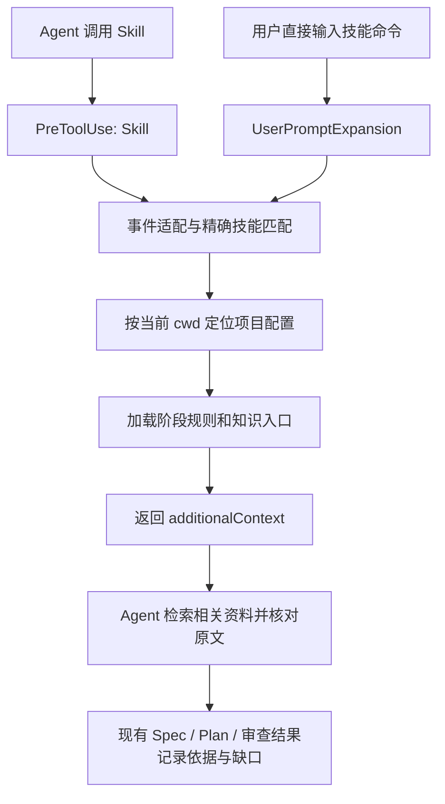

# 项目上下文 Hook 插件设计

[返回总览](../../README.md) · [Superpowers 全流程评估](superpowers-full-workflow-assessment.md) · [协议核验](../../research/execution/claude-native-stage-controls.md#项目上下文-hook-协议补充) · [行动路线图](../roadmap/action-roadmap.md#a4)

更新日期：2026-09-17。**状态：Hook 候选设计已形成，正式插件尚未实现或启用，采用取决于对照结果。** 本文描述选择 Hook 时的实现边界；不代表已经正式采用 Hook 或 Superpowers 全流程。

## 1. 候选方案与验证决定

Hook 候选形态为 **原版 Superpowers + 独立项目上下文 Hook + 每个项目自己的知识入口配置**。

**2026-09-17 验证调整：** 先按[正式验证方案](../superpowers/plans/2026-09-17-a4-context-validation.md)比较“项目规则”与“项目规则＋阶段 Hook”。相同知识要求下，分别检查投递、实际读取与正确采用；若规则已满足要求且 Hook 无可复现增益，可直接采用规则。以下是 B 候选的设计，不把所有设计项预先列为必须实现；跨机材料见[移交入口](../../validation/a4-context/README.md)。

**2026-09-17 落地节奏调整：** 上述插件是可选的分发形态。先用项目级 `.claude/settings.json`、独立脚本/规则与知识入口配置验证功能，按统一启停、跨项目复用和版本分发需要再打包。Claude Code 插件可以仅包含 Hooks，无需 `skills/` 或 `SKILL.md`；不为包装形式添加 Skill。[官方组件说明](https://code.claude.com/docs/en/plugins-reference#hooks)、[项目配置与插件的适用场景](https://code.claude.com/docs/en/plugins#when-to-use-plugins-vs-standalone-configuration)

本机已取得部分 H1 命令展开证据，完整运行验证由用户在另一台机器进行，见[执行记录](/Users/yuan.li/Documents/projects/explicit-architecture/docs/project/evidence/ai-sdlc-a4-context-hooks.md)。诊断脚本不等于完整项目上下文实现。

这里的 Hook 是 Claude Code 的技能调用事件扩展；MR 合并后的 Intent/Colla 收尾仍是另一条集成链。

当 `brainstorming` 被调用时，插件向当前 Agent 补充“到哪里查、查什么、怎样核实和报告”的要求。Agent 在提出工程方案前读取相关 Wiki、有效 ADR、源码和测试；实际采用的依据写入现有 Spec / Design。相同机制可扩展到计划和审查阶段。

**首版解决上下文接入，不承担流程调度。** 保留 Superpowers 原文件，无需复制或修改 `brainstorming`，也不为这项能力新增顶层工作流 Skill。插件不生成 Wiki、不调用 Codegraph、不推进阶段、不维护 Task 状态、不代替审核或接受决定。知识查询仍由当前 Agent 使用已配置的工具完成。

| 能力 | 首版安排 |
| --- | --- |
| `superpowers:brainstorming` | 默认启用，验证模型调用和用户直接命令两条路径 |
| `superpowers:writing-plans` | 提供独立规则，默认关闭；完成该阶段用例后启用 |
| `superpowers:requesting-code-review` | 提供交接规则，默认关闭；验证实际审查子代理收到资料后启用 |
| 其他技能、其他命名空间 | 默认不注入；新增支持时同时更新路由、规则和验证用例 |
| 缺少配置、工具或知识 | 如实区分未启用、不可用与未知；按第 8 节继续调查或报告缺口 |
| 阻断、权限、生产/MR/Colla 动作 | 不纳入此插件；沿用项目现有控制与责任 |

这落实了 Playbook 中“设计前取得项目背景、约束可交接、结果有验证依据”的部分。全流程交付、生产反馈及责任归属继续由[现有产物契约](../method/sdd-artifact-contracts.md)承担。简短常驻导航、按需加载规则的选择，也与 Claude Code 的上下文管理建议一致。[AI-native SDLC Playbook](https://claude.com/blog/the-ai-native-sdlc-playbook)、[Claude Code best practices](https://code.claude.com/docs/en/best-practices)

## 2. 执行过程与职责



| 组件 | 责任 | 维护位置 |
| --- | --- | --- |
| Superpowers | 访谈、方案讨论、计划、实施和审查方法 | 原插件，保持不变 |
| 上下文插件 | 事件适配、精确路由、配置校验、规则渲染、可诊断的降级 | 独立版本化插件 |
| 项目配置 | Wiki、ADR、项目权威入口及启用哪些阶段 | 业务仓库中的 `.ai/context.json` |
| 阶段规则 | 何时检索、如何核对、输出哪些依据 | 插件默认规则；项目可追加少量约定 |
| 当前 Agent | 判断相关性、真正读取资料、处理冲突、形成产物 | 当前阶段及已有交接流程 |
| 工程负责人 | 接受关键技术决定与工具采用结论，可沿用已明确委托 | 既有责任，不新增逐次批准 |

Hook 只读取本地配置、规则及文件存在信息，必要时用固定参数查询 Git 根目录。它不联网、不调用 MCP/模型、不批量读取 Wiki 正文。这样知识读取发生在能理解当前问题的 Agent 中；插件本身保持小且可测试。

## 3. 插件与项目文件布局

以下均为**拟实现布局**，本轮只写文档。

```text
project-context/                    独立插件，暂定名称
├── .claude-plugin/plugin.json       插件元数据
├── hooks/hooks.json                 两类事件的注册
├── scripts/inject-context.mjs       stdin JSON → stdout JSON
├── scripts/doctor.mjs               只读检查配置、路径和运行环境
├── rules/brainstorming.md
├── rules/writing-plans.md
├── rules/requesting-code-review.md
├── schema/context.schema.json      自定义项目配置协议
├── tests/                          协议、渲染和失败场景
└── README.md                       已验证版本、启停、故障诊断

业务项目/
├── .ai/context.json                项目 opt-in 与实际知识入口
├── .ai/context-rules/              可选：项目追加规则
├── CLAUDE.md                       现有项目导航和权威规则
├── openwiki/                       既有知识，不复制
└── docs/architecture/adr/           既有 ADR，不搬迁
```

脚本拟使用 **Node.js 内置模块，无第三方依赖**；首个运行目标为试点主机已有 Node 24。Claude Code 本身不保证提供 Node，因此必须验证 Hook 进程实际获得的 `PATH`，不能只以终端能运行作为通过依据。若部署目标没有兼容运行时，在实现阶段选择一种可分发方式，不由 Hook 临时安装软件。

插件代码和默认规则通过 `${CLAUDE_PLUGIN_ROOT}` 定位；项目数据和可选试点日志不写入插件缓存。`hooks/hooks.json` 使用原生自动发现位置，manifest 不再重复登记同一文件。迁移到插件后，删除试验期间的项目级同款注册，避免同次调用两份注入。[插件结构与 Hook 注册](https://code.claude.com/docs/en/plugins-reference#hooks)、[插件路径变量](https://code.claude.com/docs/en/plugins-reference#environment-variables)

## 4. 项目配置协议

### 4.1 explicit-architecture 的拟用配置

下面是**本插件拟定义的配置，不是 Claude Code 原生设置**。路径根据试点仓库现有文件核对；此文件尚未写入试点项目。

```json
{
  "schemaVersion": 1,
  "enabled": true,
  "knowledge": {
    "wiki": {
      "index": "openwiki/index.md",
      "overview": "openwiki/quickstart.md"
    },
    "adr": {
      "index": "docs/architecture/adr/README.md"
    },
    "authority": {
      "entry": "CLAUDE.md",
      "references": [
        "docs/architecture/clarified-architecture/clarified-architecture-en.md",
        "docs/architecture/architecture-spec.md"
      ]
    },
    "codegraph": {
      "policy": "if-available",
      "toolNames": []
    }
  },
  "profiles": {
    "superpowers:brainstorming": { "enabled": true },
    "superpowers:writing-plans": { "enabled": false },
    "superpowers:requesting-code-review": { "enabled": false }
  }
}
```

| 字段 | 含义及默认行为 |
| --- | --- |
| `schemaVersion` | 必填，首版只接受 `1`；不兼容版本进入配置错误路径 |
| `enabled` | 必填；`false` 时整项目不注入 |
| `knowledge.wiki` | 可省略；`index` 必填于该对象，`overview` 可选。省略表示未配置，不表示没有 Wiki |
| `knowledge.adr` | 可省略；配置时必须给出 `index`；Agent 沿索引选择原文 |
| `knowledge.authority` | 必填，`entry` 为已有权威导航；`references` 可选，作为补充入口，不由数组顺序建立新的优先级 |
| `knowledge.codegraph` | 可省略，省略按 `policy: off`；支持 `off` / `if-available`。`toolNames` 为已确认的会话工具名，不是可执行命令 |
| `profiles` | 必填；仅接受已支持的完整技能名。未列出或 `enabled: false` 均关闭 |
| `profiles.<name>.rulesFile` | 可选，本项目追加规则的 Markdown 路径；追加到默认规则之后，不替换默认规则 |

首版拒绝未知字段并报告具体位置，避免拼写错误被当作成功。所有配置路径相对当前项目根目录；绝对路径、越界的 `..`、解析后指向项目外的符号链接不纳入首版支持。跨仓库或远程 Wiki 接入留待有具体来源与权限时扩展，不能将 URL 冒充本地路径。

`toolNames: []` 表示尚未登记具体 Codegraph 工具名。Agent 只能使用本会话真实可用且能力已确认的检索工具；没有明确入口就用宿主文件搜索、`rg` 和源码读取，并记录回退。不编造 MCP 名称，不因为配置提到 Codegraph 就视为已安装。

### 4.2 与项目既有规则的关系

试点的 [CLAUDE.md](/Users/yuan.li/Documents/projects/explicit-architecture/CLAUDE.md)已经定义架构原则、项目结构规则和操作指引的权威关系。插件要求按该关系核对适用 ADR，不能自行宣称“ADR 一律最高优先”。源码和测试用于证明实际行为；ADR 表达决定，两者不一致时分别记录“应当如此”和“当前如此”，不可静默修改任一方来消除差异。

试点 [AGENTS.md](/Users/yuan.li/Documents/projects/explicit-architecture/AGENTS.md)把 OpenWiki 定义为按需读取的知识索引。这与“进入设计阶段时选读相关资料”相容：不在每次会话启动时灌入全部 Wiki，也不让生成页面中的未知项自动成为新需求。现有生成区块及 OpenWiki 页面保持其原维护方式。

### 4.3 项目定位

1. 以事件 JSON 中的 `cwd` 作为当前位置，解析实际目录；不以插件路径定位项目。
2. 在 Git 仓库中，用固定参数查询当前 worktree 根；只读取该根的 `.ai/context.json`。从仓库子目录调用得到相同配置，linked worktree 使用自己的副本，不回到主 checkout。
3. 找到 Git 根但配置缺失时，判定本项目未启用；不向父仓库、用户目录寻找其他配置。子模块按自己的仓库处理。
4. 非 Git 项目首版只接受 `cwd/.ai/context.json`，要求从该项目根启动；不猜测父目录归属。Git 不可执行时不能声称完成了仓库定位，应提示能力缺失并仅检查上述当前目录配置。
5. 不支持同一次调用合并多个项目配置。额外目录中的材料须由当前项目规则明确交接，不能自动继承另一个项目的约束。

`${CLAUDE_PROJECT_DIR}` 代表会话起点，可能在进入 worktree 或切换目录后与当前 `cwd` 不同，因此不作为唯一定位依据。[官方目录变量说明](https://code.claude.com/docs/en/hooks#reference-scripts-by-path)

## 5. 两种调用路径与协议

### 5.1 原生 Hook 注册示例

下面是拟用的插件 `hooks/hooks.json`。命令名采用待实测的完整名称；正则锚定，避免匹配其他插件的同名技能。

```json
{
  "hooks": {
    "PreToolUse": [
      {
        "matcher": "Skill",
        "hooks": [
          {
            "type": "command",
            "command": "node \"${CLAUDE_PLUGIN_ROOT}/scripts/inject-context.mjs\"",
            "timeout": 5
          }
        ]
      }
    ],
    "UserPromptExpansion": [
      {
        "matcher": "^superpowers:(brainstorming|writing-plans|requesting-code-review)$",
        "hooks": [
          {
            "type": "command",
            "command": "node \"${CLAUDE_PLUGIN_ROOT}/scripts/inject-context.mjs\"",
            "timeout": 5
          }
        ]
      }
    ]
  }
}
```

两条路径互补。`PreToolUse` 的 matcher 匹配工具名，脚本再辨认具体技能；用户直接输入技能命令走 `UserPromptExpansion`，不经过 `PreToolUse`。不能只配置第一条，也不应预期一次调用必然触发两条。[直接命令展开事件](https://code.claude.com/docs/en/hooks#userpromptexpansion)

| 事件 | 解析方式 | 需要现场验证的部分 |
| --- | --- | --- |
| `PreToolUse` | 检查 `tool_name == Skill`，再经宿主适配器读取 `tool_input` 中的技能名 | `tool_input.skill` 是待验证适配假设；本次未找到官方明文输入 schema，必须采集目标版本实际 payload 后固定 |
| `UserPromptExpansion` | 读取 `command_name`；保留 `command_args`、`command_source`、`expansion_type` 的准确字段含义 | Superpowers 展开的完整名称、别名及来源值；不根据用户 prompt 字符串猜技能 |

首版只支持已验证的精确名称。若实际宿主返回别名，在适配器显式登记“别名 → 完整名”，并同步调整展开事件 matcher；不得用 `endsWith("brainstorming")` 扩大匹配。参数、提示词和配置内容只作数据，不拼入 shell 命令，也不从其中推导权限。

### 5.2 输出与时机

命中已启用的配置时，stdout 只输出一个 JSON，exit 0。例如模型调用路径：

```json
{
  "hookSpecificOutput": {
    "hookEventName": "PreToolUse",
    "additionalContext": "本次 brainstorming 的项目上下文要求：……"
  }
}
```

直接命令路径使用同样结构，将 `hookEventName` 改为 `UserPromptExpansion`。不输出权限决定，不设置 `permissionDecision: allow`，不修改工具输入。未命中、未配置、关闭的正常路径 exit 0 且 stdout 为空。

`PreToolUse.additionalContext` 随工具结果提供，在下一次模型请求中可见；这能补充 Skill 加载后的模型上下文，**不能证明 Skill 工具执行前已检索资料**。直接命令的上下文随 prompt 提供。Hook 返回一条“读取 Wiki”的文字不会自行执行 Read。[上下文投递方式](https://code.claude.com/docs/en/hooks#add-context-for-claude)、[Hook 限制](https://code.claude.com/docs/en/hooks-guide#limitations)

### 5.3 脚本处理步骤

1. 有界读取 stdin，解析事件；未知事件或无法识别的 Skill 输入进入可诊断的不支持路径。
2. 精确匹配支持的技能；无关调用立即退出。
3. 定位当前项目，验证配置版本与字段，检查项目和该阶段是否启用。
4. 检查入口能否定位，加载对应插件规则及可选项目追加规则。路径存在只记为“入口存在”，不记为“已读”或“内容有效”。
5. 渲染：当前项目根、技能、事件、插件/配置版本、解析时间、知识入口、可用性、阶段要求及回退办法。路径以解析后的明确位置展示。
6. JSON 序列化并返回；正常路径不写状态文件、不改变 Git、正式产物或项目配置。

拟定限额：stdin 不超过 1 MiB、项目配置不超过 64 KiB、单份规则不超过 32 KiB；最终 `additionalContext` 不超过 6,000 个 Unicode 字符。上限内应完整保留阶段要求、知识入口和错误说明；超出则报告配置过长并返回简短降级说明，不能截断到一半后当作成功。官方对超过 10,000 字符的文本有转为文件及预览的行为，因此本方案主动留出余量。[输出大小与上下文](https://code.claude.com/docs/en/hooks#add-context-for-claude)

脚本总预算小于 Hook 的 5 秒超时；Git 子进程另设短超时。初版不设缓存，也不使用“本 session 已读”标记。只有实际测量证明重复解析成为问题，才考虑文件内容缓存；缓存不得跳过每次调用的必要投递。

## 6. 阶段注入规则

### 6.1 brainstorming

以下为默认规则的内容规格。渲染时替换入口，不把示例中的省略号原样投递。

```text
本次 brainstorming 的项目上下文调查要求

项目：<当前项目根>；配置：<路径及版本>；本次解析时间：<时间>
知识入口：
- 项目权威与操作规则：<authority.entry 及补充入口>
- OpenWiki：<index；必要时 overview；入口存在/缺失/未配置>
- ADR：<index；入口存在/缺失/未配置>
- Codegraph：<已登记入口或尚未确认>；只使用本会话实际可用的能力。

先明确本次是在澄清业务意图，还是形成工程设计。
已有 Intent 和接受依据直接复用，不重新猜测业务承诺。
在提出工程设计方案前：
1. 从 Wiki 索引选择与当前需求相关的页面，理解业务流程和模块边界。
2. 从 ADR 索引选择相关原文，核对状态、适用范围及替代关系，遵守项目权威规则。
3. 使用可用的 Codegraph 定位实现和影响，再读关键源码、测试；不可用则用文件搜索和源码读取。
4. 对影响方案的 Wiki 结论和 ADR 实现状态核对原文；发现冲突或过期内容时分别记录。
5. 在方案依据中简要列出实际查阅资料、适用约束、源码核对结果及未解决缺口。

只澄清业务意图时按需查业务现状，不提前强加工程方案。
关键资料不足时补查或澄清受影响范围；可继续独立工作，不猜测缺失结论。
未检索不能写成没有相关资料，存在路径不能写成已阅读。
恢复会话或项目/输入变化后重新核对当前入口；旧注入不是当前事实。
这些要求补充项目背景，沿用既有阶段职责和授权。
```

选读必须实际发生，但无需读完所有知识。对币种一致性校验，应查订单定价相关 Wiki、相关架构约束、`OrderPricingService` / `Order` / `Money` 与相关测试；不要因为 ADR 索引存在就无差别加载十一篇，也不要为了满足条数编造“适用 ADR”。没有相关决定时，说明查过的索引与查找范围。

### 6.2 writing-plans 与审查

| 阶段 | 追加检索重点 | 沿用的输出位置 | 单独验收的重点 |
| --- | --- | --- | --- |
| `writing-plans` | 读取当前 Spec 及其采用依据；按实际工作区核实受影响符号、调用方、复用点、文件和测试位置；ADR 有变化时重新核对 | Plan 的输入依据、任务与验证安排 | 文件和接口可定位，任务没有沿用过期设计；Codegraph 只是线索，关键结论回源码 |
| `requesting-code-review` | 把原始 Spec、适用 ADR/规范、当前完整差异、未提交/新增文件和检查证据交给审查者；审查者直读相关原文 | 现有审查 brief 与 review 结果 | 实际审查子代理收到并使用资料；主 Agent 的已读清单不能替代审查者核验 |

审查入口通常负责派发，未必亲自执行审查。因此其 profile 提醒主 Agent 明确交接；不能仅因主会话注入成功就宣布审查路径受控。实施、调试和收尾若以后需要不同知识规则，再新增相应 profile，不在首版把所有技能都注册进去。

## 7. 结果怎样证明，怎样交接

区分四层证据：

| 层次 | 能证明什么 | 不能证明什么 |
| --- | --- | --- |
| 配置检查 | 路径、格式、运行依赖、启用项及输出预算符合约定 | 实际会话已加载 Hook |
| 事件与投递记录 | 对应调用命中且返回了预期上下文 | Agent 已按指令阅读或理解 |
| 实际工具读取/查询 | Agent 访问了相关原文，查询范围可核对 | 产物正确采用了约束 |
| Spec / Plan / 审查结果复核 | 方案和工作反映了适用事实、约束及缺口 | 所有未来调用都会正确执行 |

在现有产物的“输入依据/设计依据/审查依据”处简要记录：**实际读了什么、采用什么约束、核实哪些源码事实、还缺什么**。稳定内容引用路径和章节即可；变化中的输入注明采用的修订或工作区依据。不开第二份权威上下文清单，不增加逐条 AC—Task—查询日志映射。

原文不足、知识过期和工具不可用分别记录。不能将计划去读的路径写入“已读”，也不能把检查脚本输出的存在性信息当成 Agent 的读取证据。试点时保留必要工具轨迹以复核，日常不额外收集完整用户提示词或整段知识正文。

子代理收到的交接至少包含当前目标、正式输入路径、适用约束和出处、相关源码位置、待核实项。父代理的解释可作为线索；关键判断仍允许接收者读取原文。现有接受依据直接复用，不因上下文插件新增一次人工批准。

## 8. 缺失、失败与恢复

首版**不阻断原 Skill 调用**。这只描述插件的动作；缺少设计必需信息时，Agent 仍须按既有质量标准补查或说明受阻，不能因为 Hook 继续执行就认定可以接受设计。

| 情况 | 插件行为 | Agent / 使用者的接续 |
| --- | --- | --- |
| 无关技能、项目未配置、项目或阶段关闭 | exit 0，stdout 为空 | 原流程继续；doctor 可解释为何未启用 |
| 配置格式/版本错误、声明的规则文件缺失、路径越界 | 不伪装正常注入；事件已识别时返回简短降级 `additionalContext`，可附 `systemMessage` 提示修复位置 | 按现有项目入口调查；修正配置后重新调用 |
| Wiki 或 ADR 未配置/路径缺失 | 仍投递默认阶段要求，明确各入口状态 | 查已有文档、源码和测试；不能宣称该项目没有相关知识或决定 |
| Wiki 过期、ADR 与源码或更高层规则冲突 | Hook 不作语义裁决 | Agent 分别报告现状和决定，核实适用关系；影响方案且无法解决时找对应负责人 |
| Codegraph 不可用或能力未确认 | 注入文件搜索与原文读取的回退要求 | 正常用 `rg` / 宿主搜索，不重开已排除工具选型 |
| 未知事件、无法解析输入、未知 Skill 字段 | stdout 为空、exit 0，stderr 返回不含正文的诊断码；该诊断仅进入调试日志 | 不记为注入成功；H1/doctor 排查时核对日志，适配器用实际 payload 修正后复测 |
| 输出过长、脚本内可捕获的读取/处理错误 | 返回有界降级说明；不返回半份 JSON 或半截规则 | 用既有入口补查，保留故障情况 |
| Node/脚本无法启动、进程被终止、宿主超时 | 脚本无法保证发出诊断或注入；由宿主错误和试点记录发现 | 修复运行环境或关闭插件，不能静默计为正常覆盖 |

stderr 默认只含状态码、阶段和故障字段，不写完整 payload、用户参数或 Wiki 内容。**exit 0 时 stderr 只进入调试日志，用户和 Agent 不会看到它。** 能合法输出 JSON 的已启用故障路径，分别用 `systemMessage` 提示用户、用 `additionalContext` 告知模型降级；未知输入的静默诊断不能冒充这两种通知。正常无匹配不刷警告。诊断状态建议固定为 `injected`、`skipped`、`degraded`、`unsupported`、`error`，仅为执行诊断，不是新的业务状态。[成功退出时的输出处理](https://code.claude.com/docs/en/hooks#exit-code-0)

官方事件对退出码、错误、超时和决策字段有专门语义。首版不使用 exit 2、`deny`、`block` 或 `continue: false`，也不以权限自动放行换取“更顺畅”。将来若确有阻断需求，需另行设计故障时的处理与所有实际操作通道。[退出码及错误处理](https://code.claude.com/docs/en/hooks#exit-code-output)

### 恢复、并发和子代理

- **每次匹配都重新解析并注入。** 不用 session 级“已调用 brainstorming”去重。项目、配置或当前范围改变后，下一次调用需要新上下文。
- **不依赖 Hook 顺序。** 同一事件的多个匹配 Hook 可并行执行，多份上下文都可能投递。插件与 Superpowers 各自独立；配置检查发现重复启用时提示清理，不能假定宿主替所有来源去重。[handler 行为](https://code.claude.com/docs/en/hooks#hook-handler-fields)
- **恢复会话会重放历史注入，不会重跑历史 Hook。** 首版不增加 `SessionStart` 刷新全套资料；恢复后重新调用对应技能以取得当前配置。若直接接续技能而没有新事件，须显式读取当前项目配置/来源，并按既有上游变更规则复核，不能视为自动刷新。[恢复时上下文行为](https://code.claude.com/docs/en/hooks#add-context-for-claude)
- **子代理自行调用目标 Skill 时需要自己的注入证据。** 直接委派、预加载技能、直接读取 `SKILL.md` 都不能假定触发这两类事件；这些路径使用明确交接。`context: fork` 的主子上下文传递另测，未测前不列入自动覆盖范围。[子代理启动上下文](https://code.claude.com/docs/en/sub-agents#what-loads-at-startup)、[隔离 Skill](https://code.claude.com/docs/en/skills#run-skills-in-a-subagent)
- **压缩摘要不代替正式产物。** 没有新调用时不存在重新注入保证；关键约束需从 Spec/Plan 和原文恢复。无状态脚本允许并发调用，不能用共享临时文件造成串项目或串 Agent。

## 9. 兼容性与当前证据

| 项目 | 2026-09-16 已知情况 | 实施前仍需验证 |
| --- | --- | --- |
| Claude Code | 本机只读执行 `claude --version` 返回 `2.1.250 (Claude Code)` | 目标运行实例确为该版本；两事件支持、插件实际加载及完整 payload |
| Node | 终端 `node --version` 返回 `v24.15.0` | Hook 进程 PATH 与 Node 可用性；5 秒预算内的实际运行 |
| Superpowers | 既有调查核对本机 Codex 包 6.3.0 的关键文件与固定上游提交一致 | Claude Code 中实际安装的插件版本、命名空间、调用方式；不能从 Codex 包推定 |
| Wiki / ADR | 示例中的现有索引与权威文件可定位 | 本次需求相关页的内容、来源新鲜度和适用性 |
| Codegraph | 当前会话没有已确认入口 | 若启用，登记实际工具名和能力；否则验证文件搜索回退 |
| 其他宿主 | 未实现适配 | Codex 读取 Skill 文件不等于 Claude Code 的 `Skill` 事件，不能照搬配置 |

本次未确定 `UserPromptExpansion` 的最低支持版本，不编造最低版本号。读取版本字符串也不等于事件运行通过。实施时先用无副作用输入采集两种实际 payload，保存脱敏 fixture；确定 Skill 名称字段、命名形式和投递位置后再定兼容表。

还需核验宿主的 Hook 禁用设置、管理策略、插件启用范围及运行模式是否影响加载。若旧版不支持第二事件，明确宣布“只覆盖模型调用路径”，采用支持的版本或人工上下文入口；不能把 `UserPromptSubmit` 扫描提示词等同于 Skill 展开协议。[Hook 配置与策略](https://code.claude.com/docs/en/hooks#hook-locations)

## 10. 验证用例与通过条件

协议验证与 Agent 行为验证分别进行。下表是**待执行用例**，不是本轮结果。

| 用例 | 需要观察的证据 / 通过条件 |
| --- | --- |
| 模型主动调用 brainstorming | 实际出现 `Skill` 事件，准确识别名称，投递目标项目规则；Agent 随后选读相关资料 |
| 用户直接输入 brainstorming 命令 | 出现对应展开事件和准确字段；无需 `PreToolUse` 仍收到同等要求 |
| 同名其他插件、普通 Read、无关 Skill | 不错误注入；直接读取 Skill 文件的未覆盖边界如实记录 |
| 从子目录调用、含空格路径、切换 worktree | 使用当前项目/worktree 配置，路径正确且没有读到另一个 checkout 的规则 |
| 缺配置、关闭项目、关闭单个 profile | 正常安静跳过；重新启用后下一次调用生效 |
| 非法 JSON/未知版本/规则缺失/超长内容/启动失败 | 区分对应故障，无半截输出、无伪成功、无新权限决定；原有方法仍可人工接续 |
| Wiki/ADR 缺失、Codegraph 不可用 | 明确缺口并真实使用回退；没有伪造引用、工具调用或“无相关资料”结论 |
| Wiki 与源码不一致、ADR 被替代 | 识别不一致及替代关系；当前设计引用有效依据，未将旧决定默认为有效 |
| 注入后再改变配置并重复调用 | 新调用使用新配置；不存在 session 级跳过。resume/compact 的旧信息不冒充刷新结果 |
| 两个 Agent 或两个项目并发 | 规则、路径和诊断不串用；不依赖另一 Hook 的顺序 |
| 重复安装与禁用/卸载 | 识别同款注册并清理；仅一个活动注册源。禁用后不再注入，知识和业务产物仍在 |
| 计划 / 实际审查子代理 | 仅启用对应 profile 后验收；核对来源确实进入接收者及产物，不以父会话记录代替 |

语义用例使用隔离资料副本：放置一条与当前问题有关的有效约束，以及一条需要源码纠正的 Wiki 说法，观察 Agent 是否真实发现并体现在方案中。不能仅检查输出包含“已读 ADR”。不在正式 ADR/Wiki 中植入测试内容。

通过条件为：**声明支持的入口全部跑通；相关资料确实被读取，产物正确采用约束；已知失败和恢复路径有结果；无已知质量退化。** 记录宿主/插件版本、配置、原版 Superpowers 未修改的检查、实际调用证据、发现及人工介入。语义样例通过支持本次受限采用，不能推导所有未来调用必然遵守。

Hook 延迟与 token 增量只在上述质量条件满足后评估。首轮记录观测值，不用速度或成本目标删掉必要来源和核验。

<a id="rollout"></a>

## 11. 实施顺序与退出方式

这些环节由[行动路线图](../roadmap/action-roadmap.md#a4)维护状态。映射为 **H1 → A4.1、H2 → A4.2、H3 → A4.3、H4 → A4.5**；H3 为条件打包，可延后到 A7，不是 H4 的前置。A4.4 先明确阶段契约，A4.6 再验证真实业务闭环。H1 的 Claude 运行验证转到用户另一台机器，本地可继续独立准备。

| 顺序 | 工作 | 可审查产出 / 完成标准 |
| --- | --- | --- |
| H1：核验宿主协议 | 在目标 Claude Code 环境读取版本、确认插件入口，采集两条调用路径 | 脱敏 payload、明确 Skill 名称适配与命令 matcher、运行依赖；不支持项列明 |
| H2：项目内两组对照 | 先以同一知识规则建立 A 基线及 B 最小注入；采用 B 后再完善本文完整配置协议 | 按正式方案取得质量增益或无增益结论、两入口及缺失/恢复结果；实验脚本能力不冒充完整插件实现 |
| H3：条件打包独立插件 | 有统一启停或分发需要时，将同一逻辑迁入本文布局，移除同款项目注册；可延后到 A7 | 插件加载、升级、禁用及重复安装验证；原版 Superpowers 保持；无须新增 Skill |
| H4：按阶段扩展 | 完成 A4.4 的阶段契约后，分别启用 writing-plans、审查 profile，验证子代理交接 | Plan / 审查的实际依据与结果；真实变更闭环在 A4.6 组合验收 |

H2/H3 试验与币种校验业务实施可以分开，避免知识接入故障被误判为业务代码质量差异。复用 A2/A3 有效输入和检查证据，但插件事件、读取效果和恢复行为必须有自己的结果。

任一步退回时，禁用项目/单个 profile 或插件，保留知识正文和既有正式产物，通过项目入口手动完成同样的资料调查。升级只更新插件代码/默认规则；项目配置保留，协议不兼容时报告迁移需要，不自动重写业务文件。多项目分发与第二项目适用性仍属于 A7，不因本插件打包完成就宣布整套 SDLC 产品化完成。

## 12. 与全流程方案的边界

**知识接入按规则/Hook 对照结果选择，不以修改 brainstorming 或新建总控 Skill 作为前置条件。** 但这不自动解决 Superpowers 原版的提交默认、Plan 与 ledger 的状态关系、未提交差异审查、修正轮数等行为差异，详见[完整评估第 5 节](superpowers-full-workflow-assessment.md#5-superpowers-原版中要明确处理的差异)。

因此分别作两项决定：先判断规则是否足够、额外 Hook 是否有效，再判断原版 Superpowers 配合项目契约能否覆盖完整开发主线。第一项保持原插件不变；若第二项实际仍有冲突，按实测决定项目约定或有限适配，不把所有流程例外塞进上下文 Hook。

本设计保留已确认的 Intent/Spec/Plan 责任、质量优先、本地完成边界、工程接受责任和 Colla/MR 后续安排。[A4.1 / H1](../roadmap/action-roadmap.md#a4-1)已部分执行，外机继续补齐真实运行证据；本机临时诊断会话已退出，尚未安装项目上下文插件或修改试点业务代码。

文档本身已检查本地链接/锚点、表格与代码块、三个 JSON 示例、profile 与 matcher 的对应关系，以及六个试点知识入口路径；[检查记录](../../.local/research/project-context-hooks-20260916/document-check.json)只证明文档一致性，不计为 Hook 运行通过。
