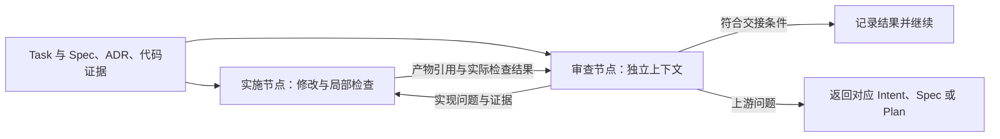

# Loop Engineering 与 Graph Engineering：来源核验与项目应用

[总览与下一步](../../README.md) · 研究依据 · 框架原生术语不等于本项目约定 · [研究索引](../README.md)

核验日期：2026-09-15。以用户指定的 [AI Builder Club 文章](https://www.aibuilderclub.com/blog/graph-engineering-vs-loop-engineering)为本次术语讨论的依据；作者为 Shirley，页面标注发布于 2026-07-20、更新于 2026-08-24。本文区分作者观点与本项目建议，未实现运行工具。

## 1. 本次采用的含义

- **Loop engineering：** 设计单个 Agent 的发现、计划、执行、验证周期及退出判断，让一次工作能够根据反馈推进。
- **Graph engineering：** 将多个专业 Agent 或步骤组合起来，明确各自职责、上下文、交接数据以及路由；需要时分发独立工作，再汇合结果。
- **关系：** 一个闭环可以成为组合中的节点。工程重点从单个工作单元如何可靠完成，扩展到多个工作单元如何可靠协作。

以上是该文的核心用法。它是对近期讨论的观点综述，不是统一标准、术语首创证明或性能基准。本文不采纳未经直接核验的社媒归因与倍数提升说法。[原文及其 Sources & Verification](https://www.aibuilderclub.com/blog/graph-engineering-vs-loop-engineering)

本项目此前侧重阶段控制图的解释覆盖了路由，但未充分表达专业分工、独立上下文和交接数据这三个要点。后续方法设计以本节含义为准，LangGraph 只作为可选实现背景。

## 2. 采用时的工程判断

以下是本项目对文章的取舍，不是照录作者结论：

1. **单个闭环也能保存外部状态、调用并发工具。** 单 Agent 周期不要求所有数据只存在一个上下文中，也不要求所有工具逐个执行；区别应落在是否建立了独立的职责和交接边界。
2. **独立审查需要独立判断及足够证据。** 新上下文有助于减少对生成过程的依赖，但审查者仍须读取原始要求、相关 ADR、实际代码或来源证据。只提供待审草稿和抽象标准，无法可靠核验遗漏与事实错误。
3. **并行不是采用图的必要条件。** 实现与独立审查可以顺序运行；是否拆节点，取决于职责隔离能否改善结果以及交接成本是否值得。
4. **成功标准无需因组织方式变化而变化。** 同一项 AC 可以用于比较单 Agent 与多个节点的表现；不能为了体现“升级”而改变验收口径。
5. **节点不必都是 Agent 闭环。** 测试、链接检查、状态校验等确定性步骤也可承担节点职责。节点内部可保留探索空间，控制图可含返工环；Plan 的任务前置依赖仍应保持无环。

Anthropic 已介绍路由、并行、协调者与工作者、生成与评价循环等可组合模式。这些是一手可核验的实践基础，不意味着 Anthropic 使用上述新术语命名其 SDLC。[Building effective agents](https://www.anthropic.com/engineering/building-effective-agents)

闭环验收应检查实际结果，并使用适合任务的评价方式；执行记录中的“完成”声明不能替代环境中的结果。[Demystifying evals for AI agents](https://www.anthropic.com/engineering/demystifying-evals-for-ai-agents)

## 3. 对现有三步三产物的借鉴

以下为本项目方案。**Intent → Spec → Plan 继续定义准备过程和主产物；节点与闭环定义这些工作如何执行。** 一个步骤可由多个节点协作，同一检查能力也可被多个步骤复用。Loop 内部的 plan 是一次行动安排，不表示每轮都生成或重写正式 `plan.md`。

| 工作 | 输入 | 局部闭环及可拆分职责 | 结果 |
| --- | --- | --- | --- |
| Intent | 用户来源、相关项目事实与适用决定 | 澄清目标、核对来源、识别缺口；缺少必要决定时等待该输入 | `intent.md` |
| Spec | Intent 原文、相关 ADR、As-Is 与代码证据 | 调查事实、形成要求与 Design、检查覆盖和可行性；必要时由独立节点审查 | `spec.md`；需要长期生效的决定进入 ADR |
| Plan | Spec 原文、ADR、实际仓库与执行条件 | 定位文件、分解 Tasks、核对依赖和验证方法 | `plan.md` |
| Task 实施 | Plan 中的 Task、相关 Spec/ADR、实际代码 | 修改、运行检查、修正；按需要交给独立审查节点 | 代码、实际证据；Plan 更新任务状态 |
| 文档维护 | 实际变更与验证结果、受影响 ADR/Topic | 定位影响、核验事实、更新与检查链接 | 更新对应 As-Is Topic；按原规则处理 ADR |

采用多节点时，先定义交接内容，再决定由何种 Agent 或工具运行。交接应交代工作对象与范围、输入版本、结果与证据、未决事项和下一动作；正式字段及路由规则以[执行流程](../../docs/method/sdd-spec-to-commit-workflow.md#loops-and-routing)为准。

交接记录以引用为主，按既有 context、Plan 和 evidence 职责落位；不新增一套权威需求或任务清单。节点间共享的是必要输入和可检查结果，不能默认把完整生成过程交给所有节点，也不能仅传摘要而阻断下游对原始要求的读取。

## 4. 一个最小组合示例

以“实施一个 Task，并进行独立审查”为首个可评估组合：

这张图不增加准备步骤。实施节点保留自己的反馈闭环；审查节点依据原始要求与实际变更判断，返回具体问题。原本的目标和 AC 保持有效。若两者共用工作区，应明确写入责任，避免一方在另一方审查时改变受审版本。

后来若有多个相互独立的调查范围，才增加并行调查及汇合。汇合需要核对分支是否齐全、输入版本是否兼容、是否存在矛盾或未解决事项，不能把部分成功自动记为整体完成。

## 5. 产出落点与实施顺序

| 内容 | 权威落点 |
| --- | --- |
| 节点职责、读取范围、交接约定、检查与路由 | 方法层 workflows/contracts；见[执行流程](../../docs/method/sdd-spec-to-commit-workflow.md#loops-and-routing) |
| 目标、要求与 Design、Tasks 和任务状态 | 变更层 Intent、Spec、Plan |
| 已采纳的长期决定与规则 | ADR；采纳不等于已经实现 |
| 已核验的仓库现状 | As-Is Topic；调查推测与目标方案不能写成已实现事实 |
| 实际运行、审查、验证与停止原因 | 对应 evidence；运行停止与任务完成分别判断 |
| 临时交接数据与恢复指针 | 按已有文档职责记录或由工具保存；不能替代上述权威来源 |

遵循[统一文档体系](../../docs/method/project-documentation-system.md)和[插件路线图](../../docs/roadmap/ai-sdlc-plugin-roadmap.md)：

1. **M0：手动验证契约。** 补齐单工作单元的输入、验证、退出条件和最小交接字段，用真实变更演练。
2. **M1：先稳定一个闭环。** 优先支持单 Task 实施与验证；稳定后试点实施与独立审查的组合，以代表性案例比较遗漏、误报完成、返工和耗时成本，决定是否保留该拆分。
3. **M2：根据发现组合节点。** 优先拆出已证明需要独立上下文或工具权限的职责，再逐步加入恢复、版本核对和按需并行汇合。未发现收益时保持较小组合。

Codegraph 的代码关系可帮助调查节点寻找受影响文件与候选证据；文档追溯关系可帮助节点选取输入。二者都不直接决定节点应如何协作，也不替代事实验证、ADR 效力判断和验收。

## 6. 可选实现背景

[LangGraph Graph API](https://docs.langchain.com/oss/python/langgraph/graph-api)提供 State、Nodes 和 Edges 等机制，可作为未来运行时评估材料。本次没有选定该框架，也不因采用 Graph engineering 而要求图数据库或专门编排平台。先稳定职责、上下文和交接约定，才能判断需要什么运行实现。
